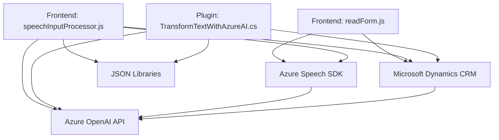

### Breve Resumen Técnico
El repositorio contiene tres archivos clave: **`readForm.js`**, **`speechInputProcessor.js`**, y **`TransformTextWithAzureAI.cs`**. Estos archivos están diseñados para implementar funcionalidades relacionadas con procesamiento de texto y voz, directamente integradas con Microsoft Dynamics CRM y Azure-powered services como Azure Speech SDK y Azure OpenAI API.

---

### Descripción de Arquitectura
La arquitectura global adoptada en el repositorio es una **arquitectura orientada a eventos** con patrones funcionales y un diseño multi-capa, que incluye:

1. **Presentación (Frontend)**
   - Interacción con formularios del CRM (captura de campos visibles, asignación de valores y generación de datos procesados).
   
2. **Back-end/Negocio**
   - Plugins y scripts relacionados con la transformación de texto basados en servicios externos (Azure OpenAI).
   - Generación de datos estructurados en JSON con procesamiento avanzado de inteligencia artificial.

3. **Integración**
   - Llamadas HTTP y uso de eventos para integración con servicios externos como Azure Speech SDK, Azure OpenAI API y APIs internas del CRM.

Las responsabilidades de procesamiento están repartidas en diferentes archivos y funciones modulares, pero siguen dependiendo del contexto general del CRM (Dynamics 365), lo cual indica una cierta dependencia de acoplamiento.

---

### Tecnologías, Frameworks y Patrones Usados
**Frontend**:
- **Frameworks/Librerías:**
  - Azure Speech SDK. 
- **Patrones:**
  - Modularización de funciones.
  - Programación orientada a eventos con callbacks y promesas.

**Backend**:
- **Frameworks/Librerías:**
  - .NET Framework/C#: Usado en el plugin (*TransformTextWithAzureAI.cs*).
  - Azure OpenAI API: Integración con servicios GPT para manejo de texto.
  - Microsoft Dynamics CRM SDK: Para interacción con formularios y datos en tiempo de ejecución.
  - JSON Libraries (Newtonsoft.Json y System.Text.Json): Para trabajar con datos estructurados.

**Patrones Aprovechados**:
1. **Plugin Architecture**:
   - Integración directa con Microsoft CRM.
2. **Event-driven Architecture**:
   - Procesos activados por eventos (ej. callback para el SDK de Azure Speech).
3. **Dependency Injection**:
   - Carga dinámica de Azure SDK y API externa.
4. **Microfrontends**:
   - Posible separación modular entre archivos de frontend que interactúan con formularios.

**Notable Observations**:
- **Language Support**: [Spanish processing in voice recognition and numerical mappings (e.g., words to numbers translation)].
- **External Integration**: Heavy reliance on Azure SDK for speech and AI processing.

---

### Diagrama **Mermaid**

---

### Conclusión Final
La solución representa una integración compleja entre **Microsoft Dynamics CRM** y **Azure cloud services—Speech SDK** para voz y **OpenAI API** para procesamiento avanzado de inteligencia artificial. La arquitectura sigue una combinación de **event-driven programming**, **plugin architecture** y **API integration patterns**. Esto permite lograr la interacción entre formularios CRM y el Azure cloud stack con extensibilidad para procesamiento de datos y voz. Sin embargo, la solución actual podría beneficiarse de una mayor modularización para simplificar la estructura, posiblemente transformándose hacia una **arquitectura de microservicios** para mayor escalabilidad en el manejo de servicios independientes (como voz y transformación JSON).