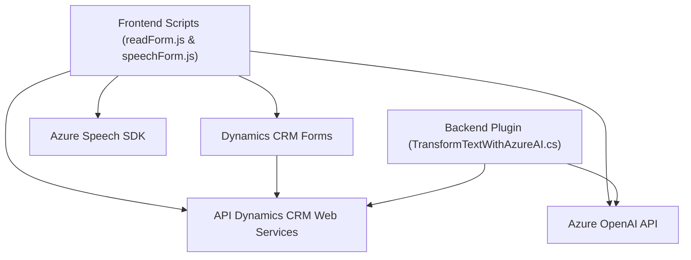

### Breve resumen técnico:
La solución presentada es un conjunto integrado que busca extender funcionalidades en Dynamics CRM a través de dos componentes principales:
1. **Frontend (JavaScript)**: Scripts que interactúan con formularios para procesar datos visibles o capturados por voz. Incluyen funcionalidades para síntesis y reconocimiento de voz mediante Azure Speech SDK.
2. **Backend (Plugin .NET)**: Plugin que utiliza Azure OpenAI Service para transformar texto en JSON estructurado y almacenarlo en el sistema CRM.

### Descripción de arquitectura:
La arquitectura es híbrida orientada a integración. Los scripts en frontend implementan una arquitectura de cliente con interacción directa con el contexto del CRM (Dynamics 365), mientras que el plugin en backend sigue una arquitectura orientada a servicios. El frontend es modular y asíncrono, diseñado para manejo de eventos y acceso dinámico a SDK. El backend sigue el patrón de integración de microservicio usando Azure OpenAI para procesamiento externo.

Se puede considerar la arquitectura global como de **n capas**, donde:
1. **Capa de presentación** está representada por los scripts de frontend que interactúan con el usuario y los formularios de Dynamics.
2. **Capa lógica** está parcialmente en el frontend con el procesamiento de voz y mapeo de valores, y se complementa en el backend con el plugin que ejecuta las transformaciones avanzadas usando Azure.
3. **Capa de datos** interactúa directamente con las entidades y campos de Dynamics CRM.

### Tecnologías usadas:
1. **Frontend**:
   - **JavaScript**: Base para los scripts de interacción.
   - **Azure Speech SDK**: Para síntesis y reconocimiento de voz.
   - **Dynamics CRM Xrm API**: Manejo y manipulación del modelo de formulario.
   - **Dynamic script loader**: Carga del SDK de manera dinámica.

2. **Backend**:
   - **.NET Framework** (Microsoft Dynamics SDK).
   - **Azure OpenAI Service**: Servicios de transformación basada en IA.
   - **Newtonsoft.Json**: Procesamiento y manipulación de JSON.
   - **HTTP Client**: Realización de llamadas HTTP REST a la API de Azure.

### Dependencias o componentes externos:
1. **Azure Speech SDK**: Para síntesis y reconocimiento de voz.
2. **Azure OpenAI Service**: Procesamiento de texto en JSON estructurado mediante IA.
3. **Dynamics CRM Xrm**: API del cliente y servicios para manipulación de datos en formularios.
4. **Dynamic loader**: Herramienta de carga de SDK externa (URL proporcionada).

### Diagrama Mermaid:

### Conclusión final:
La solución presentada se compone de una **arquitectura n capas técnicamente eficiente**, que combina procesamiento de datos en el cliente (frontend) con una integración robusta en el servidor (backend). Los scripts en JavaScript proporcionan interacción directa con los formularios para habilitar funcionalidades como reconocimiento de voz y síntesis. El plugin relacionado permite operaciones avanzadas utilizando Azure OpenAI, lo que asegura escalabilidad y capacidades de aprendizaje mediante IA. La adopción de servicios de Azure y dependencias dinámicas contribuye a la flexibilidad y potencia de la solución.