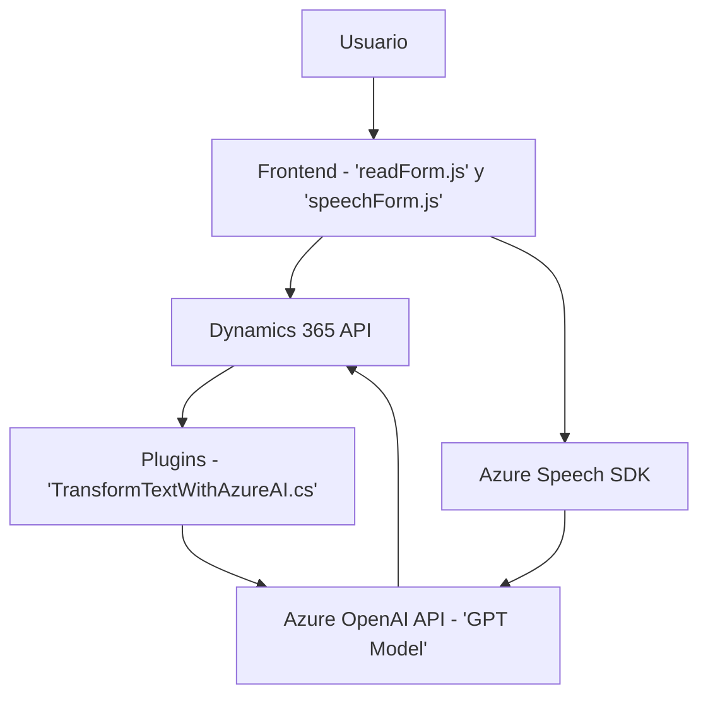

### Breve resumen técnico
El repositorio comprende una solución que integra un sistema CRM (Dynamics 365) con servicios de inteligencia artificial (Azure OpenAI y Azure Speech SDK). Su funcionalidad principal radica en procesar entradas por voz y texto en formularios de Dynamics 365 mediante síntesis de voz, reconocimiento de voz y transformación semántica con IA. Este enfoque permite la mejora de la interacción del usuario con el sistema CRM a través de la automatización y procesamiento avanzado de datos.

---

### Descripción de arquitectura
La solución tiene una arquitectura basada en **n capas**, con tres capas principales y características de integración con APIs externas: 

1. **Capa de presentación (frontend)**:
   - Scripts en JavaScript (`readForm.js` y `speechForm.js`) alojados en Dynamics 365, que manejan la interacción directa con formularios de usuario, reconocimiento de voz y síntesis de voz gracias al `Azure Speech SDK`.

2. **Capa de negocio/lógica (plugins)**:
   - El plugin `TransformTextWithAzureAI.cs` extiende la lógica de la capa de negocios de Dynamics CRM utilizando servicios de Azure OpenAI. Este componente intercepta y transforma datos del CRM en tiempo de ejecución.

3. **Capa de integración**:
   - Comunicación directa con APIs de Azure (OpenAI y Speech SDK), que actúan como servicios externos para el reconocimiento, síntesis de voz y transformación semántica de texto.

---

### Tecnologías usadas
1. **JavaScript**:
   - Construcción de lógica del frontend Dynamics 365.
   - Implementación de reconocimiento de voz y síntesis con `Azure Speech SDK`.

2. **Microsoft Dynamics 365 CRM Framework**:
   - Extensión de funcionalidades mediante scripts y el plugin desarrollado en C#. 
   - Utilización de `formContext` y `Xrm.WebApi.online`.

3. **C#**:
   - Desarrollo del plugin `TransformTextWithAzureAI` utilizando el patrón `IPlugin` nativo de Dynamics CRM.
   - Consumo de APIs externas mediante `HttpClient`.

4. **Azure Speech SDK**:
   - Reconocimiento y síntesis de voz en tiempo real.
   
5. **Azure OpenAI API**:
   - Uso del modelo GPT para transformar y estandarizar texto según normas específicas.

6. **Frameworks y bibliotecas**:
   - `Newtonsoft.Json` y `System.Text.Json` para manipulación de JSON.
   - `System.Net.Http` para comunicación HTTP con APIs externas.

---

### Diagrama Mermaid válido para GitHub

---

### Conclusión final
El repositorio define una solución para extender las capacidades de las interacciones en Dynamics 365 utilizando servicios de Azure (Speech SDK y OpenAI). La arquitectura sigue un enfoque de **n capas** con buena separación de responsabilidades y adopta patrones como **Facade**, **Event-driven architecture**, y **command-query separation**. La integración con servicios externos fortalece el sistema, pero agrega dependencias de terceros que deben ser gestionadas y monitoreadas (ej., token de Azure, tiempos de respuesta, etc.). Tal solución podría considerarse un ejemplo moderno de integración avanzada entre un sistema CRM y tecnologías AI de Microsoft.