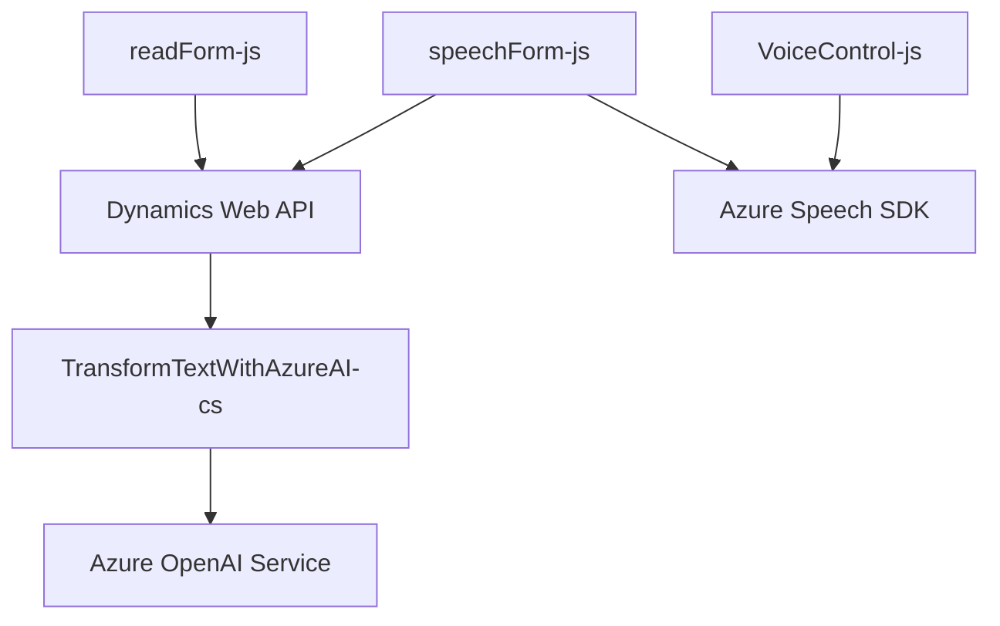

### Breve Resumen Técnico
Este repositorio contiene múltiples archivos de solución técnica orientados a la automatización y procesamiento de formularios mediante voz, texto e inteligencia artificial integrada con Azure Speech SDK, Dynamics Web API y Azure OpenAI. Está estructurado principalmente como un conjunto de componentes frontend y plugins de Dynamics CRM para trabajar con datos de formularios y responder en tiempo real a las entradas de usuario.

---

### Descripción de Arquitectura
Este sistema utiliza una arquitectura híbrida basada en **Service-Oriented Architecture (SOA)**, integrando servicios externos (Azure Speech SDK y Azure OpenAI) con Dynamics CRM mediante el uso de **plugins** y archivos funcionales. La lógica está descentralizada con una clara separación entre frontend y backend.

#### Estructura clave:
1. **Frontend (JS)**: Archivos como `readForm.js` y `speechForm.js` proporcionan funcionalidades para interactuar con formularios a través de entradas de voz y convertirlas en texto o valores manipulables para los campos de un CRM.
  
2. **Backend (Plugins)**: El archivo `TransformTextWithAzureAI.cs` actúa como un punto de integración de backend encargado del procesamiento del texto recibidos en Dynamics CRM con normas predefinidas utilizando servicios de Azure.

El diseño se alinea con principios de modularidad, encapsulación y separación de responsabilidades, además de utilizar patrones como **Encapsulación funcional**, **Data Mapping**, y **Facade Pattern**.

---

### Tecnologías Usadas
- **Lenguajes de programación**: 
  - Frontend: JavaScript.
  - Backend: C#.

- **SDK y APIs externos**:
  - Azure Speech SDK: Para la síntesis y reconocimiento de voz.
  - Dynamics Web API: Manipulación de entidades y extensiones en Microsoft Dynamics CRM.
  - Azure OpenAI API: Generación y transformación inteligente de texto de entrada.

- **Framework/Servicios**:
  - Microsoft Dynamics CRM: Para la integración tanto de plugins como del entorno de formularios Web.
  - Azure Cloud Services: Proporciona soporte para el reconocimiento y síntesis de voz, además de servicios de OpenAI.

---

### Diagrama Mermaid

---

### Conclusión Final
El repositorio parece ser parte de un sistema de automatización e interacción avanzada dentro de Dynamics CRM, donde se integra procesamiento de voz, entrada de datos automatizada y transformación de contenido por inteligencia artificial. La arquitectura es modular y se basa en una lógica de **Service-Oriented Architecture** (SOA), con servicios externos centralizando operaciones específicas (Azure SDK, OpenAI Service). Este diseño apunta a la flexibilidad para futuras expansiones, con potencial integración adicional de servicios externos.