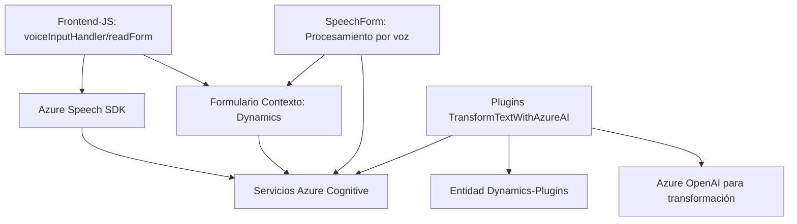

### Breve resumen técnico:
El proyecto implementa una solución que integra múltiples tecnologías para la gestión de datos recogidos mediante interacción de voz y procesamiento del texto con inteligencia artificial. Se compone de tres partes principales:
- **Frontend** en JavaScript enfocado en manejar formularios y síntesis/reconocimiento de voz utilizando Azure Speech SDK.
- **Plugins** en C# diseñados para interactuar con Dynamics CRM y procesar datos mediante Azure OpenAI.
  
### Descripción de arquitectura:
La arquitectura se divide en dos capas principales:
1. **Frontend (JavaScript)**:
   - Estructura modular enfocada en un procesamiento de voz y formulación dinámicos en tiempo real.
   - Dependencia directa de servicios web externos (Azure Speech SDK), posibilitando tareas como captura de voz, síntesis, y manejo de datos del formulario.
  
2. **Backend (Plugins en C#)**:
   - Se materializa un patrón de arquitectura orientado a eventos mediante el diseño de plugins para Dynamics CRM. Los plugins se activan en respuesta a eventos y realizan transformaciones con Azure OpenAI.

La solución exhibe características de arquitectura distribuida enfocada en **n capas**:
- Capa de presentación: Capa cliente (JavaScript) interactuando directamente con servicios Azure Speech.
- Capa de negocio: Plugins de negocio en `C#` integrados con Dynamics CRM y Azure OpenAI API.
- Capa de datos: Dependencia hacia Microsoft Dynamics CRM y servicios REST externos (Azure Cognitive y OpenAI APIs).

### Tecnologías usadas:
1. **Frontend**:
    - **JavaScript** (funciones modulares).
    - **Azure Speech SDK** para síntesis y reconocimiento de voz.
    - **Dynamics CRM contexto de formulario**.
    - Promesas y manejo asíncrono para interacción fluida con servicios externos.

2. **Backend**:
    - **C#** (principalmente .NET y Dynamics SDK).
    - **Azure OpenAI API** para transformación de texto con habilidades avanzadas.
    - **HTTP REST** para operaciones asincrónicas contra el endpoint de Azure.

### Dependencias o componentes externos:
- **Azure Speech SDK**: Para interacción con capacidades de voz (síntesis/reconocimiento).
- **Azure OpenAI**: Modelos GPT para procesamiento de texto.
- **Dynamics CRM SDK**: Contextos de formulario y entidades.
- **Librerías.NET**: Newtonsoft.Json, System.Text.Json y otras relacionadas con manipulación de JSON y HTTP.
- **API Customizada (posiblemente interna)** para interacción adicional con formularios o procesamiento de datos.

### Diagrama Mermaid:

### Conclusión final:
La solución es un **sistema distribuido basado en múltiples capas** que integra inteligencia artificial (Azure OpenAI), procesamiento de voz (Azure Speech SDK) y sistemas de negocio (Microsoft Dynamics CRM). Implementa modularidad en el frontend con lógica bien estructurada para la interacción de voz, mientras que los plugins en el backend permanecen alineados con normas del SDK de Dynamics para tratar datos empresariales con IA.