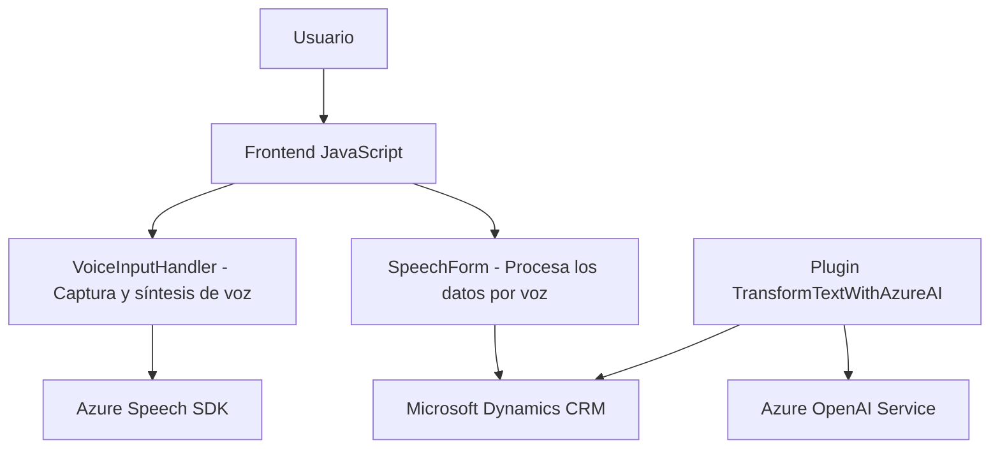

### **Breve resumen técnico**
El repositorio parece ser una solución híbrida orientada a integraciones, destinada a proporcionar interacción por voz y transformación de datos en un sistema CRM (probablemente Microsoft Dynamics 365). Contiene código frontend en JavaScript para la interacción de usuarios con formularios por medio de reconocimiento/síntesis de voz (Azure Speech SDK), y backend en C# para transformar texto usando Azure OpenAI.

### **Descripción de arquitectura**
1. **Arquitectura general**: 
   - **Tipo**: Arquitectura distribuida basada en servicios. Combina dos componentes principales: (a) un cliente web orientado al procesamiento de formularios y la interacción de voz (Frontend), y (b) un backend que ejecuta un plugin para integrar procesamiento avanzado de texto con Microsoft Dynamics CRM y Azure OpenAI.
   - **Estilo arquitectónico**:
     - De lado del cliente: **Arquitectura en capas** para separar la lógica de interacción y las funcionalidades modulares relacionadas con la voz.
     - Backend (Plugin CRM): Basado en **eventos**, diseñado en torno al concepto de "Plugin-based Architecture" típico de Dynamics CRM.
   - **Nivel de acoplamiento**: Desacoplado en términos de frontend y backend, con dependencias claras en servicios externos mediante APIs para Azure Speech SDK y Azure OpenAI.

### **Tecnologías usadas**
1. **Frontend**:  
   - **JavaScript** para lógica del cliente.
   - **Azure Speech SDK** como dependencia externa.
   - **Event-driven programming** para carga dinámica de SDK y manejo de reconocimiento/síntesis de voz.
   - **DOM API** para trabajar con formularios y su estructura visual.
   - **Formulario CRM Context API** proporcionado por Dynamics 365.

2. **Backend**:  
   - **C#/.NET Framework** para la lógica del plugin y conexión al sistema CRM (implementación de la interfaz `IPlugin`).
   - **Microsoft Dynamics CRM SDK** para extensiones, interacciones y manejo de datos.
   - **Azure OpenAI Service** con GPT para transformación de texto.
   - **Newtonsoft.Json** (manejo avanzado de JSON).

3. **Patrones arquitectónicos**:  
   - Servicios desacoplados que interactúan mediante APIs externas.
   - Event-driven design tanto en frontend (voice input) como en backend (plugin execution).
   - Modularity en manejo de formularios y reconocimiento/síntesis de voz, con separación estricta por responsabilidad.
   - **SOA (Service-Oriented Architecture)** en el backend para consumir Azure OpenAI y enviar resultados procesados.

### **Diagrama Mermaid válido para GitHub**

### **Conclusión final**
El repositorio presenta una solución bien estructurada para interacciones avanzadas con formularios en un sistema CRM, integrando tecnologías de reconocimiento de voz y procesamiento de lenguaje natural. La arquitectura es eficiente y desacoplada, destacando en su modularidad y el uso de servicios externos como Azure Speech SDK para síntesis/reconocimiento y Azure OpenAI para procesamiento avanzado basado en inteligencia artificial. Por su capacidad de conectar diversas tecnologías, es claro que el objetivo es facilitar la interacción entre usuarios y sistemas CRM mediante funcionalidades de IA y voz, mejorando la accesibilidad y automatización.