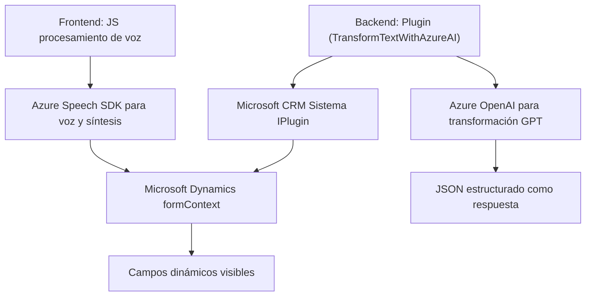

### **Breve resumen técnico**
El repositorio parece contener tres componentes principales:
1. Archivos de frontend escritos en JavaScript (`readForm.js` y `speechForm.js`) que interactúan con Azure Speech SDK para manejar entrada de voz y síntesis de texto.
2. Un archivo backend/plugin (`TransformTextWithAzureAI.cs`) implementado en C#, que utiliza el framework de Dynamics CRM para transformar texto mediante Azure OpenAI.
3. Utilización de tecnologías como Azure Speech SDK, el framework de Dynamics CRM, y Azure OpenAI para habilitar funcionalidades avanzadas de reconocimiento, síntesis, y procesamiento de texto.

---

### **Descripción de arquitectura**
La solución emplea una arquitectura híbrida que combina dos componentes principales:
1. **Frontend (JS)**: Scripts para gestionar funcionalidades del cliente, como reconocimiento de voz, procesamiento y mapeo de campos dinámicos en formularios web.
2. **Backend (Plugin en C#)**: Un complemento basado en Dynamics CRM para realizar transformaciones de texto. Este usa un enfoque **n-capas** dentro del entorno de Dynamics CRM y se integra con servicios cloud (Azure OpenAI).

La arquitectura general del sistema sigue el modelo de **SOA (Arquitectura Orientada a Servicios)**, dada la integración con múltiples APIs externas (Azure Speech y Azure OpenAI). También existen patrones de **modularización** en los scripts JS y encapsulación en la lógica del plugin para mantener separación de responsabilidades.

---

### **Tecnologías usadas**
1. **Frontend:**
   - **JavaScript**: Manejo de lógica cliente (e.g., flujo de procesamiento de datos y eventos asíncronos).
   - **Speech SDK de Azure**: Reconocimiento de voz y síntesis de texto.
   - **Microsoft Dynamics Framework**: Contexto del formulario para acceso y manipulación de atributos.
   - **Patrones**: Modularidad y encapsulación funcional.

2. **Backend:**
   - **C#**: Desarrollo del plugin.
   - **Microsoft Dynamics CRM SDK**: Integra con el sistema CRM para extender su funcionalidad.
   - **Azure OpenAI API**: Realiza procesamiento de texto avanzado mediante GPT.
   - **Newtonsoft.Json**: Manejo de datos JSON.
   - **SOA**: Uso de APIs externas como servicios cloud integrados.

---

### **Diagrama Mermaid**

---

### **Conclusión final**
Este repositorio implementa una solución híbrida que integra reconocimiento de voz, síntesis de texto, y procesamiento avanzado de datos con herramientas modernas de Microsoft y Azure. Su arquitectura utiliza **SOA** para integrarse con servicios externos de manera eficiente y sigue patrones de diseño que separan claramente la lógica cliente y backend.

El sistema general es modular, extensible, y adecuado para entornos corporativos donde la automatización de procesos mediante IA y servicios cloud es clave. Sin embargo, se recomienda elevar la seguridad al gestionar claves API mediante herramientas como **Azure KeyVault** y considerar mejoras en la documentación técnica.