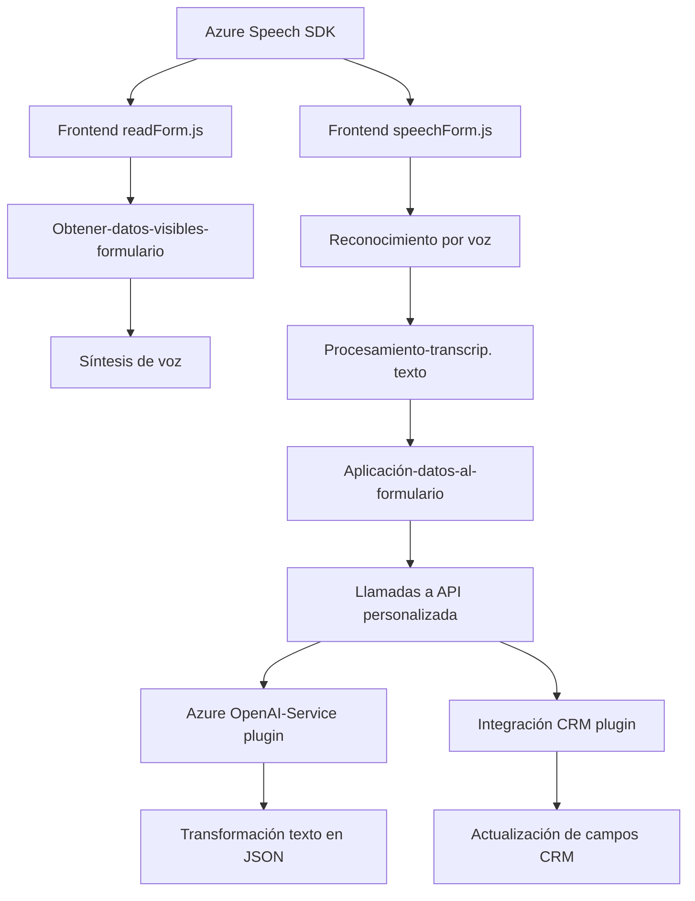

### Breve resumen técnico:
El repositorio contiene archivos que integran la funcionalidad de entrada de voz y procesamiento de texto en un sistema CRM. Estas soluciones utilizan el **Azure Speech SDK** y un plugin para **Microsoft Dynamics CRM** con soporte para Azure AI, implementando una interacción avanzada basada en voz y transformaciones inteligentes de texto. 

---

### Descripción de arquitectura:

1. **Tipo de solución:**
   - La solución implementa una **API basada en plugins** para Microsoft Dynamics CRM y un **frontend interactivo** que procesa formularios utilizando síntesis y reconocimiento de voz. Integra servicios externos como el **Azure Speech SDK** y **Azure OpenAI Service**.
   - Parece estar orientada a la automatización dentro de un entorno empresarial como un CRM.

2. **Tipo de arquitectura:**
   - El sistema tiene características de **arquitectura en capas**, dado que separa responsabilidades entre frontend (procesamiento de formularios), backend (plugins CRM) y servicios externos (Azure SDK/AI).
   - Utiliza integración de servicios externos mediante **microservicios** como el plugin `TransformTextWithAzureAI`.

3. **Tecnologías usadas:**
   - **Frontend**:
     - **JavaScript**: Funcionalidad interactiva para formularios.
     - **Azure Speech SDK** para reconocimiento de voz y síntesis.
     - **Promise** y programación asíncrona.
   - **Backend**:
     - **C# (.NET)**: Plugin basado en la interfaz `IPlugin` del SDK de Dynamics CRM.
     - **Azure OpenAI Service** para transformaciones inteligentes.
     - Dependencias como `Newtonsoft.Json` y `System.Net.Http`.
   - **CRM SDK**:
     - Extensiones propias del framework de Dynamics CRM (`Xrm.WebApi`, `IOrganizationService`).

4. **Patrones utilizados:**
   - **Lazy Loading**: Carga del Azure Speech SDK dinámicamente en el frontend.
   - **Fachada**: Punto único de entrada para interactuar con los servicios de voz.
   - **Plugin-Based Architecture**: La extensión de funcionalidades del CRM mediante el plugin `TransformTextWithAzureAI`.
   - **Asíncronía**: Uso de promesas y transacciones remotas para llamadas HTTP al servicio Azure OpenAI.
   - **Modularidad**: Separación clara de funcionalidades (procesamiento de voz, interacción con APIs, manipulación de formularios).

5. **Dependencias externas:**
   - **Azure Speech SDK**: Reconocimiento y síntesis de voz.
   - **Azure OpenAI Service**: Procesamiento y transformación avanzada de texto.
   - **APIs personalizadas**: Específicas para interacciones con el CRM (como `trial_TransformTextWithAzureAI`).
   - **Microsoft Dynamics CRM SDK**: Framework de integración y manipulación de datos CRM.
   - **Libraries**: `Newtonsoft.Json` para serialización y `System.Net.Http` para realizar peticiones HTTP.

---

### Diagrama Mermaid válido para GitHub Markdown:

---

### Conclusión final:
La solución representa una integración avanzada de un sistema CRM con capacidades de síntesis y reconocimiento de voz, así como transformación de texto personalizada mediante IA/ML. 

El diseño modular en capa permite escalabilidad y reutilización de funcionalidades para el tratamiento de datos en formularios. El uso de servicios como **Azure Speech SDK** y **Azure OpenAI Service** le añade flexibilidad pero también introduce una fuerte dependencia externa y posibles costos asociados a estas integraciones. 

El enfoque arquitectónico con plugins acoplados a Dynamics CRM es ideal para entornos empresariales donde se requiere precisión y automatización en el manejo de datos interactivos. Sin embargo, debe considerarse el manejo de errores y la latencia en servicios externos para garantizar una experiencia fluida.