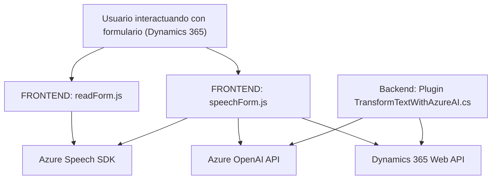

### Breve resumen técnico

El proyecto está diseñado para trabajar con un entorno de Microsoft Dynamics CRM y servirse de servicios en la nube de Azure (Speech SDK y OpenAI). Su objetivo principal es la integración de reconocimiento de voz, síntesis de voz y manejo de datos con tecnologías avanzadas en un ecosistema orientado a CRM. Contiene tres componentes clave:

1. **FRONTEND/JS/readForm.js**: Extrae datos visibles de un formulario y utiliza Azure Speech SDK para convertir texto en voz.
2. **FRONTEND/JS/speechForm.js**: Realiza reconocimiento de voz y transcribe datos hablados para interactuar con un formulario basado en Dynamics 365.
3. **Plugins/TransformTextWithAzureAI.cs**: Ejecuta transformaciones inteligentes de texto mediante Azure OpenAI con integración a la lógica del CRM.

---

### Descripción de arquitectura

- **Tipo de solución**: Sistema híbrido entre frontend (JS) y backend (Dynamics CRM). La integración directa con servicios en la nube de Azure sugiere una **arquitectura orientada a servicios**. 
- **Modelo arquitectónico**:
  - **Capa de presentación**: ReadForm.js y SpeechForm.js actúan como el frontend interactivo que maneja entrada/salida de datos del usuario.
  - **Capa funcional/acceso externo**: Speech SDK y OpenAI API sirven como capa de servicios externos para procesar voz y texto.
  - **Backend/negocio en el CRM**: El archivo TransformTextWithAzureAI.cs implementa un plugin **basado en lógica interna** (Dynamics 365) que conecta al modelo y los servicios de Azure.

Se sigue una estructura **n capas**, adaptada para integrarse con **microservicios** externos (Azure).

---

### Tecnologías usadas

1. **Frontend** (JavaScript):
   - Azure Speech SDK (Cognitive Services): Para sintetizar voz y reconocer entrada hablada.
   - Dynamics 365 UI Framework: Interacción directa con formularios y datos del CRM.
   - Carga dinámica de SDK desde CDN.

2. **Backend** (.NET/C#):
   - Microsoft Dynamics CRM SDK: Para interacción CRUD e integración con plugins.
   - Azure OpenAI: Procesamiento de texto avanzado (transformación y normalización de entrada textual).

3. **Patrones observados**:
   - **Proveedor externo**: Usa servicios como Azure Speech SDK y OpenAI mediante suscripción externa.
   - **Plugin-pattern**: Extensión para lógica específica en Dynamics CRM.
   - **Modularidad**: Funciones reutilizables en el frontend para tareas específicas.
   - **Event-driven**: Uso de eventos para iniciar tareas (reconocimiento o síntesis de voz).

---

### Dependencias y componentes externos

- **Azure Speech SDK**: Para funcionalidad de reconocimiento y síntesis de voz.
- **Azure OpenAI (GPT)**: Para procesamiento y transformación avanzada de texto.
- **Dynamics 365 Web API**: Para interacción directa con datos del CRM, incluyendo identificadores específicos de formularios y mapeos.
- **Newtonsoft.Json.Linq**: Probablemente usado en el backend para manejar estructuras JSON.

---

### Diagrama Mermaid

---

### Conclusión final

El repositorio muestra un sistema híbrido que combina frontend y backend, con integración directa a servicios en la nube de Azure y Microsoft Dynamics CRM. La arquitectura utiliza principios de **n capas** y **microservicios** para mantener modularidad y escalabilidad, además de emplear patrones comunes como proveedor externo y event-driven en la lógica funcional. Es una solución avanzada que gestiona datos con entrada/salida por voz y procesamiento inteligente de texto, facilitando la interacción natural con sistemas CRM.