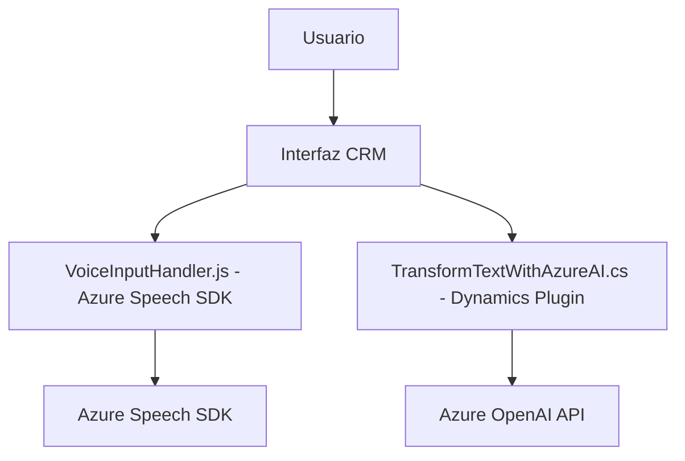

### Breve resumen técnico ###
El repositorio alberga una solución que integra funcionalidades como procesamiento de formularios, entrada/salida de voz y transformación avanzada de texto. A través de la utilización de APIs externas como Azure Speech SDK y Azure OpenAI, se vinculan microservicios con sistemas CRM (Dynamics 365).

---

### Descripción de arquitectura ###
La arquitectura de esta solución es híbrida, calibrada en torno a dos componentes principales:
1. **Frontend:** Funciones JS que procesan la interacción del usuario mediante SDKs y APIs externas. El código encapsula funcionalidades de entrada/salida de voz, formularios, y ajuste basado en IA.
2. **Plugin Backend:** Integración directa con Dynamics CRM mediante la API del SDK y ejecución de acciones extendidas por un plugin en .NET que, a su vez, interactúa con Azure OpenAI.

Los patrones observados incluyen:
- **Microservicio orientado a API:** La solución acude a servicios externos como Azure Speech y OpenAI.
- **MVC simplificado:** En el Frontend, los formularios actúan como vista, la lógica en JS como controlador y el CRM como modelo.
- **Gestión de eventos:** Uso de callbacks y carga dinámica en el frontend para funcionalidades/SDK asincrónicos.
- **Hexagonal Architecture:** El plugin .NET conecta el dominio CRM con servicios externos (OpenAI) mediante abstracción de entradas/salidas.

---

### Tecnologías usadas ###
1. **Frontend:**
   - **JavaScript:** Implementación lógica para formularios y voz.
   - **Azure Speech SDK:** Entrada/salida de voz.
   - **Dynamics 365 Web API:** Manipulación de datos del formulario.
   - **CDN Carga Dinámica:** Azure Speech SDK.

2. **Plugin Backend (.NET):**
   - **Azure OpenAI API:** Transformación de texto basado en IA.
   - **Dynamics CRM SDK:** Extensiones específicas de backend.
   - **Newtonsoft.Json:** Manipulación de objetos JSON.
   - **HTTP Client:** Comunicación con APIs externas.

---

### Diagrama Mermaid ###

---

### Conclusión final ###
La solución integra un flujo de trabajo con Frontend en JavaScript e Interacciones Backend a través de Plugins en Dynamics CRM. Utiliza tecnologías modernas como Azure Speech SDK, OpenAI, y APIs personalizadas que implementan microservicios. Su arquitectura híbrida combina los enfoques de modelo-vista-controlador (MVC) en el cliente con hexagonal (en el plugin). Esto asegura modularidad, escalabilidad y capacidad para implementar flujos asincrónicos.