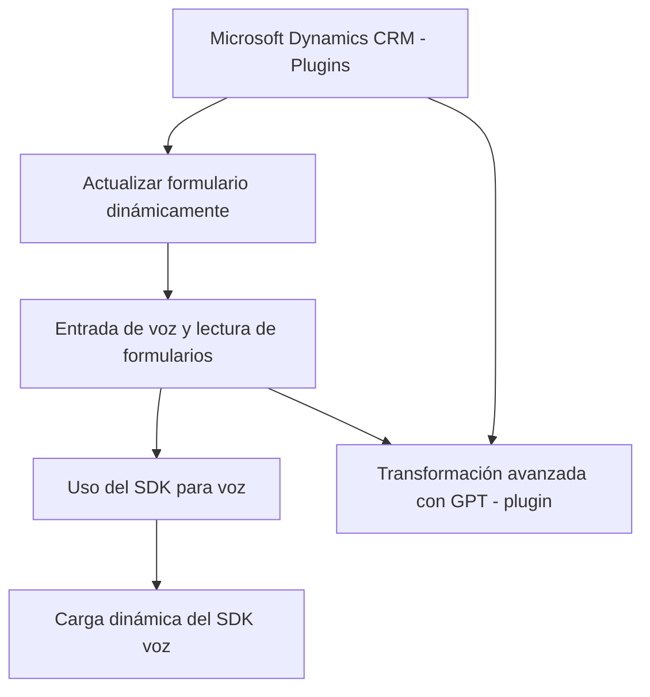

# Análisis del repositorio

## Breve resumen técnico
El repositorio implementa una solución que integra funcionalidades de entrada y síntesis de voz, así como un servicio de transformación de texto mediante inteligencia artificial. La solución tiene tres componentes principales: el **frontend** que interactúa con formularios, el **backend plugin** que conecta a Microsoft Dynamics CRM y Azure OpenAI, y una API **externa** (Azure Speech y Azure OpenAI). La funcionalidad es asincrónica e intensivamente dependiente de APIs externas.

---

## Descripción de arquitectura
La solución tiene una típica arquitectura de integración distribuida:
- **Frontend:** Archivos JavaScript gestionan la interacción directa con los usuarios (entrada por voz, lectura de formularios) y consumen servicios externos como Azure Speech SDK.
- **Backend:** Plugins escritos en C# corren sobre Dynamics CRM para procesar datos y delegan tareas de inteligencia artificial usando Azure OpenAI.
- **Patrones detectados:**
  - Uso de capas (frontend, servicio externo, backend) para organizar funciones.
  - **Event-driven programming** para manejo de SDK y APIs (triggers).
  - **Integración distribuida**: Dependencias de servicios remotos (Azure).

La arquitectura general podría clasificarse como una combinación de **n-capas** y **orientación a microservicios**, debido al rol crucial de servicios externos.

---

## Tecnologías usadas
1. **Frontend:**
   - **JavaScript:** Procesamiento de voz, lectura de formularios.
   - **Azure Speech SDK:** Lectura y entrada por voz.
   - **Async/Await y Promises:** Para gestionar llamadas remotas.

2. **Backend:**
   - **C# (.NET Framework):** Plugins sobre Dynamics CRM.
   - **Newtonsoft.Json / System.Net.Http:** Serialización JSON y comunicación HTTP con Azure OpenAI API.
   - **Microsoft Dynamics CRM SDK:** Para integrar con el framework CRM.
   
3. **Servicios externos:**
   - **Azure OpenAI API:** Transformación de texto con GPT.
   - **Azure Speech SDK:** Entrada y salida de voz.

---

## Dependencias y componentes externos
1. **Azure Speech SDK**: Provee la funcionalidad de entrada y síntesis de voz.
2. **Dynamics 365 SDK**: Utilizado para gestionar datos en formularios y entidades del CRM.
3. **Azure OpenAI API**: Realiza la transformación avanzada del texto con normas específicas.
4. **APIs REST**: Todas las interacciones con Azure se manejan mediante servicios RESTful.

---

## Diagrama Mermaid válido en GitHub Markdown

---

## Conclusión final
El repositorio implementa una solución para interacción con formularios en Microsoft Dynamics 365, aprovechando conceptos modernos como entrada/salida por voz y procesamiento de lenguaje mediante inteligencia artificial. La arquitectura mezcla **capas funcionales distribuidas** y **microservicios**, con una integración robusta de APIs externas (Azure Speech/OpenAI). Los puntos destacados incluyen:
- Uso de SDKs y servicios REST para inteligencia artificial y síntesis de voz.
- Modularidad entre frontend y backend.
- Alta dependencia de sistemas externos, cubriendo objetivos específicos de usuarios en CRM.

Esta estructura es escalable si los servicios externos son confiables, pero depende fuertemente de la calidad de las APIs de proveedores como Azure.