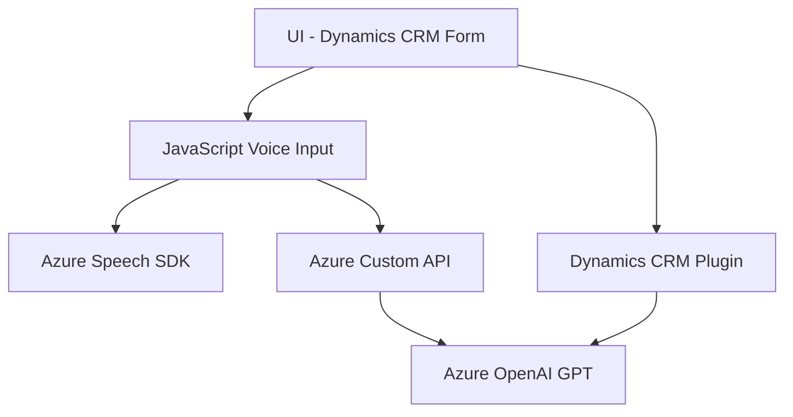

### Breve resumen técnico
El repositorio contiene tres archivos que están diseñados para trabajar con la tecnología de Microsoft Dynamics 365 y Azure Speech SDK. Los archivos proporcionan funcionalidades avanzadas de interacción por voz y procesamiento de texto para formularios en un entorno CRM. Además, hay una integración con Azure OpenAI GPT mediante un plugin que transforma texto según reglas predefinidas.

### Descripción de arquitectura
Este sistema puede clasificarse dentro de una **arquitectura modular** basada en capas, con integración de servicios externos (Azure Speech SDK y Azure OpenAI GPT). Cada componente del sistema parece estar diseñado para cumplir una función específica:
- **Frontend**: Archivos en la carpeta `FRONTEND/JS` implementan funcionalidades de interacción con el usuario (entrada/salida de voz).
- **Backend Plugins**: La carpeta `Plugins` contiene plugins que extienden Dynamics 365 para realizar procesamiento personalizado.

### Tecnologías usadas
1. **Microsoft Dynamics 365**:
   - Utiliza la API `Xrm.WebApi` para operaciones en el contexto del CRM.
   - Implementa técnicas de mapeo entre datos del formulario y atributos del CRM.
   - Uso de plugins para extender la funcionalidad de Dynamics 365 (código C#).
2. **Microsoft Azure Speech SDK**:
   - Manejo de entrada y salida de voz con integración directa usando el CDN de Azure.
   - Realización de reconocimiento de voz y síntesis de texto a voz.
3. **Azure OpenAI GPT (via REST API)**:
   - Realiza transformación de texto en el backend mediante solicitudes HTTP al endpoint correspondiente.
   - Manejo de respuestas JSON y procesamiento avanzado usando técnicas de procesamiento de lenguaje natural (NLP).
4. **JavaScript (Frontend)**:
   - Implementación de lógica asíncrona mediante callbacks y promesas (`async/await`).
   - Gestión dinámica de SDKs mediante programación del DOM.
5. **C# (Plugin Backend)**:
   - Uso de dependencias como `Microsoft.Xrm.Sdk` y `HttpClient` para conexión de servicios externos.
   - Manejo de respuestas JSON con `System.Text.Json` y `Newtonsoft.Json.Linq`.

### Diagrama Mermaid válido para GitHub

### Conclusión final
El repositorio presenta una solución híbrida que combina tecnologías frontend y backend con integraciones externas. El sistema se centra en mejorar la accesibilidad y manejo de formularios dentro de Dynamics 365, utilizando tecnologías avanzadas como el reconocimiento de voz (Azure Speech SDK) y procesamiento de texto (Azure OpenAI GPT).

La arquitectura es modular, donde cada componente cumple una función específica, siguiendo principios de diseño basados en eventos, manejo asíncrono, y la integración de servicios externos. Las decisiones arquitectónicas están alineadas para construir una solución extensible y con soporte para servicios inteligentes como Azure AI, proporcionando una interfaz amigable para usuarios finales que necesitan funcionalidad por voz.