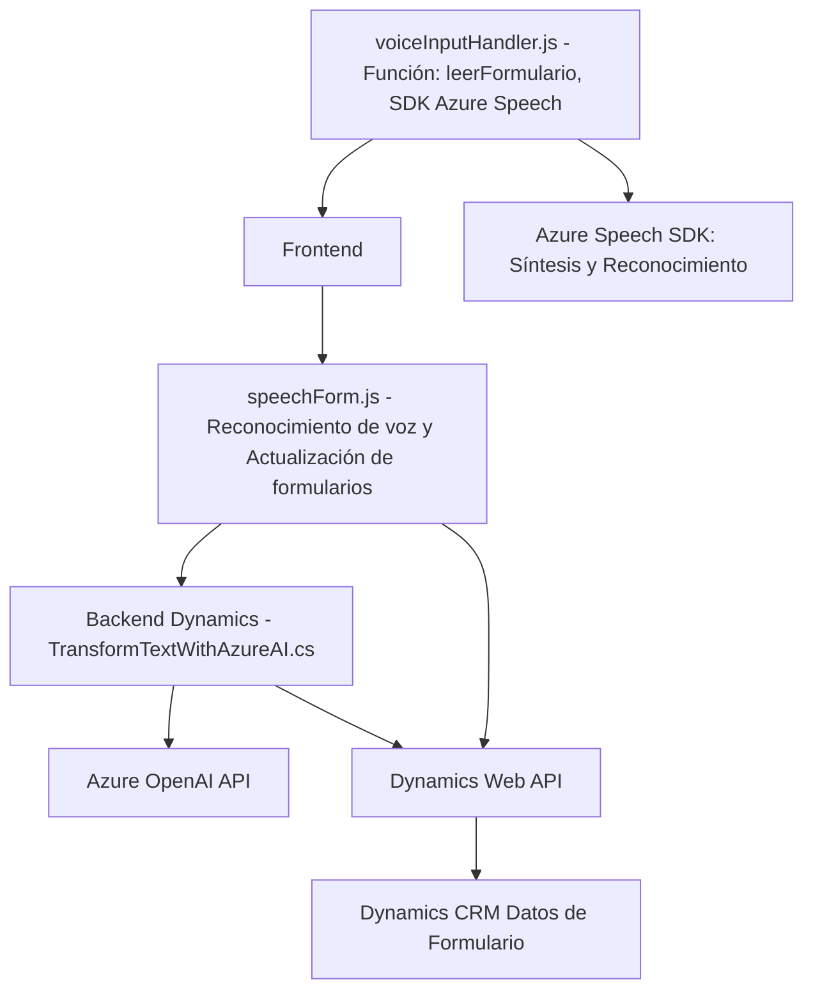

### Breve resumen técnico

Este repositorio es parte de un sistema complejo que integra múltiples componentes para interactuar con Dynamics 365 usando entradas de voz, texto, y servicios de IA. La funcionalidad del sistema gira en torno a la síntesis y reconocimiento de voz mediante **Azure Speech SDK** y procesamiento avanzado de texto con **Azure OpenAI**.

---

### Descripción de arquitectura

La arquitectura está basada en un enfoque híbrido que combina una **n-capas** tradicional (frontend y backend conectados mediante APIs) con integración de servicios externos (Azure Speech SDK y OpenAI). El backend de Dynamics 365 utiliza un **plugin estilo microservicio**, que es invocado mediante eventos en los formularios.

- **Frontend**: Componente basado en JavaScript que interactúa con los usuarios para captura de entrada y síntesis de voz.
- **Backend**: Plugins de extensión en Dynamics 365 que procesan datos mediante servicios externos, como Azure OpenAI.
- **Arquitectura orientada a servicios**: Los servicios de Azure Speech y OpenAI son utilizados como microservicios externos que complementan las funcionalidades del sistema.

---

### Tecnologías y patrones usados

1. **Frontend (JavaScript)**:
   - **Azure Speech SDK**: Para síntesis de voz y reconocimiento de voz en tiempo real.
   - **Dynamics 365 Web API**: Para interacción con los datos del formulario dentro de Dynamics CRM.
   - **JavaScript ES6+** con un enfoque modular (funciones específicas para tareas concretas).
   - **Patrones usados**:
     - "Lazy load" para la carga dinámica del Azure Speech SDK (`ensureSpeechSDKLoaded`).
     - "Encapsulación funcional" para mayor modularidad y separación de responsabilidades en funciones como `getReadableValue` o `getVisibleFieldData`.

2. **Backend (.NET)**:
   - **Microsoft Dynamics 365 Plugin**: Extensiones específicas para Dynamics.
   - **Azure OpenAI Service (GPT-4)**: Para transformación avanzada de texto.
   - **Newtonsoft.Json** y **System.Net.Http**: Para interacción con la API de Azure OpenAI y manejo de JSON estructurados.
   - **Patrones usados**:
     - Encapsulación en la arquitectura de plugins propias de Dynamics CRM (`IPlugin`).
     - "API Facade" mediante el método `GetOpenAIResponse`.
     - Separación de responsabilidades mediante métodos específicos en el plugin (`GetOpenAIResponse`, `Execute`).

---

### Dependencias o componentes externos

1. **Azure Speech SDK**: Para reconocimiento de voz y síntesis.
2. **Azure OpenAI Service**: Para procesamiento avanzado de texto (transformación a JSON estructurado).
3. **Dynamics 365 Web API**: Manejo de datos de formularios, eventos y atributos de entidades.
4. **Newtonsoft.Json**: Biblioteca para serialización de JSON en .NET plugins.
5. **System.Net.Http**: Para realizar solicitudes HTTP al API de OpenAI.
6. **Google Chrome/Browser environment**: El frontend parece estar orientado a funcionar en navegadores modernos.
7. **JavaScript external libraries (if applicable)**: Aunque no se mencionan, es común que se requieran herramientas como lodash, moment.js, etc. para facilidades de manejo de objetos y fechas.

---

### Diagrama Mermaid (Estructura del repositorio)

---

### Conclusión final

La solución está diseñada para habilitar interacción entre usuarios y formularios a través del procesamiento de voz (synthesizing voice-to-text) y transformación posterior del texto mediante inteligencia artificial en Azure OpenAI. Combina tecnologías de frontend (JavaScript para navegadores), backend (plug-ins de Dynamics CRM en .NET), y servicios externos (Azure Speech SDK, OpenAI API). Es una solución moderna que aprovecha nubes públicas (Azure) para capacitar aplicaciones empresariales con capacidades de voz y IA, mientras conserva modularidad para una posible evolución hacia microservicios. Sin embargo, se debe abordar el desacoplamiento de claves API desde el código y evaluar su implementación en contenedores o servicios serverless para mejorar seguridad, escalabilidad y mantenimiento.