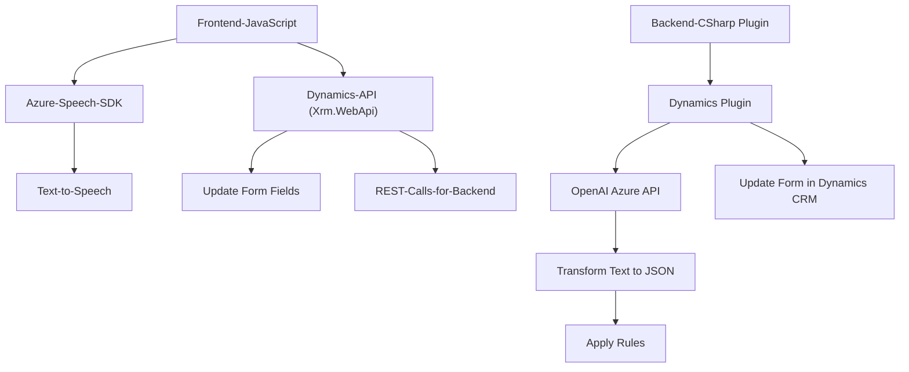

### Breve resumen técnico

El repositorio parece ser parte de una solución híbrida que combina frontend (implementado en JavaScript) y un backend/plugin en C#. Su propósito principal es integrar formularios inteligentes con capacidades de síntesis de texto a voz, entrada por voz, y procesamiento avanzado de textos utilizando servicios de Azure (Azure Speech SDK y Azure OpenAI). Tiene dependencias externas relevantes como Dynamics CRM y el ecosistema de APIs de Azure.

---

### Descripción de arquitectura

1. **Tipo de solución**:  
   - **Frontend y Plugins.** La parte frontend gestiona la interacción con el usuario y realiza procesamiento mediante Azure Speech SDK y Dynamics 365. El backend (plugin) extiende la funcionalidad de Dynamics CRM, procesando texto con reglas específicas usando Azure OpenAI.

2. **Arquitectura observada**:  
   - **N-capas con integración entre capas.**  
     - **Capa frontend:** Procesa formularios y sintetiza entradas de voz mediante un navegador.  
     - **Capa backend/plugin:** Resuelve la integración de Dynamics CRM con servicios como Azure AI para transformación de datos.  

   - Existe un claro desacoplamiento del frontend y backend, combinando interacción directa con APIs externas (REST) mediante **patrones de integración por servicios remotos**.

---

### Tecnologías y patrones usados

1. **Front-end:**
   - **Lenguaje:** JavaScript.
   - **Frameworks/SDKs:** Azure Speech SDK.
   - **Integración:** Manipulación dinámica del DOM y carga de scripts externos para SDK.  
   - **Patrones:**
     - Modularidad: Cada función tiene una responsabilidad específica.
     - Externo Gateway: Integración directa con Azure Speech SDK para funciones como síntesis de texto a voz y reconocimiento de voz.
     - Pipeline de procesamiento: Implementado en la serie de funciones que convierten voz en datos aplicables al formulario.

2. **Backend/plugin:**
   - **Lenguaje:** C#.
   - **Ecosistema:** Dynamics CRM Plugin Architecture.  
   - **Azure OpenAI API:** Transformaciones avanzadas y estructuración de texto.  
   - **Frameworks:** Dynamics SDK, Newtonsoft.Json.  
   - **Patrones:**
     - Plugin Architecture: Extensión de funcionalidades mediante `IPlugin`.
     - REST API Integration: Uso explícito de una API HTTP POST para comunicarse con Azure OpenAI.
     - Encapsulación: Procesos como la petición y transformación están separados en métodos específicos para claridad y modularidad.

---

### Dependencias o componentes externos

1. **Azure Speech SDK** (en frontend):  
   - Utilizado para síntesis de texto a voz y reconocimiento de voz.  
   - Cargado dinámicamente desde la URL: `https://aka.ms/csspeech/jsbrowserpackageraw`.

2. **Dynamics CRM SDK** (backend/plugins):  
   - Manipulación de formularios y datos en el ecosistema Dynamics 365.  
   - Interacción directa mediante las interfaces disponibles (`IPlugin`, `IOrganizationService`).

3. **Azure OpenAI API** (plugin/backend):  
   - Endpoint específico: `https://openai-netcore.openai.azure.com/`.  
   - Usado para generación y transformación de datos basándose en el contenido recibido (proceso POST).

4. **JSON libraries**: Uso de `Newtonsoft.Json` y `System.Text.Json` para manipulación estructurada de datos JSON.

---

### Diagrama Mermaid compatible con GitHub

---

### Conclusión final

La estructura y funcionalidad del repositorio apuntan a una solución híbrida bien diseñada para gestionar formularios inteligentes en un entorno Dynamics CRM. Combina:
- **Frontend:** Utilizando Azure Speech SDK para facilitar interacciones basadas en voz y gestión en tiempo real.
- **Backend:** Plugins en C# que estructuran y manejan los datos, además de extender capacidades mediante integración directa con Azure OpenAI para mejora de las transcripciones y datos procesados.

La solución implementa patrones adecuados de modularidad, desacoplamiento, e integración con servicios externos. Se aprovecha una arquitectura multi-capa enfocada en la separación de responsabilidades y en sistemas de comunicación mediante APIs.