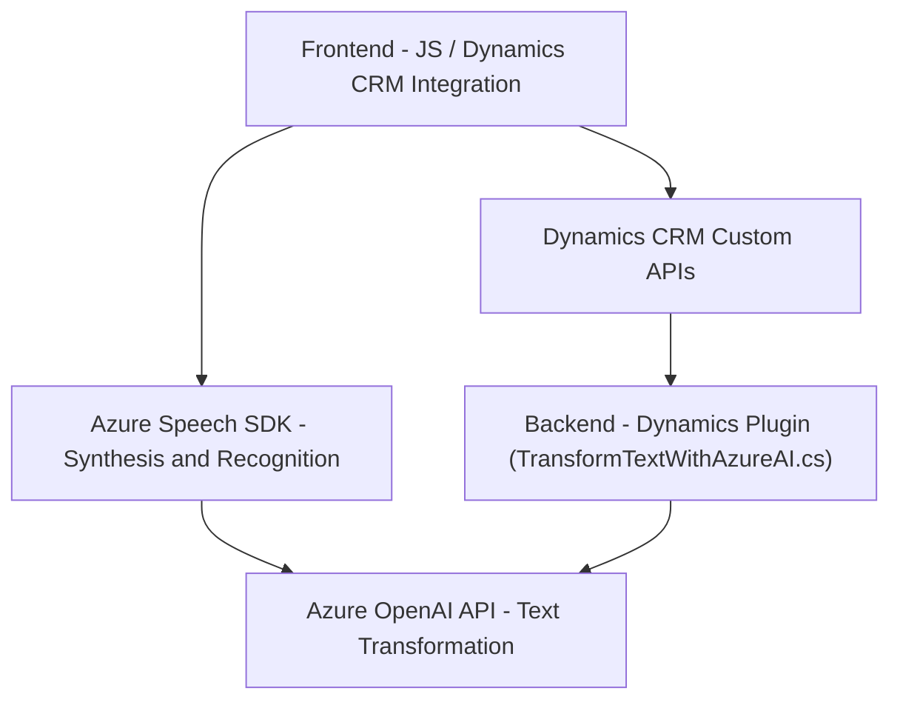

### Breve resumen técnico
Este repositorio implementa un conjunto de soluciones en una arquitectura híbrida, diseñada para interactuar con **Dynamics CRM** utilizando tecnologías como el **Azure Speech SDK**, la **OpenAI API** y plugins para extender la funcionalidad del CRM. Incluye componentes frontend en JavaScript, backend en .NET para plugins de Dynamics, y lógica centrada en procesamiento de voz y transformación de texto. 

### Descripción de arquitectura
La solución implementa una arquitectura de **n capas**. Los componentes están organizados para separar la interacción directa del usuario (frontend) del procesamiento de datos en el servidor (plugins en .NET). Los módulos de la aplicación permiten integración con servicios externos como Azure Speech SDK y OpenAI API, adoptando principios de **cliente-servidor** y promoviendo **modularidad** mediante funciones encapsuladas. La lógica de voz y texto puede ser parte de un ecosistema de **microservicios**.

### Tecnologías usadas
#### Backend (.NET)
- **Microsoft.Xrm.Sdk:** Para interacción con Dynamics CRM.
- **Azure OpenAI API:** Procesamiento avanzado de texto.
- **Newtonsoft.Json y System.Text.Json:** Manipulación de formato JSON.
- **System.Net.Http:** Consumo de APIs web externas.

#### Frontend (JavaScript)
- **Azure Speech SDK**: Procesamiento de voz a texto y síntesis de voz.
- **JavaScript para interacción con Dynamics CRM**, utilizando APIs locales de Dynamics (`Xrm.WebApi`).

#### Servicios externos
- **Dynamics CRM Custom APIs:** Para extender la funcionalidad de base del CRM.
- **Azure Speech SDK:** Para capacidades avanzadas de entrada y salida de voz.
- **Azure-hosted OpenAI (GPT-4o):** AI para transformación de datos.

### Diagrama Mermaid válido para GitHub

### Conclusión final
La solución utiliza una combinación de varias tecnologías, con implementación de patrones como **facade**, **callback**, **dependency injection**, y **plugin architecture**. Además, se divide en distintas capas que interactúan entre sí, cumpliendo los principios fundamentales de una arquitectura bien estructurada de **n capas** con una posible extensión hacia **microservicios**. La integración de servicios de Azure como Speech SDK y OpenAI muestra un enfoque moderno, aunque algunos aspectos podrían beneficiarse de optimización, como la gestión de credenciales para mejorar la seguridad. En términos de funcionalidad, la solución aborda necesidades específicas en el espacio de un CRM, complementando capacidades estándar con procesamiento avanzado de voz y texto.