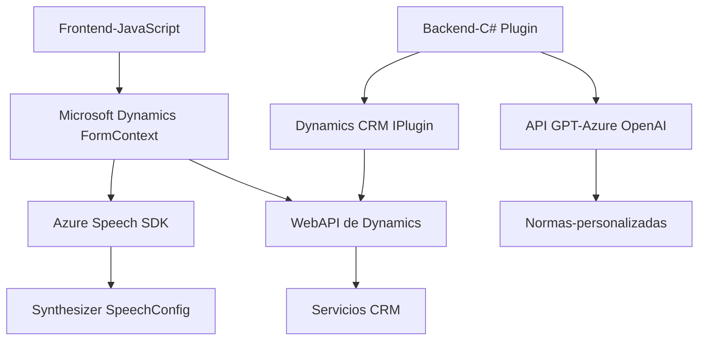

### Breve Resumen Técnico

El repositorio contiene diferentes archivos que implementan funcionalidades específicas relacionadas con Microsoft Dynamics CRM y Azure Speech SDK/OpenAI. La solución se enfoca en la interacción con formularios Dynamics a través de entrada y salida de voz, reconocimiento de voz, y sintetización junto con procesamiento de texto mediante IA (Azure OpenAI). Además, posee integración directa con servicios cloud de Microsoft Azure.

---

### Descripción de Arquitectura

La arquitectura sugiere una solución **modular basada en servicios** que facilita la interacción con formularios en Dynamics CRM. Utiliza una combinación de tecnologías como Azure Speech SDK, Dynamics WebAPI, y Azure OpenAI API para distribuir responsabilidades en distintas partes del código.

#### Arquitectura Observada:
1. **Microservicio-complementaria:**
   - Los plugins de Dynamics actúan como extensiones que integran servicios cloud externos para añadir capacidades avanzadas (reconocimiento de voz, síntesis, IA).
2. **N-Capas o Lógica Distribuida:**
   - El código está dividido entre el frontend (JavaScript para la interfaz/formularios) y el backend (C# para Plugins en Dynamics), lo que sugiere una separación por capas:
     - **Presentación**: Gestiona la interacción del usuario y captura datos visibles con funciones como `leerFormulario`.
     - **Aplicación**: Gestiona flujos como la interacción con APIs/SDKs en el cliente y envía las solicitudes al backend para procesamiento avanzado (e.g., OpenAI).
     - **Incorporación de Servicios Externos**: El SDK de Azure y la API proporcionan capacidades NLP/IaaS mediante solicitudes HTTP.

---

### Tecnologías Usadas

1. **Frontend**
   - **Lenguaje:** JavaScript.
   - **Framework:** Microsoft Dynamics (extensiones del FormContext).
   - **Servicios Externos:** Azure Speech SDK y WebAPI de Dynamics.
   - **Patrones:** Modularización con funciones específicas, carga dinámica de dependencias (SDK).

2. **Backend**
   - **Lenguaje:** C# (.NET Framework).
   - **Framework:** Dynamics CRM SDK.
   - **Servicios Externos:** Azure OpenAI API para procesamiento NLP mediante modelos GPT.
   - **Patrones:**
       - *Plugin Pattern* (Dynamics CRM).
       - *Service-Oriented Architecture* (API externa de generación de datos).
       - *Encapsulación*: Ejemplo con el método `GetOpenAIResponse`.

---

### Dependencias o Componentes Externos

- **Azure SDKs:** Speech SDK y OpenAI API proveen las capacidades de síntesis y procesamiento de voz así como generación estructurada de texto transformado.
- **Microsoft Dynamics:** Base de la solución, utiliza FormContext y la API para gestionar datos visibles dentro de formularios CRM.
- **HTTP Services:** Llamadas RESTful a servicios (Azure OpenAI API).
- **JSON Libraries:** Serialización/deserialización en C# (`Newtonsoft.Json` o `System.Text.Json`).

---

### **Diagrama Mermaid**

---

### Conclusión Final

La solución está bien diseñada para entornos Dynamics CRM donde las capacidades extendidas de reconocimiento de voz, síntesis, y procesamiento inteligente de texto son necesarias. La arquitectura demuestra principios de modularidad, integración externa (SDK/API), y sigue buenos patrones como separación de capas y encapsulación. A pesar de que la solución aún está centralizada en dos elementos principales (frontend y plugin backend), incorpora servicios cloud que podrían evolucionar hacia un enfoque más distribuido si se separan como microservicios completamente independientes.

