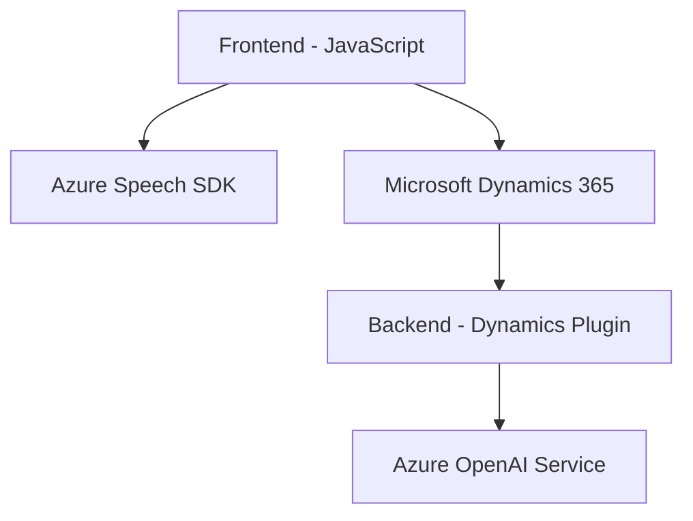

### Breve resumen técnico

El repositorio analizado presenta una solución orientada al procesamiento avanzado de voz y datos en formularios integrados, usando tanto APIs externas como plugins en Microsoft Dynamics 365. La solución incluye un frontend en JavaScript para interacción directa, un sistema de reconocimiento de voz basado en Azure Speech SDK, así como un plugin backend de .NET que realiza procesamiento de texto utilizando el servicio Azure OpenAI.

---

### Descripción de arquitectura

La solución utiliza una **arquitectura n-capas** compuesta por:

1. **Frontend**:
   - JavaScript/TypeScript en el navegador para interactuar con formularios y capturar comandos mediante reconocimiento y síntesis de voz implementados con Azure Speech SDK.
   - Incluye una lógica cliente que combina procesamiento de datos con integración de APIs.

2. **Backend**:
   - Plugins desarrollados en .NET para extensión de funcionalidades de Dynamics 365. Los plugins son utilizados para comunicarse con Azure OpenAI y ejecutar transformaciones de texto.

3. **Integración con servicios externos**:
   - Azure Speech SDK para reconocimiento de voz y síntesis textual.
   - Azure OpenAI Service para transformación y procesamiento inteligente de texto.

Esta arquitectura implementa técnicas de **modularización, integración SDK/API** y procesamiento distribuido entre cliente y servidor. 

---

### Tecnologías usadas

#### **Frontend:**
- **Lenguaje:** JavaScript.
- **Framework:** Utilización de APIs nativas del navegador y Dynamics (`Xrm.WebApi`).
- **SDK Externo:** Azure Speech SDK.

#### **Backend:**
- **Lenguaje:** C# (.NET Framework).
- **Dynamics Plugin Framework:** `IPlugin` para registrar y procesar eventos en Microsoft Dynamics 365.
- **Azure OpenAI Service:** Procesamiento con modelos GPT basados en Azure AI.
- **Libraries:** `Newtonsoft.Json`, `HttpClient`, `System.Text.Json`.

#### **Servicios externos:**
- **Microsoft Dynamics 365** (trabajo en formularios y eventos).
- **Azure Speech SDK**.
- **Azure OpenAI Service**.

#### **Patrones Implementados:**
1. **Wrapper SDK/API:** Funciones que aseguran la carga y uso del SDK pertinente (`SpeechSDK`, Azure OpenAI).
2. **Plugin Design Pattern:** Plugins registrados para eventos en Dynamics CRM.
3. **Asynchronous Programming:** Uso de Promesas y Async/Await para operaciones tanto en frontend como en backend.
4. **Encapsulación Modular:** Código organizado en funciones independientes, por ejemplo, extracción de datos del formulario, procesamiento de texto y síntesis de voz.

---

### Diagrama Mermaid

---

### Conclusión final

Esta solución representa una integración cuidada de tecnologías tanto para procesamiento de voz como modificación dinámica de formularios en Microsoft Dynamics 365. La arquitectura n-capas permite distribuir las responsabilidades de captura/interacción de audio, procesamiento inteligente de texto mediante AI y manipulación de datos del CRM. La implementación técnica destaca por su modularidad y uso de patrones escalables como SDK Wrapping y Plugins, aunque podría ser optimizada mediante mejores prácticas como el desacoplamiento de servicios externos y mayor seguridad en el manejo de claves API.