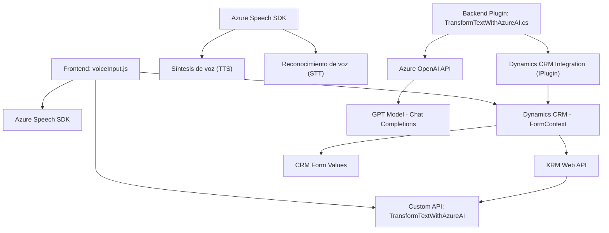

# Análisis de arquitectura y diseño

## Breve resumen técnico
El repositorio parece estar diseñado para integrarse con **Microsoft Dynamics CRM**, permitiendo accesibilidad mediante entrada y salida de voz, así como funcionalidades de procesamiento de texto utilizando servicios como **Azure Speech SDK** y **Azure OpenAI API**. Las funcionalidades están distribuidas en archivos para frontend en JavaScript y en un backend con C# para integración como plugin.

## Descripción de arquitectura
El diseño sigue una arquitectura híbrida con componentes funcionales distribuidos:

1. **Frontend**:
   - Incluye procesamiento de entrada de voz y formulación de datos visibles del formulario.
   - Usa un enfoque modular basado en funciones asincrónicas.
   - Está diseñado para interactuar dinámicamente con un sistema CRM y servicios externos (Azure Speech y OpenAI).

2. **Backend**:
   - Implementa un `Plugin`, basado en la arquitectura de extensibilidad de Dynamics CRM.
   - Se encarga de integrar datos provenientes de APIs externas como **Azure OpenAI API**.
   - Usa una arquitectura de servicios con comunicación directa hacia componentes externos mediante operaciones HTTP.

En términos generales, el sistema no se considera estrictamente "microservicios", ya que se diseñó para ejecutarse como parte de Microsoft Dynamics CRM. Sin embargo, incluye integración con servicios externos y manejo modular.

## Tecnologías usadas
1. **Frontend** (archivos JavaScript):
   - **Azure Speech SDK**: Para entrada y salida de voz.
   - **XRM WebAPIs**: Para realizar acciones en el CRM, como modificar campos.
   - **JavaScript ES6**: Funciones asincrónicas y programación orientada a eventos.

2. **Backend** (archivo C#):
   - **C#**: Lenguaje orientado a objetos para escribir el plugin.
   - **Microsoft Dynamics CRM SDK**: Para extender funcionalidades del sistema.
   - **Azure OpenAI API**: Para procesamiento y transformación de texto utilizando modelos GPT.

## Diagrama **Mermaid**

A continuación, se representa la estructura general del repositorio y su interacción con componentes externos:

## Conclusión final
El sistema es un ejemplo de una solución híbrida que combina frontend dinámico con backend extensible, utilizando servicios modernos en la nube como **Azure Speech SDK** y **Azure OpenAI API**, integrado con **Dynamics CRM**. Aunque no sigue una arquitectura de microservicios, existe una separación estratégica entre procesos de voz, procesamiento de texto, y la integración con el sistema. Sin embargo, se debe trabajar en mejorar la seguridad y configurabilidad (por ejemplo, no almacenar claves de API directamente en el código).