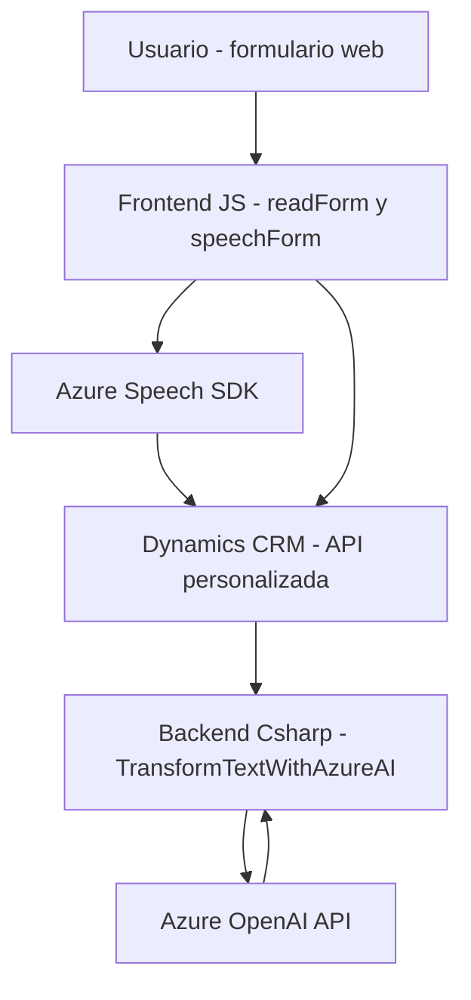

### Resumen técnico

El repositorio presentado parece implementar una solución híbrida que utiliza reconocimiento de voz y síntesis de texto a voz (por medio de **Azure Speech SDK**) junto con procesamiento avanzado de texto basado en **Azure OpenAI API**. Este diseño interactúa con formularios en entornos de Dynamics 365, permitiendo gestionar datos mediante entrada de voz y la transformación semántica de texto.

---

### Descripción de arquitectura

La solución sigue un enfoque orientado a servicios con características del patrón de **arquitectura de n capas**:
1. **Capa de presentación** (frontend de gestión del formulario): Archivos en **JavaScript** que manejan la interacción con el usuario, reconocimiento de voz y síntesis de voz.
2. **Capa de lógica de negocio** (servidor): Archivos como `TransformTextWithAzureAI.cs` que interactúan con Dynamics CRM mediante plugins y APIs externas.
3. **Capa de integración/externalización**: Uso de servicios externos como Azure Speech SDK y Azure OpenAI API para proporcionar características avanzadas como voz y procesamiento semántico.

Además, el componente desarrollado en **C#** configura plugins bajo la arquitectura de **Dynamics CRM**, lo que aporta más modularidad al proyecto en un entorno de **Service-Oriented Architecture (SOA)**.

---

### Tecnologías usadas

1. **Frontend**:
   - **JavaScript** para lógica del lado del cliente.
   - Integración con Azure Speech SDK para el reconocimiento y síntesis de voz.
   - Uso de API personalizada dentro de Dynamics 365 para procesamiento avanzado externo.
   - Dynamics 365 context API para manipulación de datos en formularios.

2. **Backend**:
   - Lenguaje de programación **C#**, orientado a objetos.
   - Microsoft Dynamics SDK para interacción con datos y sistemas de Dynamics CRM.
   - Azure OpenAI API para procesamiento y transformación avanzada de texto.
   - Dependencias como `Newtonsoft.Json.Linq` y `System.Net.Http` para trabajar con JSON y realizar solicitudes HTTP.

3. **Patrones**:
   - **Lazy loading**: El SDK se carga dinámicamente según necesidad (frontend).
   - **Fachada**: Integración simplificada entre servicios y formularios en la lógica del frontend y backend.
   - **External Service Integration**: Uso de APIs de Azure para delegar funcionalidades avanzadas (texto a voz, procesamiento semántico).
   - **Factory Pattern**: Implementado en la configuración del Speech SDK y los objetos relacionados con Audio.

4. **Servicios adicionales**:
   - Servicios en la nube: **Azure Speech SDK**, **Azure OpenAI API**.
   - Dynamics CRM: APIs y gestión de plugins.

---

### Diagrama Mermaid (GitHub compatible)

---

### Conclusión final

La solución creada se basa en una arquitectura de **n capas** que combina un frontend robusto con un backend conectado por servicios externos como **Azure Speech SDK** y **Azure OpenAI API**. El uso de plugins configurados dentro de Dynamics CRM refleja un enfoque **orientado a servicios (SOA)**. Las tecnologías y patrones empleados garantizan escalabilidad y modularidad, pero es crucial mejorar el manejo seguro de claves API al utilizar servicios externos como OpenAI (por ejemplo, gestionándolas desde Azure Key Vault). 

Además, el diseño modular facilita la incorporación de nuevas funcionalidades como el procesamiento de lenguaje natural o compatibilidad con otros sistemas dinamizadores que pueden interactuar con Dynamics CRM.