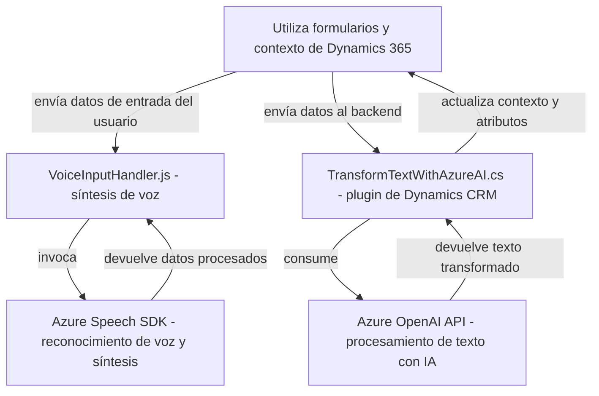

### Breve resumen técnico

El repositorio parece ser parte de una solución que integra tecnologías de Azure y Dynamics 365 para implementar funcionalidades avanzadas como síntesis y reconocimiento de voz, procesamiento de entradas con inteligencia artificial y manipulación de datos en formularios CRM. Incluye componentes para el frontend en JavaScript y plugins backend en C#, que interaccionan con servicios externos como Azure Speech SDK y Azure OpenAI.

---

### Descripción de la arquitectura

La arquitectura sigue el patrón **n capas** con división de responsabilidades:

1. **Frontend (JavaScript):** Maneja interacciones del usuario mediante scripts que permiten captura y síntesis de audio, procesamiento de datos con IA, y comunicación con el backend.
2. **Backend (C# plugin):** Extiende la funcionalidad de la plataforma Dynamics 365 mediante un sistema basado en **plugins**, que consume servicios de Azure como OpenAI para procesar datos.
3. **Servicios externos:** La solución depende de dos servicios importantes:
   - Azure Speech SDK (para reconocer entrada de voz y generar audio).
   - Azure OpenAI API (para transformar texto basado en reglas definidas).

Se puede clasificar como una arquitectura de **n capas** debido a la separación clara del frontend (que interactúa con usuarios y recolecta datos), el backend (que provee funcionalidades avanzadas), y los servicios externos (para funcionalidades de voz y análisis lingüístico). Opcionalmente puede tener ciertos elementos de diseño que imitan patrones de arquitectura hexagonal, dado el uso de adaptadores y dependencias externas en el código.

---

### Tecnologías usadas

1. **Lenguajes de programación:**
   - Frontend: JavaScript (ES6)
   - Backend (plugin): C#

2. **Frameworks y SDK:**
   - Azure Speech SDK: Para síntesis de voz y reconocimiento de entrada de audio.
   - Azure OpenAI API: Para transformar texto siguiendo reglas definidas por IA.
   - Microsoft Dynamics CRM SDK (`Microsoft.Xrm.Sdk`): Para conectar con la API de Dynamics.

3. **Patrones:**
   - Modular: Reutilización del código funcional en módulos específicos por medio de funciones en el frontend.
   - Service-Oriented Architecture (SOA): Integración directa con servicios externos como Azure API y Speech SDK.
   - IoC (Inversion of Control): Dinámico con el manejo de dependencias mediante `ensureSpeechSDKLoaded`.
   - Extendibilidad con Plugins: Implementación de la interfaz `IPlugin` en Dynamics CRM.

---

### Dependencias o componentes externos

- **Azure Services:**
  - Speech SDK: Usado para reconocimiento de entrada de voz y generación de audio hablado.
  - OpenAI API: Consumida para transformación de texto mediante inteligencia artificial.

- **Dynamics 365 API:**
  - Contextos de datos (`executionContext`) para manipular formularios.
  - Servicios API para solicitar datos de CRM y aplicar cambios.

---

### Diagrama Mermaid válido para GitHub

---

### Conclusión final

La solución presentada es una integración avanzada entre sistemas cliente/servidor, servicios en la nube (Azure) e inteligencia artificial, orientada al uso en workflows empresariales, probablemente dentro del contexto de Dynamics 365. La arquitectura es de **n capas**, con una separación evidente entre la capa de presentación (JavaScript frontend) y la lógica de negocio (plugin backend). Las tecnologías como Azure Speech SDK y Azure OpenAI potencian el reconocimiento y procesamiento de entrada de voz, mientras que la estructura modular y los patrones como IoC y SOA aseguran sostenibilidad y posibilidades de extensión. Sin embargo, se recomienda revisar el manejo adecuado de configuraciones sensibles (como claves de API) y considerar estrategias de seguridad adecuadas.