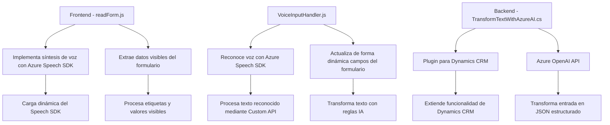

### Resumen Técnico  
El repositorio contiene distintos archivos diseñados para trabajar con formularios en entornos web y Microsoft Dynamics CRM, incorporando capacidades de reconocimiento y síntesis de voz mediante Azure Speech SDK, y utilizando Azure OpenAI para procesamiento avanzado de texto.  

---

### Descripción de Arquitectura  
La arquitectura utilizada es claramente **n-capas**, aunque muestra características de integración externa con servicios basados en la nube. Hay una fuerte separación entre las tareas realizadas por el frontend (interacciones con el usuario y ejecución de lógica de procesamiento) y el backend (procesamiento avanzado y plugins para Dynamics CRM).  
- La capa de presentación está formada por distintos archivos frontend diseñados para trabajar con formularios web.  
- La capa de negocio está representada por el plugin en Dynamics CRM que procesa texto utilizando la OpenAI API.  
- La capa de integración permite la conexión con servicios externos como Azure Speech SDK y OpenAI.  

---

### Tecnologías Usadas  
1. **Lenguajes:**  
   - **JavaScript:** Para interacción en frontend, manejo del DOM y SDKs externos.  
   - **C#:** Para plugins y extensiones de Dynamics CRM.  

2. **Frameworks/SDKs:**  
   - **Azure Speech SDK:** Reconocimiento y síntesis de voz.  
   - **Azure OpenAI API:** Procesamiento avanzado de texto.  
   - **Microsoft Dynamics CRM SDK:** Extensiones para la plataforma Dynamics CRM.  

3. **Patrones Arquitectónicos:**  
   - **MVC Implícito:** La lógica representa una división entre vista (formularios), modelo (datos procesados) y controlador (actualización dinámica del formulario).  
   - **Callback Delegate:** En la carga dinámica del Azure Speech SDK.  
   - **Orientación a Servicios:** Integración con APIs externas como Speech SDK y OpenAI API.  
   - **Plugin para CRM:** Extensión mediante la implementación de `IPlugin` en Dynamics.  

---

### Dependencias o Componentes Externos  
1. **Dependencias Frontend:**  
   - **Azure Speech SDK**: Importado dinámicamente mediante scripts.  
   - **Contexto de formularios (executionContext)**: Dependencia interna para la manipulación del formulario en CRM.  

2. **Dependencias Backend:**  
   - **System.Net.Http:** Para solicitudes a Azure OpenAI API.  
   - **Microsoft Dynamics CRM SDK:** Para manejar extensiones específicas en el sistema Dynamics CRM.  
   - **Azure OpenAI API:** Integra procesamiento avanzado de texto.  

---

### Mermaid Diagram  

---

### Conclusión Final  
El repositorio representa una solución híbrida **n-capas** que integra funcionalidades de frontend y backend para trabajar con formularios en Microsoft Dynamics CRM, aprovechando el reconocimiento de voz y procesamiento avanzado de texto. Los archivos frontend están orientados a mejorar la interacción del usuario mediante reconocimiento y síntesis de voz, mientras que los plugins para CRM amplían las capacidades de procesamiento de texto con Azure OpenAI.  

Aunque la arquitectura es funcional y sólida, es importante tener en cuenta mejoras en seguridad, especialmente para el manejo de claves de API, y considerar el uso de técnicas asíncronas en el plugin para evitar problemas de bloqueo en escenarios de alta concurrencia.