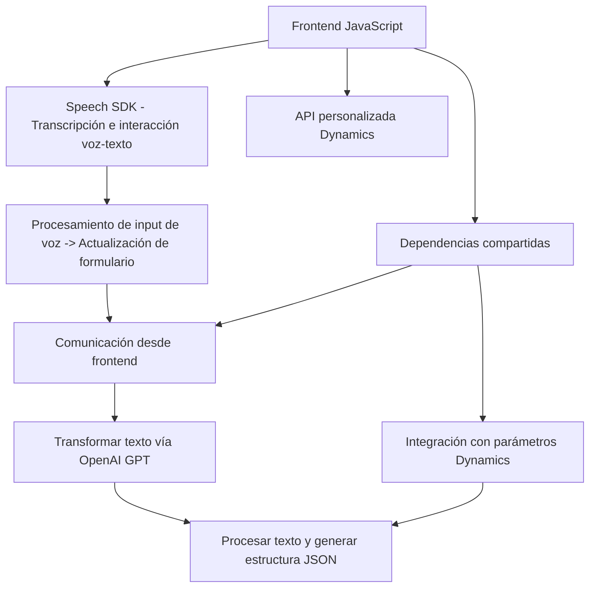

### Análisis técnico del repositorio GitHub

#### Breve resumen técnico
El repositorio contiene archivos que implementan funcionalidades para interacción entre formularios, transcripción de voz y transformación de texto mediante inteligencia artificial. Está claro que la solución se centra en la integración de servicios externos como Azure Speech SDK, Dynamics CRM y Azure OpenAI GPT para agregar capacidades avanzadas (chat, transcripción y procesamiento) en los sistemas relacionados con formularios.

---

### Descripción de arquitectura
1. **Tipo de solución**:  
   - La solución global apunta a una **suite complementaria para Dynamics CRM**, basada en la interacción con formularios donde se permite captura de voz, síntesis de texto a voz y transformación de la información mediante inteligencia artificial. Está orientada a la expansión de funcionalidades del entorno Dynamics CRM.

2. **Tipo de arquitectura**:
   - **Plugins dinámicos (evento-driven)** (en la capa de backend): El archivo `TransformTextWithAzureAI.cs` utiliza un enfoque de extensión basado en eventos de Dynamics CRM para utilizar los servicios de texto predictivo de Azure OpenAI.  
   - **Arquitectura n capas** (frontend): Los scripts en los archivos de JavaScript (`speechForm.js` y `readForm.js`) están estructurados en módulos funcionales que crean una capa independiente para la integración de SDK, logic y APIs personalizadas.  
   - **Integración de servicios externos**: Tanto en frontend como en backend, la arquitectura descansa sobre la dependencia de servicios externos como Azure Speech SDK y Dynamics API.

---

### Tecnologías usadas
1. **Lenguajes**:
   - **JavaScript**: Scripts frontend (`speechForm.js` y `readForm.js`) que integran Azure Speech SDK y funciones para la interacción con formularios en Dynamics CRM.
   - **C#**: Plugin backend (`TransformTextWithAzureAI.cs`) que implementa lógica más robusta utilizando Dynamics SDK y Azure OpenAI GPT.
   
2. **Frameworks y SDKs**:
   - **Azure Speech SDK**: Para transcripción y síntesis de texto a voz en los scripts frontend.
   - **Dynamics 365 SDK**: En el plugin y scripts para interactuar con formularios y entidades.
   - **Newtonsoft.Json** y **System.Text.Json**: Manipulación de objetos JSON en el backend.
   - **Azure OpenAI GPT API**: Punto de integración del plugin para procesamiento avanzado de texto.

3. **Patrones de diseño**:
   - **Carga dinámica**: Los scripts cargan el SDK de Azure directamente desde una URL en tiempo de ejecución (`ensureSpeechSDKLoaded`).
   - **Patrón Repository**: Se utiliza un acceso estructurado a campos y datos de Dynamics CRM.
   - **Principio de responsabilidad única (SRP)**: Cada función maneja una tarea específica, reduciendo el acoplamiento.

---

### Dependencias o componentes externos
1. **SDKs y servicios usados claramente en el código**:
   - **Azure Speech SDK**: Integrado desde `https://aka.ms/csspeech/jsbrowserpackageraw`.
   - **Dynamics 365 Xrm.WebApi**: Para comunicación con las entidades y servicios del ecosistema Dynamics.
   - **Azure OpenAI GPT API**: Utilizada en el backend para transformación avanzada de datos.
   
2. **Potenciales dependencias fuera del código**:
   - **Browser Compatibility**: La solución depende de navegadores capaces de cargar scripts dinámicos y manejar dependencias como Speech SDK.
   - **Hosting de plugins y APIs dinámicas**: Requiere un espacio de ejecución para Dynamics CRM.

---

### Diagrama **Mermaid** compatible con GitHub Markdown

---

### Conclusión final
La solución presentada aprovecha un diseño modular para habilitar una integración avanzada entre transcripciones de voz, interacción con formularios de Dynamics CRM y capacidades de inteligencia artificial basadas en Azure OpenAI. Esto posiciona la arquitectura como una solución de **n capas**, con un backend orientado a eventos (plugins) y un frontend dependiente de SDKs externos dinámicos.

La combinación de estas tecnologías muestra un enfoque hacia la extensibilidad y el uso de herramientas basadas en la nube, lo que facilita la adaptabilidad y la escalabilidad. Sin embargo, la dependencia fuerte en SDKs externos puede ser un problema potencial para la portabilidad.