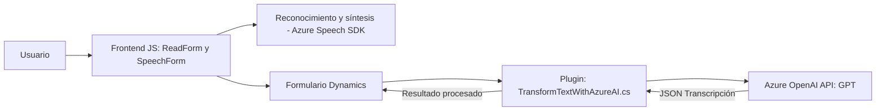

### Breve Resumen Técnico:
El repositorio contiene múltiples archivos relacionados con la implementación de soluciones específicas: utilización del reconocimiento y síntesis de voz usando **Azure Speech SDK**, integración con **Microsoft Dynamics CRM**, y creación de un plugin que extiende las capacidades del sistema CRM mediante la integración con **Azure OpenAI (GPT)**. En conjunto, la solución combina una interfaz de usuario (Frontend/JavaScript), servicios web, y extensiones de Dynamics 365 para procesar datos dinámicamente utilizando API y tecnologías de inteligencia artificial.

---

### Descripción de Arquitectura:
1. **Tipo de solución:**
   - La solución es un híbrido entre:
     - **Frontend**: Interfaz de usuario en JavaScript que interactúa con el usuario.
     - **Microservicio**: Plugin desarrollado en C# que actúa como un servicio de lógica empresarial.
     - **Desarrollo extendido** sobre Dynamics 365.

2. **Arquitectura:**
   - **N-Capas con integración de servicios externos**:
     - **Capa de presentación (Frontend)**: Archivos en JavaScript como `readForm.js` y `speechForm.js` procesan datos y sintetizan voz.
     - **Capa de lógica empresarial (Plugin)**: Implementa reglas de negocio específicas en Dynamics CRM usando el plugin `TransformTextWithAzureAI.cs`.
     - **Capa de integración de servicios externos**: Conectores hacia **Azure Speech SDK** (para síntesis/reconocimiento de voz) y **Azure OpenAI GPT** (para transformación de texto).

3. **Patrones de diseño utilizados:**
   - **Event-driven programming**: El frontend se basa en eventos (SDK cargado, interacción de usuario, transcripción, etc.) para ejecutar procesos.
   - **SDK Integration**: Utilización de SDKs como **Azure Speech SDK** para simplificar funcionalidades avanzadas.
   - **Dependency Injection (DI)**: El plugin utiliza el proveedor de servicios (`IServiceProvider` en Dynamics CRM).
   - **Adapter Pattern**: Funciones como `getReadableValue` adaptan los datos a un formato legible.

4. **Componentes externos presentes:**
   - **Azure Speech SDK**: Reconocimiento y síntesis de voz.
   - **Azure OpenAI Service (GPT)**: Procesamiento de lenguaje natural.
   - **Microsft Dynamics CRM Web API (Xrm)**: Para acceder y modificar datos de formularios con dinámicas del negocio.

---

### Tecnologías Usadas:
- **Principal:**
  - **JavaScript (Frontend)**: Lógica en el cliente, manipulación del DOM y comunicación con SDK/API.
  - **C# .NET Framework**: Desarrollo del plugin.
- **Frameworks / SDK:**
  - **Azure Speech SDK**: Servicios de síntesis y reconocimiento de voz con integración dinámica vía browser.
  - **Azure OpenAI API**: Implementación de NLP (procesamiento de lenguaje natural) utilizando GPT.
- **Plataforma:**
  - **Microsoft Dynamics CRM & Web API**: Interacción con formularios y datos.
- **Adicional:**
  - **Newtonsoft.Json** para análisis/conversión JSON en el plugin.

---

### Diagrama Mermaid:

Diagrama que muestra cómo las diferentes capas se comunican y cómo las bibliotecas y servicios externos están integrados:

---

### Conclusión Final:
La solución presentada es un sistema integrado que combina tecnologías frontend, backend, y de servicios externos para ofrecer capacidades avanzadas de reconocimiento de voz y procesamiento de texto. Utiliza una arquitectura **N-Capas**, incorporando interacción entre el usuario, formularios de Dynamics CRM, y servicios de Azure (Speech y OpenAI). Es una implementación modular, escalable, extensible, y adaptada para entornos empresariales donde la automatización orientada al usuario es crucial.