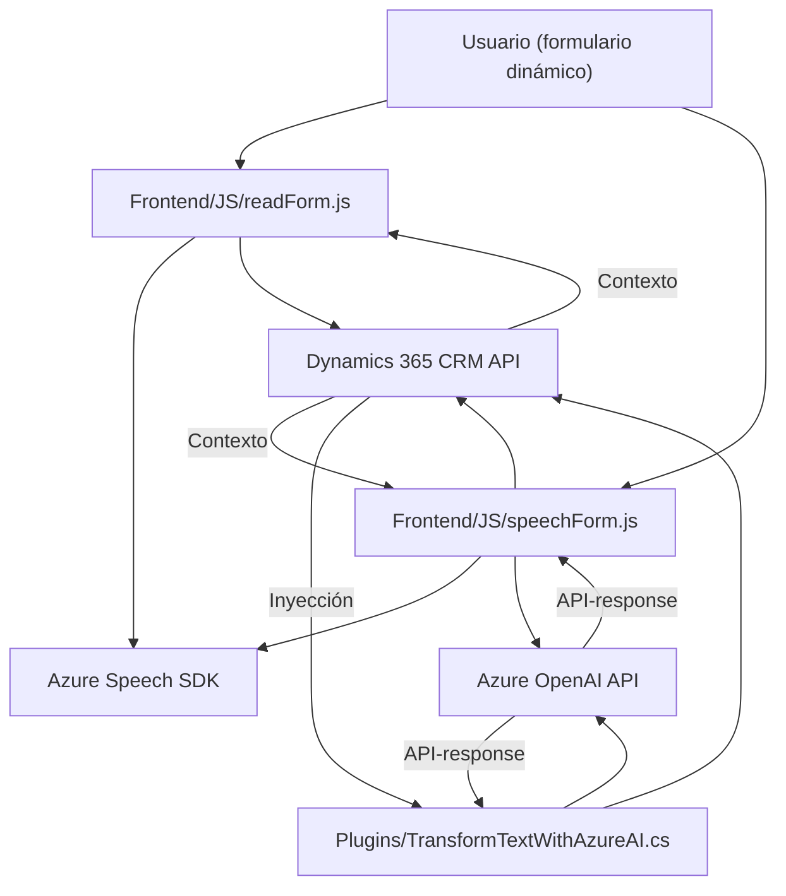

### Breve resumen técnico:
El repositorio maneja funcionalidades centradas en **CRM Dynamics 365** para mejorar la experiencia de usuario mediante **procesamiento de lenguaje natural (NLP)** y **speech-to-text/text-to-speech**. Usa Azure SDKs para interactuar con servicios como OpenAI y Speech, además de implementar plugins y JS para formularios dinámicos.

---

### Descripción de arquitectura:
La solución sigue una arquitectura **modular orientada a servicios (SOA)**, donde cada archivo contribuye a una funcionalidad independiente (entrada de voz, síntesis y conversión de texto, y generación de JSON estructurado). Aunque no es un sistema microservicios completo, varios puntos de interacción con APIs externas (Azure Speech y OpenAI) reflejan características de integración modular.

---

### Tecnologías usadas:
1. **Frontend**:
   - **JavaScript**, con funciones para la interacción del usuario (voz/texto).
   - **Azure Speech SDK** para la síntesis y reconocimiento de voz.
   - **Dynamics CRM APIs** para acceder/modificar datos.
2. **Backend (plugin)**:
   - **C#**, como lenguaje estándar para plugins en Dynamics 365 CRM.
   - **Azure OpenAI API** para NLP y generación de estructuras JSON.
   - **Dynamics CRM SDK** para acceder al contexto del formulario.
   - **Newtonsoft.Json** para manejar JSON.
   - **System.Net.Http** para comunicación HTTP.

---

### Diagrama Mermaid válido para GitHub:

---

### Conclusión final:
La solución se enfoca en integrar procesamiento y síntesis de lenguaje natural con Azure SDKs dentro de Dynamics CRM. Aunque utiliza servicios externos y sigue una arquitectura modularizada, no cumple todas las características de microservicios, sino que está más cerca de un **monolito desacoplado** con interacciones externas. Las dependencias clave son Azure Speech, Dynamics CRM API y Azure OpenAI API, que son manejadas mediante patrones de modularización y encapsulamiento.

Además, mejora la experiencia del usuario al automatizar interacciones de voz y texto, con áreas potenciales de mejora en la seguridad (manejo de claves), limpieza de redundancias y uso de estándares modernos para administración de plugins.