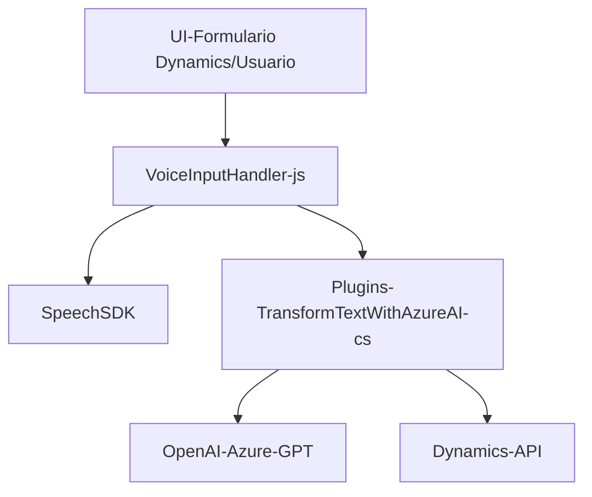

### Breve resumen técnico

El repositorio presenta tres archivos principales que interactúan con un formulario web en Dynamics 365 utilizando el **Azure Speech SDK** para síntesis y transcripción de voz, junto con un plugin para transformación de texto en JSON mediante **Azure OpenAI**. El código sigue el patrón de arquitectura **modular** y hace uso de SDKs y servicios externos como **Azure Speech SDK** para la síntesis de voz y reconocimiento de voz, así como **Azure OpenAI** para la creación de objetos JSON estructurados siguiendo una estrategia de procesamiento basada en reglas o IA.

---

### Descripción de arquitectura

La solución parece ser un **integrador** de servicios y un complemento para Dynamics 365. Consta de módulos bien definidos que se encargan de funciones específicas:

1. **Frontend/Client-side**:
   - Gestiona la interacción con el usuario (captura de dictados, lectura y síntesis de formularios hablados).
   - Utiliza el SDK de Azure Speech para implementar síntesis y reconocimiento de voz, complementado con Dynamics 365.

2. **Backend-side (Dynamics Plugin)**:
   - Implementa plugins de Dynamics CRM usando la interfaz `IPlugin` y servicios de OpenAI.
   - Realiza transformaciones avanzadas de texto hablado y escrito en objetos JSON estructurados para interactuar con formularios de Dynamics 365.

Aunque los archivos utilizan distintas responsabilidades (Frontend vs Backend), la arquitectura sigue el modelo de **n Capas**:

1. **Capa de Presentación**: Archivos en `FRONTEND/JS` interactúan con usuarios mediante formularios (Dynamics 365 frontend).
2. **Capa de Aplicación**: Lógica de interacción con el SDK de Azure Speech y transcripción/transformación de texto.
3. **Capa de Servicios**: Integración con servicios externos (Azure Speech SDK y Azure OpenAI).
4. **Capa de Datos**: Utilización de API y modelos internos de Dynamics 365 para almacenar y procesar datos.

Además, el código muestra elementos de **arquitectura hexagonal**, donde los servicios externos son adaptados mediante "puertos y adaptadores" para interactuar con el dominio específico.

---

### Tecnologías utilizadas

1. **Lenguajes y frameworks**:
   - Frontend: **JavaScript** (uso estándar para lógica client-side, DOM manipulation).
   - Backend: **C# .NET Framework** (para la implementación del plugin en Dynamics CRM).

2. **Dependencias**:
   - **Azure Speech SDK**
   - **Azure OpenAI API** (GPT-based models)
   - Dynamics CRM Web API

3. **Patrones usados**:
   - **Modularización funcional**: Cada archivo estructura la lógica en funciones para claridad y reutilización.
   - **Event-driven architecture**: Funciones de frontend se disparan por eventos del frontend y el contexto del formulario.
   - **Plugin-based development**: El archivo backend sigue el patrón de arquitectura de Plugins para Dynamics CRM.
   - **Third-party SDK integration**: Uso del Azure Speech SDK y OpenAI como servicios externos.
   - **Strategy pattern**: Alterna entre reglas estáticas y procesamiento IA para transformar texto y aplicar datos en formularios.

---

### Diagrama **Mermaid**

### Conclusión final

La solución presentada es un sistema integrador con foco en la interacción de aplicaciones de voz, texto y la inteligencia artificial aplicada al procesamiento de lenguaje natural. Conceptualmente puede considerarse como una arquitectura híbrida: combina **n Capas** con elementos de **arquitectura hexagonal** y **event-driven programming**. Hace un muy buen uso de tecnologías modernas, como Azure Speech SDK y OpenAI para resolver casos de negocio avanzados, especialmente orientados a la mejora de la accesibilidad y de los flujos de trabajo en plataformas CRM como Dynamics 365.

Recomendaciones de mejora:
- Considerar la externalización de configuraciones sensibles (ejemplo: API keys) mediante **Key Vaults** o configuraciones seguras.
- Agregar manejo robusto de excepciones para garantizar que errores en los servicios externos no impacten la aplicación.
- Evaluar un patrón más consistente (por ejemplo, **adapter**) para el tratamiento uniforme de dependencias externas como Azure Speech SDK y OpenAI.