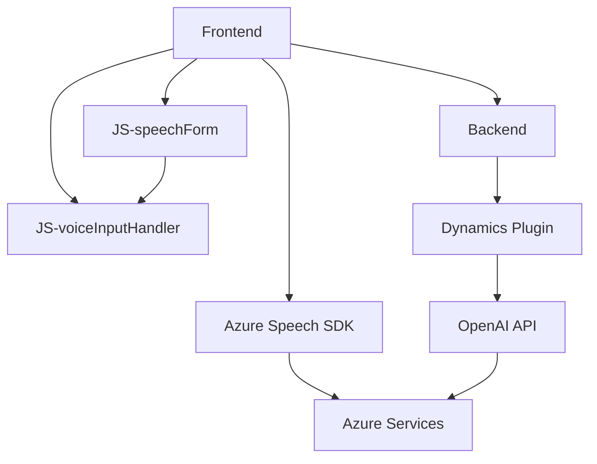

### Breve resumen técnico

El repositorio define una solución que integra múltiples tecnologías como **Microsoft Dynamics CRM**, **Azure Speech SDK**, y **Azure OpenAI**. Los objetivos principales son:

1. **Entrada**: Captura de datos de formularios mediante entrada de texto y voz.
2. **Transformación**: Conexión con APIs externas (Azure Speech SDK y Azure OpenAI) para transcribir voz y generar resultados estructurados.
3. **Output**: Asociación de entradas procesadas con campos en los módulos o entidades del sistema Dynamics CRM mediante *plugins* y mapeo de datos.

---

### Descripción de arquitectura

El diseño arquitectónico es esencialmente una combinación de dos enfoques:

- **Arquitectura en capas (n-tier)**: La solución se organiza en **capa de presentación (Frontend)** y **capa de lógica de negocio (Plugins)**. Los módulos de funciones están estructurados en diferentes directorios para definir responsabilidades claras.
- **Integración con servicios externos**: Utiliza Azure Speech SDK en el frontend para reconocimiento de voz y Azure OpenAI a través de plugins en Dynamics CRM para transformación avanzada de texto.

### Tecnologías usadas

1. **Frontend**:
   - JavaScript: Funciones para extraer datos de formularios y usar el SDK.
   - Framework externo: Azure Speech SDK.
   - Promises y funciones asíncronas para manejar solicitudes.
2. **Backend plugin**:
   - C#: Desarrollo de plugins en Dynamics CRM.
   - Azure OpenAI API: Transformación de texto en JSON estructurado.
   - HTTP Client para comunicación con endpoints externos.
   - Serialización/deserialización con *System.Text.Json* y *Newtonsoft.Json*.
3. **External Integration**:
   - Azure services: Speech SDK y OpenAI GPT-model integrations.
   - Dynamics CRM SDK API.

### Diagrama Mermaid 100 % compatible

---

### Conclusión final

1. **Tipo de solución**: La solución se clasifica como una integración de tecnologías diversas, combinando un **frontend** con funcionalidades avanzadas (extracción de datos y generación de voz) que se comunica directamente con una **backend plugin** diseñado para trabajar en plataforma Dynamics CRM.
   
2. **Patrones y arquitectura**: La solución sigue principios de **modularidad** y responsabilidad única. Utiliza una arquitectura en capas (n-tier) para dividir las responsabilidades del frontend y backend. Además, utiliza APIs y SDK externos para implementar el reconocimiento de voz y generación de JSON.

3. **Componentes externos**: Las integraciones con **Azure Speech SDK** y **Azure OpenAI API** permiten implementar capacidades avanzadas de inteligencia artificial que serían complicadas de desarrollar desde cero. También utiliza herramientas nativas de Dynamics CRM, como el servicio `Xrm.WebApi.online.execute`.

En general, se trata de una solución bien segmentada, centrada en extender las funcionalidades de Dynamics CRM con capacidades de AI y voz, lo que permite la entrada y transformación de datos de manera eficiente.