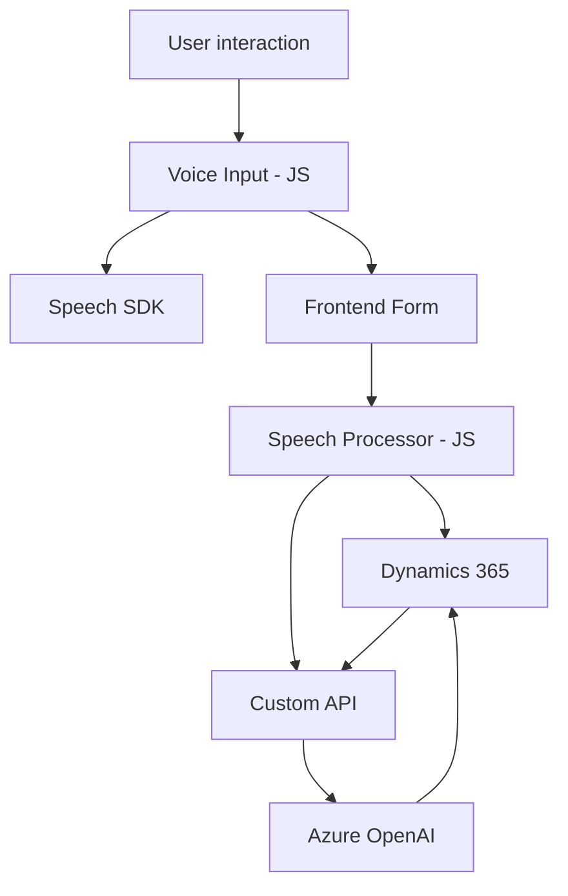

### Breve Resumen Técnico
Este repositorio se centra en el desarrollo de soluciones integradas para Microsoft Dynamics 365. Utiliza tecnologías de entrada de voz, síntesis de texto a voz (TTS) y transcripción de voz en texto mediante el uso del Azure Speech SDK y el servicio Azure OpenAI. Se organiza en diferentes niveles, desde funciones asociadas al frontend hasta plugins para interacción avanzada con Dynamics CRM.

---

### Descripción de Arquitectura
La arquitectura general combina los siguientes elementos:
1. **Modularidad:** Tanto el frontend como los plugins están diseñados con funciones especializadas y componentes modulares.
2. **Customer Relationship Management (CRM):** Extensas dependencias e integración con el ecosistema de Microsoft Dynamics 365.
3. **Distribución basada en servicios externos:** Comunicación con el Azure Speech SDK y el servicio Azure OpenAI.
4. **Event-driven Architecture:** En el frontend predominan callbacks para manejar eventos como transcripciones en tiempo real o actualizaciones de formularios.
5. **Plugin Architecture:** En la capa backend utiliza patrones estándar para plugin de Dynamics CRM.

La arquitectura general podría clasificarse como un **Monolito de N Capas**, integrada con servicios distribuidos (Azure).

---

### Tecnologías Usadas
**Frontend:**
- **JavaScript:** Lenguaje principal para toda la lógica de procesamiento de datos del formulario y llamadas a APIs.
- **Azure Speech SDK:** Para síntesis de voz y transcripción de voz.
- **Dynamics 365 Web APIs:** Para la actualización dinámica de datos.
- **HTML/DOM:** Manipulación de formularios y sus atributos.

**Backend:**
- **Microsoft Dynamics SDK (`IPlugin`)**: Para plugins personalizados.
- **Azure OpenAI:** Consume APIs externas para la transformación basada en IA.
- **HTTP (System.Net.Http):** Para realizar solicitudes.
- **JSON Manipulation (Newtonsoft.Json):** Procesamiento estructurado de datos.

---

### Diagramación Mermaid

---

### Conclusión Final
El repositorio sigue un enfoque modular con integración directa con Azure Speech SDK y Dynamics CRM. El frontend utiliza patrones funcionales en JavaScript para manipular formularios e integrar capacidades de texto a voz y transcripción de voz. Por otro lado, los plugins backend amplían la funcionalidad de Dynamics CRM mediante Azure OpenAI. La arquitectura está compuesta por capas distribuidas, pero debido a la fuerte dependencia de Dynamics, podría interpretarse como **monolítica en términos organizacionales**, con algunos elementos distribuidos para procesar tareas específicas.