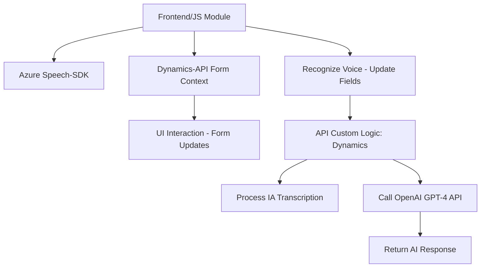

### Breve Resumen Técnico
Este proyecto consta de tres módulos principales que integran lógica para reconocimiento de voz, síntesis de voz, y transformación de texto mediante inteligencia artificial. Se diseñó para interactuar con Dynamics 365, aprovechando tanto las APIs nativas de Dynamics como servicios de Azure como **Speech SDK** y **OpenAI GPT-4**. Los módulos siguen principios de modularidad y desacoplamiento para optimizar la interacción con formularios y datos dentro de dicha plataforma.

---

### Descripción de Arquitectura
La aplicación sigue una **arquitectura modular** basada en una mezcla de patrones **n-capas** y servicios externos que colaboran para proporcionar las funcionalidades deseadas. Los diferentes componentes (frontend, backend, plugins) están organizados como unidades desacopladas que interactúan mediante APIs y eventos.

Los principales roles en la arquitectura incluyen:
- **Frontend/JS:** Manejo de UI basada en formularios con interacción por voz, que utiliza patrones de modularidad y delegación para una lógica eficiente.
- **Dynamics Plugins:** Backend asociado al modelo de datos de Dynamics 365, implementando lógica personalizada mediante la interfaz `IPlugin`.
- **Azure Services:** Actualización dinámica de formularios y procesamiento enriquecido de texto con Speech SDK y GPT-4 a través de integraciones HTTP.

Aunque los módulos están conectados, no se observa una arquitectura completa de **microservicios**, sino más bien una composición monolítica avanzada con servicios externos.

---

### Tecnologías Usadas
1. **Frontend**:
   - **JavaScript**: Para modularidad y lógica dinámica.
   - **Azure Speech SDK**: Interacción con servicios de síntesis y reconocimiento de voz.
   - **Dynamics API (Xrm)**: Manipulación de formularios y datos.

2. **Backend**:
   - **C#**: Desarrollo del plugin que integra OpenAI con Dynamics 365.
   - **Microsoft Dynamics Plugin SDK**: Para interacción con datos y estructura interna.
   - **HTTP Client Libraries**: Para invocación de API externa.
   - **Newtonsoft.Json y System.Text.Json**: Procesamiento de datos JSON.

3. **Servicios Externos**:
   - **Azure OpenAI GPT-4**: Procesamiento avanzado de texto.
   - **Azure Speech Services**: Síntesis y reconocimiento de voz.

---

### Diagrama Mermaid

---

### Conclusión Final
Este repositorio compone una solución integrada enfocada en mejorar la **experiencia de usuario mediante herramientas de IA** y una sólida integración entre servicios **Azure** y **Microsoft Dynamics 365**. Si bien cada componente se encuentra bien definido, la arquitectura general se asemeja más a un monolito moderno con una delegación en **servicios externos** para expandir su funcionalidad. Esto hace la solución adecuada para entornos empresariales que usan Dynamics, pero no está optimizada para escenarios de infraestructura altamente distribuida como los microservicios.