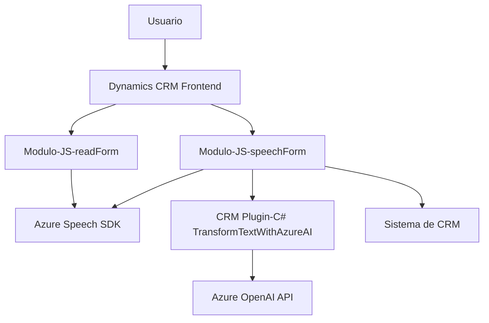

### Breve resumen técnico:
El conjunto del repositorio describe un sistema que utiliza input y output de voz mediante el **Azure Speech SDK** y emplea un plugin basado en **C# para Dynamics CRM**. La solución está diseñada para interactuar con un sistema CRM (Dynamics 365) y utiliza integraciones con servicios de inteligencia artificial como **Azure OpenAI API** para transformación de texto.

---

### Descripción de la arquitectura:
La arquitectura de este sistema sigue un patrón **cliente-servidor** y exhibe características de una arquitectura **n-capas**. Está compuesto de dos lados funcionales principales:
1. **Front-end** basado en archivos JavaScript que proveen entrada/salida de voz a través de la SDK de Azure Speech, para interactuar con formularios.
2. **Back-end** con una implementación de plugin en C# que interactúa con el contexto del CRM y realiza procesamiento avanzado utilizando Azure OpenAI API.

El frontend interactúa directamente con el servicio de entrada/salida de voz (SDK de Azure), mientras que el backend en C# implementa una lógica intensiva con el modelo de lenguaje GPT-4 para transformar datos de texto. Se detectan patrones como **event-driven programming**, **modularización** y un diseño basado en la integración de servicios externos.

---

### Tecnologías usadas:
1. **Frontend:**
   - Lenguaje: JavaScript.
   - Dependencias:
     - Azure Speech SDK (integración vía CDN).
     - Dynamics CRM context, representado por objetos como `executionContext`.
     - Document Object Model (DOM) para manejar formularios y eventos.

2. **Backend Plugin (Dynamics CRM):**
   - Lenguaje: C#.
   - Frameworks/Librerías:
     - **Microsoft.Xrm.Sdk**: Para interacción con Dynamics CRM.
     - **System.Net.Http** y **System.Text.Json**: Para manejar la conexión con Azure OpenAI API y procesar respuestas.
   - Servicios externos:
     - **Azure OpenAI API**: Modelos GPT-4 para procesamiento de texto.
     - **Azure Speech SDK**: Entrada y salida de voz.

---

### Diagrama Mermaid:

---

### Conclusión final:
Este repositorio claramente corresponde a una solución **híbrida** basada en una arquitectura **n-capas** que integra componentes frontend (JavaScript) y backend (C# Plugin). Además, utiliza complementos de inteligencia artificial y reconocimiento de voz de servicios externos como **Azure Speech SDK** y **Azure OpenAI**. La solución también aprovecha APIs y contexto del sistema CRM Dynamics 365.

Puntos destacados:
- **Ventajas:** Modularización, integración con servicios avanzados como Azure Speech y OpenAI que posibilitan una interfaz por voz.
- **Desafíos:** Seguridad mejorable en la gestión de claves API. También sería ideal implementar abstracciones en el manejo HTTP para facilitar las pruebas unitarias del plugin.

Se sugiere mantener un archivo de configuración seguro para credenciales, evaluar la dependencia del SDK de Azure Speech, y utilizar un sistema de inyección de dependencias para mejorar la testabilidad del plugin.