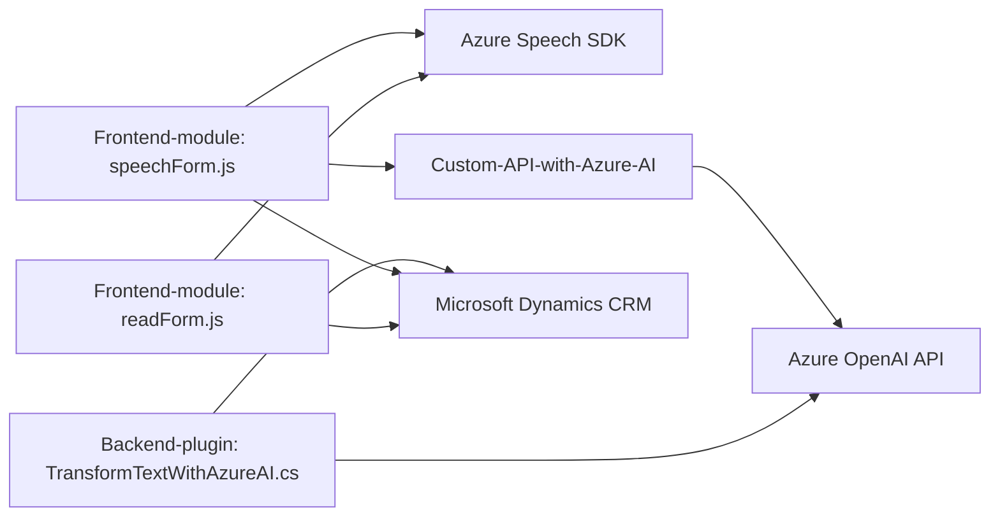

### Resumen técnico
El repositorio contiene múltiples módulos que se integran en una solución con funcionalidades de entrada y salida de voz mediante Azure Speech SDK, procesamiento de transcripciones por IA y plugins relacionados con Microsoft Dynamics CRM. Está diseñado para mejorar la interacción con formularios dinámicos, integrándose con servicios externos de Azure y APIs personalizadas.

---

### Descripción de arquitectura
La solución está organizada en módulos que implementan una arquitectura de **n capas con microservicios**, debido a la integración de varias capas funcionales (frontend y backend) y la comunicación con APIs externas. La lógica de cliente y servidor está claramente separada, y se utiliza el **patrón de plugin** para extender las capacidades de Dynamics CRM. Además, se observa un esquema basado en eventos para la interacción entre los componentes.

1. **Nivel de presentación (Frontend):**
   - Implementado en JavaScript.
   - Inicia interacciones con usuarios y servicios externos mediante Azure Speech SDK.
   - Realiza procesamientos en tiempo de ejecución y envía las transcripciones al backend para su transformación por IA.
   
2. **Nivel de lógica de negocio:**
   - Implementado como un plugin (archivo `.cs`) en Microsoft Dynamics CRM.
   - Ejecuta la lógica para interactuar con la API de OpenAI de Azure y procesar las respuestas.
   
3. **Servicios externos (microservicios):**
   - Uso extensivo de Azure Speech SDK y Azure OpenAI API.
   - Llamadas desde los módulos de frontend y backend hacia APIs externas.

4. **Base de datos:**
   - Uso nativo de Microsoft Dynamics CRM SDK para gestionar el modelo de datos.

---

### Tecnologías usadas
1. **Frontend:**
   - JavaScript: Lógica de entrada y síntesis de voz.
   - Azure Cognitive Services Speech SDK: Reconocimiento de voz y síntesis.
   - REST API: Para la integración con el backend y servicios externos.
   
2. **Backend:**
   - Microsoft Dynamics CRM SDK: Extensiones de CRM mediante plugin.
   - **C# y .NET Framework**: Desarrollo del plugin para Dynamics.
   - Azure OpenAI API: Procesamiento de texto con IA.
   - `Newtonsoft.Json`, `System.Text.Json`: Manejo de JSON.
   - `System.Net.Http`: Llamadas HTTP al servicio de Azure OpenAI.

---

### Dependencias o componentes externos
1. Azure Speech SDK: Para la interacción con Voice-to-Text y Text-to-Speech.
2. Azure OpenAI API: Para transformar transcripciones en estructuras JSON.
3. Microsoft Dynamics CRM SDK: Extensiones del sistema CRM.
4. RESTful APIs: Para integración con servicios personalizados adicionales.
5. Bibliotecas como `Newtonsoft.Json.Linq` y `System.Text.Json` para el manejo de datos en formato JSON.
6. Dependencias estándar de .NET como `System.Net.Http` para consumir APIs externas.

---

### Diagrama **Mermaid** válido para GitHub

---

### Conclusión final
El repositorio corresponde a una solución integral que utiliza múltiples tecnologías de Microsoft y terceros para proporcionar interacción avanzada mediante voz y procesamiento de texto con inteligencia artificial en los formularios de Dynamics CRM. La arquitectura es una combinación de n capas y microservicios debido al uso de diferentes módulos para frontend y backend, cada uno integrado con diferentes APIs de Azure. La modularidad y el uso de servicios hacen que este sistema sea escalable y extensible. Es ideal para casos de accesibilidad y mejora de la experiencia del usuario por medio de voz e IA.