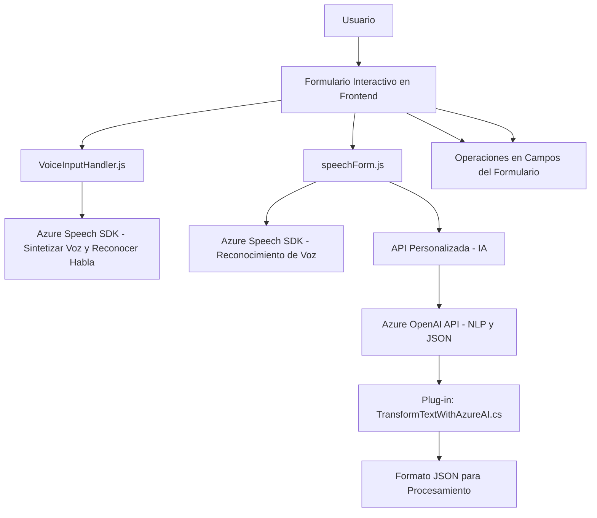

# Análisis Técnico Completo del Repositorio GitHub

## Breve Resumen Técnico
El repositorio define funcionalidades relacionadas con procesamiento de formularios interactivos y reconocimiento de voz, integrándolos con el servicio **Azure Speech SDK** y un **plugin de Dynamics CRM** basado en **Azure OpenAI**. La solución parece orientada a una arquitectura integrada en un sistema más amplio como un CRM, que utiliza capacidades de análisis de texto, síntesis de voz, y reconocimiento de comandos hablados.

---

## Descripción de la Arquitectura
La arquitectura se puede describir como **modular** y de estilo **n capas**, donde cada capa gestiona un aspecto distinto del sistema:
1. **Frontend (JavaScript)**: Responsable de la interacción con el usuario, específicamente para el manejo de formularios con actividades de reconocimiento de voz y sintetización de texto a voz.
2. **Backend (Plug-In)**: Implementado mediante la interfaz de mecanismos plug-in de Dynamics CRM, encargado de realizar la lógica de integración con la API de **Azure OpenAI**.
3. **Servicios Externos**:
   - **Azure Speech SDK** para reconocimiento y síntesis de voz.
   - **Azure OpenAI API** para procesamiento avanzado de lenguaje natural (NLP).

Habitualmente, este tipo de solución sería utilizada como una extensión dentro de sistemas CRM como Dynamics, donde el intercambio de datos y la división del manejo lógico y la interfaz juegan un rol prominente.

---

## Tecnologías Usadas
### Tecnologías y Frameworks Detectados
1. **Frontend (JavaScript)**:
   - **Azure Speech SDK**: Para operaciones de texto a voz y reconocimiento de voz.
   - **Microsoft Xrm.WebApi**: Usado para integración directa con formularios de Dynamics CRM.
   - JavaScript, sin uso de frameworks avanzados SPA como React, Vue o Angular.

2. **Backend/Plugin (.NET)**:
   - **Microsoft Dynamics SDK**:
     - Uso de la interfaz `IPlugin` para lógica extendida en eventos del CRM.
   - Dependency Injection mediante `IServiceProvider`.
   - Serialización/Deserialización de JSON.
   - Conexiones HTTP para interactuar con el servicio de Azure OpenAI.

### Patrones Detectados
1. **Integración de servicios externos** (Azure Speech y OpenAI).
2. **Event-driven architecture** en la gestión de voz mediante callbacks.
3. **Procedural/Modular Programming** en los archivos JavaScript, donde funciones encapsulan tareas claramente relacionadas.
4. **Facade Pattern** en el plugin, simplificando la interacción entre Dynamics y Azure OpenAI.

---

## Dependencias o Componentes Externos
1. **Azure Speech SDK**: Para convertir texto a comandos de audio y realizar reconocimiento de voz.
2. **Azure OpenAI API**: Procesa lenguaje natural vía GPT-4, estructurando los datos en JSON según reglas definidas en el código.
3. **Microsoft Dynamics SDK**: Extiende el comportamiento del CRM mediante el modelo de plug-ins para lógica personalizada.
4. **Xrm.WebApi**: Manejo de formularios en entorno Dynamics CRM, tanto para lectura como para escritura de datos.
5. **Librerías JSON**:
   - `Newtonsoft.Json` para manipulación avanzada de estructuras JSON.
   - `System.Text.Json` para operaciones estándar con JSON en el backend.
6. **HTTP Client** integrado en .NET para consumir APIs.

---

## Diagrama Mermaid 100 % Compatible con GitHub Markdown

---

## Conclusión Final
La solución está diseñada como una extensión funcional para un CRM (probablemente **Microsoft Dynamics CRM**) que explora capacidades de voz mediante **Azure Speech SDK** y de inteligencia artificial vía **Azure OpenAI**. Este enfoque modular y basado en n capas garantiza que las funcionalidades de entrada por voz, integración con IA y procesos de formulario permanezcan separadas, promoviendo la escalabilidad y facilidad de mantenimiento.

Algunos puntos finales a considerar:
1. **Refactorización del Frontend** mediante un patrón MVC o MVVM podría mejorar la legibilidad y testabilidad de los componentes de JavaScript.
2. **Seguridad del Backend (Plug-in)** debe ser revisada para manejar las credenciales de API (ejemplo: Azure AI) de forma segura, evitando exponerlas directamente en el código.
3. Considerar utilizar un sistema más avanzado de registro de actividades para mejorar el diagnóstico de errores en ambos módulos (Frontend y Backend).

Esta solución combina tecnologías modernas y lenguajes robustos para cumplir con casos de uso específicos como interacción por voz y automatización en entornos de CRM.