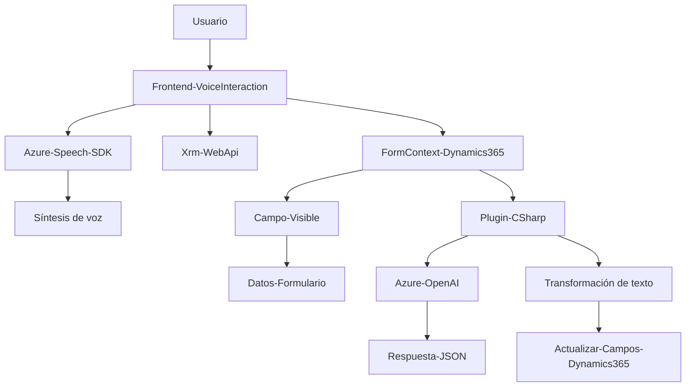

### Análisis y Explicación:

#### **Breve resumen técnico**
El repositorio parece estar enfocado en la implementación de un sistema que permite la interacción entre un usuario y sistemas de gestión empresarial (Dynamics 365) utilizando reconocimiento de voz y tecnologías de inteligencia artificial de Azure. Se compone de un frontend basado en JavaScript para recoger y procesar datos y un backend definido como un plugin en C# para integrarse con Dynamics CRM, procesar texto, y utilizar la API de Azure OpenAI para transformación avanzada.

---

### **Descripción de arquitectura**
La solución sigue una arquitectura tipo **de capas (n-capas)**:
1. **Frontend (UI Layer)**: Implementado en JavaScript, proporciona la interfaz de usuario y las interacciones de voz mediante Azure Speech SDK.
2. **Backend (Application Layer)**: Plugin en C# que interactúa con Dynamics CRM y realiza procesamiento de datos con Azure OpenAI.
3. **Servicios Externos**: Interacción con APIs externas como Azure Speech SDK y Azure OpenAI, aplicando los principios de integración basada en servicios.

Adicionalmente, podría integrarse con una arquitectura híbrida al seguir aspectos de arquitectura orientada a eventos, facilitando la interacción basada en voz o procesamiento de datos cuando se dispara una acción.

---

### **Tecnologías y frameworks utilizados**
1. **Frontend**:
   - **JavaScript**: Funciones modulares para voz y transcripción.
   - **Azure Speech SDK**: Reconocimiento y síntesis de voz.
   - **Dynamics 365 SDK (Xrm)**: Para manipular datos de formularios en Dynamics CRM.

2. **Backend**:
   - **C#**: Lógica del plugin.
   - **Microsoft Dynamics CRM SDK**: Integración directa con CRM.
   - **Azure OpenAI**: Procesamiento de texto y manejo de IA.

3. **Patrones de diseño**:
   - **Modularización Funcional**: Diseño basado en funciones independientes.
   - **Event-Driven**: Uso de eventos del contexto de formulario y captura de voz como desencadenantes.
   - **Integración con APIs externas**: Comunicación con Azure Speech y OpenAI para servicios especializados.
   - **Factory Pattern**: Uso de IServiceProvider en el plugin para obtener dependencias.

---

### **Dependencias o componentes externos**
1. **Azure Speech SDK**: En el frontend, para síntesis de voz y reconocimiento en tiempo real.
2. **Azure OpenAI API**: Para procesamiento avanzado de texto en el plugin backend.
3. **Microsoft Dynamics CRM SDK**: Dependencia obligatoria para integrar las funcionalidades como plugins.
4. **Newtonsoft.Json**: Biblioteca para el manejo estructurado de JSON en C#.
5. **Xrm.WebApi**: Para operaciones de búsqueda, actualización y carga dinámica de scripts en Dynamics.

---

### **Diagrama Mermaid**
A continuación, se presenta un diagrama que representa la arquitectura:

---

### **Conclusión final**
La solución combina componentes de frontend y backend para integrar reconocimiento de voz, inteligencia artificial y manipulación de datos en Dynamics CRM. Está bien estructurada en capas y utiliza tecnologías modernas como Azure Speech y OpenAI para ofrecer funcionalidad avanzada. Sin embargo, su correcta operación depende significativamente del contexto de Dynamics y servicios externos de Azure, lo cual requiere configuraciones robustas y mantenimiento constante.