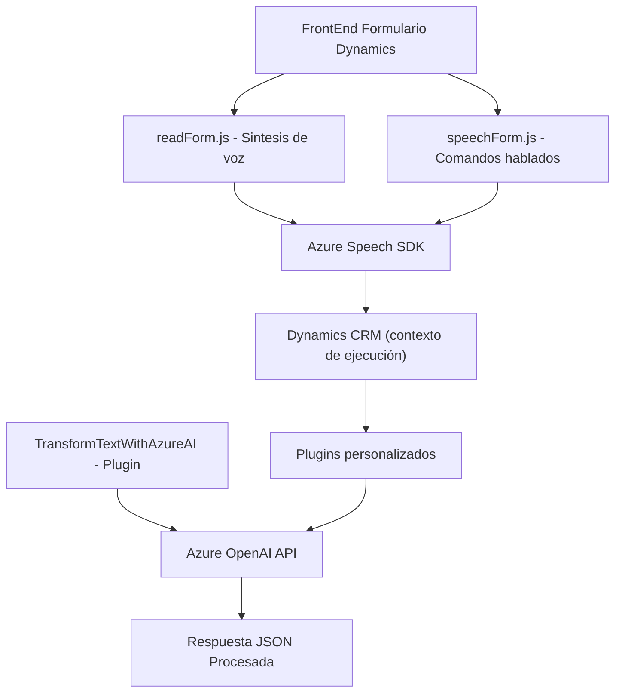

### Breve resumen técnico:
El repositorio contiene tres archivos principales:  
1. **`readForm.js`** y **`speechForm.js`**: Scripts JavaScript orientados al frontend que encapsulan la integración de **Azure Speech SDK** para síntesis y reconocimiento de voz, y su interacción con formularios Dynamics CRM.  
2. **`TransformTextWithAzureAI.cs`**: Un plugin desarrollado en C# para Dynamics CRM, configurado para interactuar con **Azure OpenAI API**, transformando texto según reglas específicas.

El repositorio define una solución que combina frontend dinámico con backend en Dynamics CRM, utilizando servicios externos ofrecidos por Azure.

### Descripción de arquitectura:
La arquitectura del repositorio sigue un modelo **n-capas**, dividido funcionalmente en:  
1. **Capa de UI (Frontend)**: Scripts que gestionan la interacción usuario-formulario y voz.  
2. **Capa de lógica server-side (Plugin Dynamics CRM)**: Extensiones y lógica definida mediante un plugin en C#, usando **Microsoft Dynamics SDK**.  
3. **Capa de integración externa**: Servicios externos como Azure OpenAI y Azure Speech SDK.

Adicionalmente, hay un uso claro del patrón **Event-Driven** para acciones como reconocimiento de voz, procesamiento de texto y carga de librerías dinámicas.

### Tecnologías usadas:
1. **Frontend**:  
   - **Azure Speech SDK**: Para síntesis y reconocimiento de voz.  
   - **JavaScript**: Lógica de interacción con formularios y API.  
   - **Dynamics 365**: Interacción con el sistema de formularios.  

2. **Backend (Plugin)**:  
   - **C#** (Framework .NET): Desarrollo del plugin en Dynamics CRM.  
   - **Microsoft Dynamics SDK**: Contexto de ejecución y comunicación con el sistema CRM.  
   - **Azure OpenAI Service**: Para transformar texto.  
   - **Newtonsoft.Json** y **System.Text.Json**: Manejo de formato JSON.  
   - **System.Net.Http** para consumo de servicios API.

### Dependencias o componentes externos:
1. **Azure Speech SDK**: Para funcionalidades de texto a voz y voz a texto.  
2. **Azure OpenAI Service**: Capacidad de procesamiento e inferencia de texto.  
3. **Microsoft Dynamics SDK**: Lógica del backend para la integración con CRM.  
4. **Xrm.WebApi** (usado implícitamente en los scripts frontend): Comunicación directa con Dynamics CRM.  
5. **Plugins personalizados**: Para extender capacidades de Dynamics CRM.

---

### Diagrama Mermaid:

---

### Conclusión final:
El repositorio presenta una solución integrada que combina frontend dinámico con procesamiento backend en Dynamics CRM. La arquitectura utiliza **Azure Speech SDK** para gestionar síntesis y reconocimiento de voz, mientras que la lógica extendida del CRM se apoya en un plugin desarrollado en C# para interactuar con **Azure OpenAI API**. Aunque funcional y modular, podría beneficiarse de refactorizaciones en su seguridad (gestión de credenciales) y manejo de errores en la comunicación con APIs externas. 

La estructura está claramente orientada a **multi-capas** con un enfoque híbrido que permite tanto interacción dinámica del usuario como extensibilidad del CRM mediante plugins y servicios en la nube.