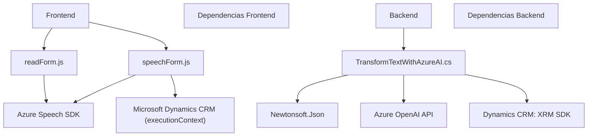

### Breve resumen técnico

El repositorio presentado implementa una solución basada en la interacción entre Microsoft Dynamics 365 y servicios de Azure, integrando principalmente Azure Speech SDK y Azure OpenAI. La solución es una combinación de:
1. **Frontend**: Archivos JavaScript (`readForm.js`, `speechForm.js`) que habilitan la entrada por voz, procesamiento de formularios y actualización dinámica de datos en el contexto del formulario de Dynamics 365.
2. **Backend**: Plugin en C# (`TransformTextWithAzureAI.cs`) que procesa texto recibido y lo transforma invocando Azure OpenAI API.

---

### Descripción de arquitectura

La solución tiene una arquitectura distribuida y se orienta al uso de microservicios que están integrados con aplicaciones de Dynamics 365. Puntos clave de arquitectura y diseño:
1. **Event-driven patterns**: Las interacciones se desencadenan por eventos en los formularios de Dynamics 365 (e.g., interacción por voz, cambio en el estado de los datos).
2. **Integración API basada en servicios externos**:
   - Uso de Azure Speech SDK en el lado del cliente para sintetizar voz y reconocer la entrada por voz.
   - Interacción del plugin de Dynamics con Azure OpenAI API para modificar y transformar texto.
3. **Plug-in Architecture**: El archivo `TransformTextWithAzureAI.cs` es un plugin que se ejecuta en el servidor de Dynamics y encarna una arquitectura de adición modular al sistema.
4. **Modularidad**: Cada archivo está diseñado con un enfoque de separación de responsabilidades, reflejando coherencia entre las tareas ejecutadas por el frontend y el backend deseado.

---

### Tecnologías usadas
- **Frontend**:
  - **JavaScript**: Manejo del DOM, interacción API, lógica de negocio básica y procesamiento local.
  - **Azure Speech SDK**: Procesamiento de voz, incluyendo síntesis y reconocimiento.
  - **Microsoft Dynamics CRM Javascript SDK** (`executionContext`) para manipular formularios.
- **Backend**:
  - **Microsoft Dynamics CRM SDK** (plugin en C#).
  - **Azure OpenAI API** para transformar datos en formatos avanzados mediante inteligencia artificial.
  - **Newtonsoft.Json.Linq y System.Text.Json** para manejo de JSON.
- **Patrones de diseño**:
  - Delegate/Callback para la carga del SDK.
  - Factory Pattern para mapping y procesamiento de datos del formulario.
  - Event-driven Architecture para respuesta a actividades en Dynamics 365.

---

### Diagrama **Mermaid** válido para GitHub

---

### Conclusión final

La solución es un **integrador de datos basado en interacción por voz y/o reglas AI**, diseñado para optimizar el manejo de formularios en Microsoft Dynamics 365. La arquitectura se basa en componentes distribuidos altamente acoplados al ecosistema de Microsoft, y hace uso de **microservicios** mediante la interacción con las APIs de **Azure Speech SDK** y **Azure OpenAI**. Los archivos frontend implementan la interacción entre usuarios y Dynamics form context, mientras que el backend se encarga del procesamiento avanzado de texto. La modularidad del diseño la convierte en una solución escalable, que puede ser extendida para soportar más funcionalidades en el futuro.