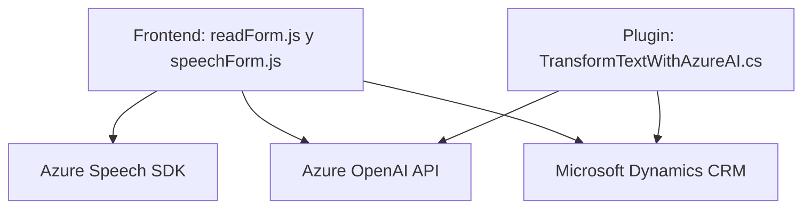

### Breve resumen técnico

El repositorio representa una solución integrada creada para:
1. Captura de datos mediante entrada de texto y voz.
2. Procesamiento avanzado de voz y texto utilizando servicios externos como **Azure Speech SDK** y **Azure OpenAI**.
3. Integración con **Microsoft Dynamics CRM**, actualizando campos en formularios dinámicos y ejecutando plugins para transformación de datos.

### Descripción de arquitectura

El repositorio sigue un enfoque **modular y orientado al servicio**. Aunque contiene múltiples elementos, su arquitectura puede clasificarse como **"n capas"**, con componentes que interactúan mediante capas claramente definidas:
1. Capa de presentación (Frontend).
2. Capa de lógica de negocios (archivos JS con integración de Azure y APIs personalizadas).
3. Capa de datos con acceso y manipulación en Dynamics CRM usando plugins (.NET).

Los módulos están desacoplados mediante:
- Llamadas asíncronas para cargar el SDK de Azure Speech antes de ejecutar operaciones dependientes.
- Integración de servicios externos (Voice-To-Text, Text-To-Audio, AI Data Processing) mediante APIs de Azure.

### Tecnologías usadas

1. **Frontend**:
   - **JavaScript (ES6)** para lógica de interacción con formularios de Microsoft Dynamics.
   - Uso de SDK externo como **Azure Speech SDK**.
   - Custom APIs para procesamiento de texto.

2. **Backend/Plugins**:
   - **C# (.NET Framework)** utilizado para definir plugins aplicables a procesos Dynamics CRM.
   - Integración de Azure OpenAI para transformación de texto y generación de datos estructurados.

3. **Dependencias clave**:
   - **Azure Speech SDK** para manejo de voz.
   - **Azure OpenAI API** para análisis semántico avanzado.
   - Librerías .NET relacionadas:
     - `Microsoft.Xrm.Sdk`: Para la integración con Dynamics CRM.
     - `Newtonsoft.Json.Linq`: Procesamiento JSON.
     - `System.Net.Http`: Llamadas HTTP al servicio OpenAI.

### Diagrama Mermaid válido para GitHub

### Conclusión final

La solución presentada es una arquitectura de **n capas con integración profunda en servicios de Microsoft Dynamics CRM**. Los componentes están orientados hacia un flujo modular y altamente desacoplado, utilizando servicios externos como Azure Speech SDK y Azure OpenAI para procesar voz, texto y datos contextuales. El uso de tecnologías de Azure garantiza escalabilidad y acceso a funcionalidades avanzadas.

Puntos destacados:
- Modularidad y desacoplo mediante SDKs y APIs externas.
- Potente integración con Dynamics CRM, soportando extensibilidad mediante plugins de backend.
- Gestión asíncrona de dependencias externas.
  
Aspectos a mejorar:
- Considerar un enfoque seguro para gestión de claves API (por ejemplo, un vault seguro).
- Seguir las mejores prácticas de diseño arquitectónico, como uso de una arquitectura hexagonal para mayor adaptabilidad frente a futuros cambios en dependencias externas.