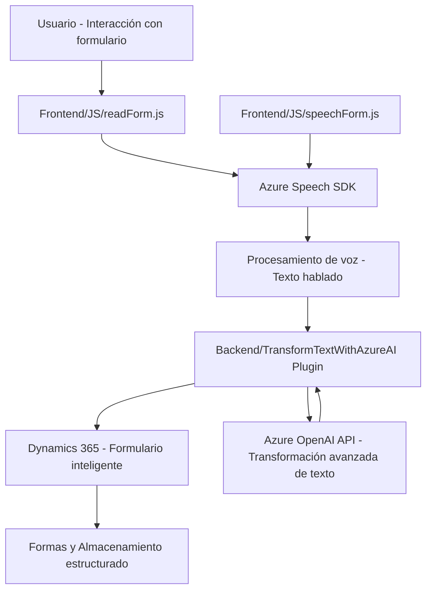

## Breve Resumen Técnico
El repositorio contiene archivos clave que integran funcionalidad de lectura/síntesis de voz y procesamiento contextual en formularios utilizando **Azure Speech SDK** y **Dynamics 365 CRM**. El `TransformTextWithAzureAI` actúa como un plugin de Dynamics 365 para realizar transformaciones sofisticadas de texto mediante la API de **Azure OpenAI**, proporcionando respuestas en formato JSON para ser utilizadas como datos estructurados en formularios.

## Descripción de Arquitectura
La arquitectura puede ser conceptualizada como un sistema de **integración de microservicios** que combina:
1. **Frontend**: Archivos en JavaScript como `readForm.js` y `voiceInput.js`, responsables de interactuar con el usuario a través de la interfaz web y conectar con servicios como Azure Speech SDK y Dynamics 365.
2. **Backend**: Un plugin en C#, `TransformTextWithAzureAI.cs`, desarrollado para integrarse como servicio backend en Dynamics CRM. Este permite realizar solicitudes a la API de Azure OpenAI y proporciona resultados procesados al sistema mediante un evento.

### Tipo de arquitectura:
La solución está estructurada en una arquitectura de **n capas** que incluye:
1. **Presentación (Frontend)**: Captura datos desde formularios mediante interacciones basadas en voz y sintetiza respuestas habladas.
2. **Capa de negocio (Plugins en Dynamics CRM)**: Procesa las entradas de los formularios usando la integración con Azure OpenAI.
3. **Servicios externos (Azure APIs)**: Manejan la síntesis de voz (Speech SDK) y la transformación avanzada de texto (OpenAI).

El uso de servicios externos como Azure también apunta a una aproximación similar a **microservicios**, donde cada componente tiene una tarea específica y bien definida. Es una arquitectura híbrida entre n capas y microservicios.

## Tecnologías, Frameworks y Patrones Usados
1. **Frontend**:
   - Lenguaje: JavaScript.
   - Microfrontend: Componentes basados en funciones modulares, integrados en un sistema más amplio.
   - Azure Speech SDK: Para síntesis y reconocimiento de voz.
   - Lazy loading: SDK de Azure Speech cargado dinámicamente solo cuando es necesario.

2. **Backend**:
   - Lenguaje: C#.
   - Framework: Microsoft Dynamics CRM SDK para plugins.
   - Azure OpenAI API: Para procesamiento avanzado de texto.
   - .NET Framework/NuGet Libraries:
     - `System.Net.Http`: Para manejar peticiones HTTP hacia APIs externas.
     - `Newtonsoft.Json` y/o `System.Text.Json`: Para manipulación de datos en JSON.

3. **Patrones de diseño**:
   - **Modular Design**: Separación clara de responsabilidades en funciones específicas.
   - **Event-driven Architecture**: Respuestas a eventos en Dynamics CRM usando la interfaz `IPlugin`.
   - **Facade Pattern**: Simplificación y encapsulamiento del SDK de Azure Speech y las capacidades de Dynamics CRM API.
   - **Client-side lazy loading**: Carga bajo demanda de dependencias externas.

## Dependencias o Componentes Externos
- **Azure Speech SDK**: Para procesos de lectura/síntesis de voz. Requiere una clave y región específicas.
- **Azure OpenAI API**: Para transformación de texto a JSON estructurado, probablemente basado en modelos GPT.
- **Microsoft Dynamics CRM SDK**: Interacción programática con el backend del sistema CRM.
- **.NET/NuGet libraries**:
  - `System.Net.Http` para hacer peticiones HTTP.
  - `Newtonsoft.Json` o `System.Text.Json` para serialización/deserialización de datos en JSON.
- **Browser APIs**: JavaScript interactúa con APIs del navegador y la DOM para manipular formularios.

## Diagrama Mermaid válido para **GitHub Markdown**

## Conclusión Final
Este repositorio implementa una solución orientada a la interacción con formularios mediante voz, utilizando servicios avanzados de Azure Speech y OpenAI. La arquitectura presenta un diseño **híbrido**, combinando elementos de **n capas** y **microservicios** mediante la integración de servicios externos. La modularidad del diseño permite desarrollar con separación de responsabilidades y una alta posibilidad de escalabilidad, ideal para entornos corporativos basados en Dynamics CRM y servicios en la nube.