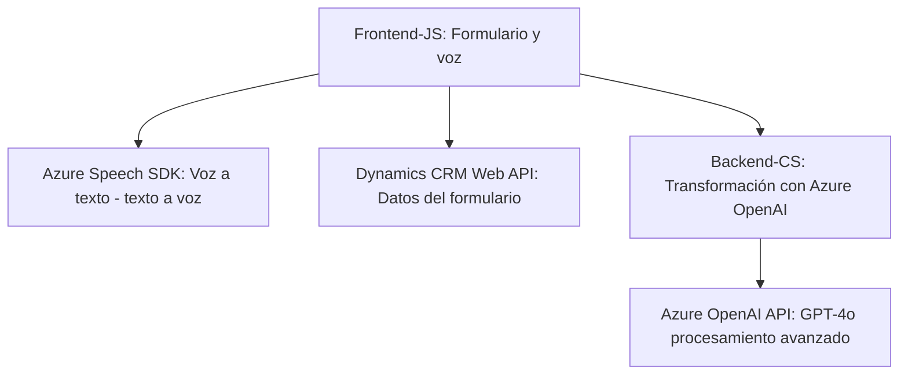

### Breve resumen técnico
El repositorio implementa una solución híbrida que incluye un **frontend** basado en JavaScript para interacción voz-texto y procesamiento de formularios, junto con un **plugin de backend en C#** diseñado para Microsoft Dynamics 365. Utiliza tecnologías como Azure Speech SDK y Azure OpenAI API para reconocimiento y procesamiento de voz, así como transformación de datos en JSON estructurado.

---

### Descripción de la arquitectura
La solución sigue una **arquitectura de capas**:
1. **Frontend (JavaScript)**: Interactúa con el usuario mediante voz y formularios. Procesa datos localmente y utiliza Azure Speech SDK para síntesis y reconocimiento de voz. También realiza llamadas API para procesamiento de datos en Azure AI.
2. **Backend (Plugin C#)**: Opera en la capa del servidor de Dynamics 365 como una extensión (plugin). Implementa lógica de negocio para transformar texto mediante Azure OpenAI y realizar operaciones en contextos CRM.
3. **Integración de API**: Comunicaciones entre el frontend y servicios como Azure Speech o Azure OpenAI se realizan mediante HTTP.

El diseño general incluye patrones como **MVC** (front), **plugin architecture** (backend) y **connector pattern** para integración de servicios externos.

---

### Tecnologías usadas
1. **Frontend**:
   - JavaScript para las mecánicas de interfaz.
   - Azure Speech SDK para síntesis y reconocimiento de voz.
   - Dinámica de formularios basada en APIs de Dynamics CRM.

2. **Backend**:
   - C# en Microsoft Dynamics 365 (IPlugin architecture).
   - Azure OpenAI para procesamiento avanzado de datos.

3. **Dependencias comunes**:
   - `Newtonsoft.Json.Linq` y `System.Text.Json` para manejo de JSON.
   - Dynamics CRM Web API (`Xrm.WebApi`) para acceso a datos del CRM.

4. **API externas**:
   - Azure Speech SDK y Azure OpenAI API (GPT-4o).

---

### Diagrama Mermaid

---

### Conclusión final
La solución implementa una **arquitectura de capas** que combina interacción de usuario mediante voz con procesamiento avanzado de datos. Es ideal para escenarios de alto nivel de personalización en Dynamics CRM. Los puntos fuertes incluyen modularidad en el procesamiento frontend y la integración avanzada con servicios de Microsoft Azure. Sin embargo, la dependencia de servicios externos y el SDK de Azure puede requerir robustez en manejo de errores y latencia para mantener una experiencia de usuario fluida.