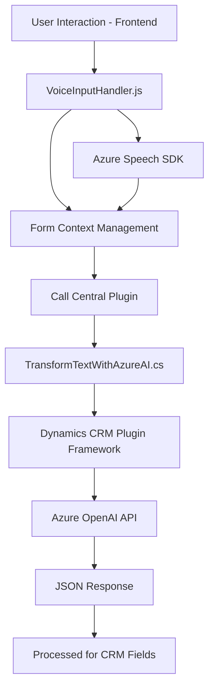

### Breve resumen técnico
El repositorio expuesto muestra tres elementos clave:
1. **Frontend JavaScript**: Bibliotecas orientadas a integrar capacidades de voz (Azure Speech SDK) dentro de formularios dinámicos, probablemente en un sistema CRM como Dynamics 365.
2. **Plugin de Dynamics CRM**: Extensión escrita en C# que usa Azure OpenAI API para transformar datos de texto en un JSON estructurado.
3. **Arquitectura híbrida** que integra frontend dinámico, APIs externas (Azure) y extensibilidad en Dynamics 365.

---

### Descripción de arquitectura
La solución combina varios tipos de componentes:
1. **Frontend basado en JavaScript**: Procesa voz y texto en el navegador, interactuando con formularios y SDKs dinámicos (Azure Speech SDK).
2. **Backend y plugins de Dynamics CRM**: Ejecuta lógica empresarial avanzada al transformar texto y enviar datos procesados a la AI de Azure OpenAI mediante servicios REST.
3. **Arquitectura en capas**:
   - **Capa de presentación**: Archivos frontend que brindan interactividad al usuario.
   - **Capa lógica**: Plugins centralizados en Dynamics CRM para procesamiento avanzado.
   - **Capa de servicios**: Interacción con APIs externas (Azure Speech y OpenAI).

Se puede categorizar como una **arquitectura híbrida de n capas** con integración modular a través de **componentes externos**.

---

### Tecnologías usadas
1. **Frontend**:
   - **JavaScript**.
   - **Azure Speech SDK** para texto a voz y reconocimiento de voz.
   - **Dynamics 365 JavaScript Client APIs** (`Xrm`).
   - **Dynamic Form Context Management** (manejo de atributos visibles y mapeo dinámico de campos).

2. **Backend (C# Plugin)**:
   - **Microsoft Dynamics CRM SDK** para extensibilidad.
   - **Azure OpenAI API** para procesamiento automático de texto.
   - **HttpClient** para llamadas REST.
   - **System.Text.Json** o **Newtonsoft.Json** para manejo de datos JSON.

3. **Patrones de diseño**:
   - **SDK Loader**: Carga dinámica de Azure Speech SDK en el navegador.
   - **Event-driven development**: Los formularios y plugins dependen de eventos relacionados al contexto.
   - **Plugin-based Architecture**: Extensibilidad mediante la capa de plugins en Dynamics CRM.
   - **Pipeline funcional**: Transformación estructurada de datos en pasos consecutivos.

---

### Dependencias o componentes externos
1. **Azure Speech SDK**: Gestión de reconocimiento de voz y síntesis de texto en audio.
2. **Azure OpenAI API**: Procesamiento de texto dinámico y generación de JSON estructurado.
3. **Microsoft Dynamics CRM SDK**: Extensibilidad y manejo de objetos contextuales en Dynamics 365.
4. **HttpClient**: Realiza solicitudes REST para interactuar con servicios externos.
5. **JSON Libraries**: Serialización/deserialización de datos mediante `Newtonsoft.Json` o `System.Text.Json`.
6. **Dynamic Form Context Attributes**: Integración con estructuras CRM como formularios, entidades y atributos.

---

### Diagrama Mermaid válido para GitHub

---

### Conclusión final
La estructura del repositorio representa una solución altamente modular: 
1. **Frontend** maneja interactividad de usuarios mediante voz y mapeo de datos dinámicos en formularios.
2. **Backend** ejecuta lógica empresarial avanzada, extendiendo las capacidades de Dynamics CRM mediante integración con Azure AI.
3. La arquitectura híbrida en capas demuestra robustez y escalabilidad, haciendo que el sistema sea interoperable entre múltiples servicios externos (Azure SDK y OpenAI).

Es adecuado para escenarios donde la automatización de procesos mediante voz y procesamiento AI permite aumentar la usabilidad y eficiencia tanto en interacciones humanas como contextos empresariales complejos.