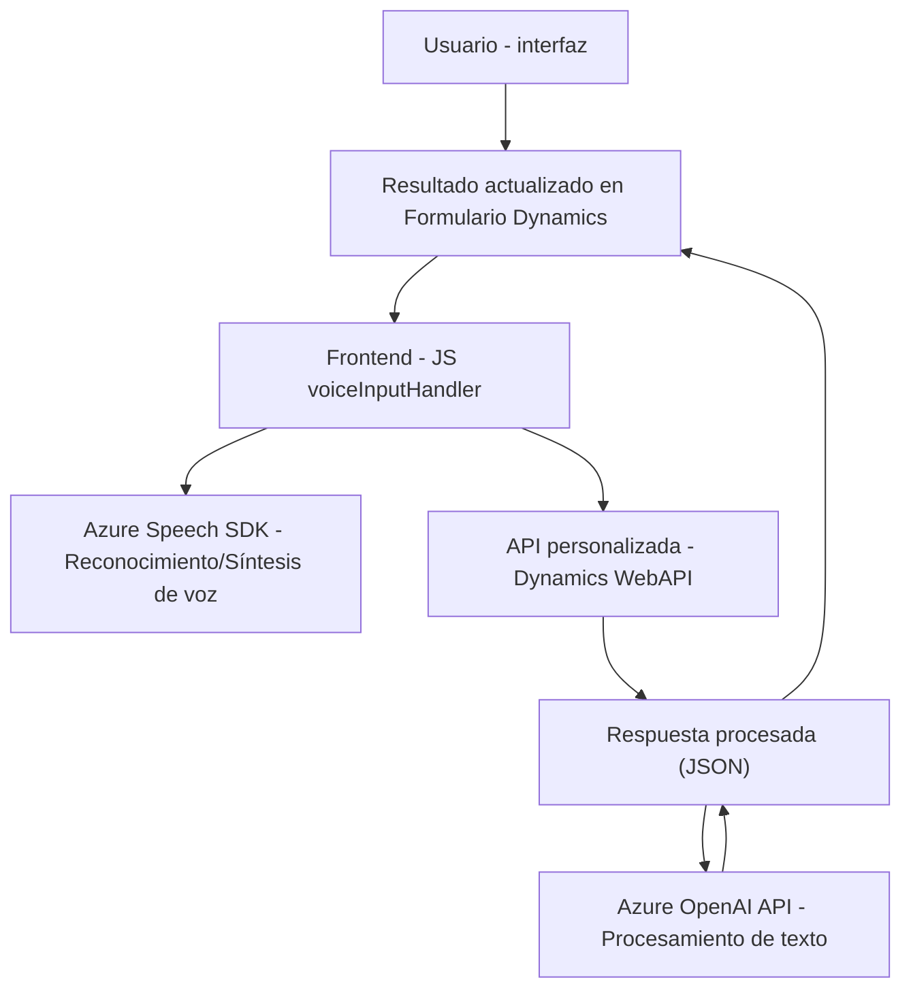

### Breve Resumen Técnico

El repositorio presenta una solución software orientada a la integración de tecnologías avanzadas de reconocimiento y síntesis de voz (Azure Speech SDK) y procesamiento de texto mediante inteligencia artificial (Azure OpenAI API) con la plataforma Dynamics 365. Los archivos analizados muestran un sistema dividido en dos principales componentes: un **frontend** (en JavaScript) que interactúa directamente con el usuario y la interfaz de Dynamics y un **plugin backend** (en C#) que procesa datos en la plataforma CRM.

---

### Descripción de la Arquitectura

La solución describe una arquitectura híbrida compuesta por los siguientes elementos:
1. **Frontend ligero**: Encargado de la interfaz de usuario y habilitación de features como el reconocimiento y síntesis de voz.
2. **Backend (Plugin)**: Un plugin para Dynamics CRM que invoca la Azure OpenAI API para el procesamiento avanzado de texto.
3. **Servicios externos**: Utiliza Azure Speech SDK para reconocimiento y síntesis de voz en tiempo real y una integración programada mediante una webhook con la API de Azure AI en el plugin.

El diseño general parece alinearse con una **arquitectura de capas**:
- Capa de presentación: Formada por el **frontend**, que interactúa directamente con los usuarios.
- Capa de lógica de negocio: Formada por el plugin que define las reglas para la transformación del texto e interacción con APIs externas.
- Capa de servicios: Uso de **Azure Speech SDK** y **Azure OpenAI API**.

---

### Tecnologías Usadas

**Frontend:**
- **JavaScript**: Implementación de funciones para la lectura dinámica de formularios, reconocimiento y síntesis de voz.
- **Azure Speech SDK**: Procesamiento de voz, incluyendo reconocimiento y síntesis, cargado dinámicamente a través de un script ubicado en `https://aka.ms/csspeech/jsbrowserpackageraw`.
- **Dynamics 365 SDK (global Xrm variable)**: Interoperabilidad con los formularios y datos dinámicos de la plataforma CRM.

**Backend:**
- **C#**: Desarrollo de un plugin siguiendo el patrón de arquitectura de extensibilidad propio de Dynamics CRM.
- **System.Net.Http**: Realización de peticiones HTTP para invocar la API de Azure OpenAI.
- **Azure OpenAI API**: Utilizada para transformar texto mediante inteligencia artificial.
- **Microsoft.Xrm.Sdk**: Para conectar y manipular datos en Dynamics CRM.
- **Newtonsoft.Json / System.Text.Json**: Manejo de estructuras JSON para serialización/deserialización.

---

### Diagrama Mermaid

El siguiente diagrama representa los componentes principales de la solución y su interacción lógica. Cumple con las reglas declaradas:

---

### Conclusión Final

La solución encapsula una integración avanzada entre tecnologías de reconocimiento de voz y procesamiento de texto utilizando servicios cloud (Azure Speech SDK y Azure OpenAI API) y la plataforma Dynamics 365. Con una arquitectura modular y event-driven, los componentes permiten una aplicación extensible que combina funcionalidades en tiempo real (frontend) y procesamiento remoto basado en servicios (plugin backend).

- Es una **solución híbrida basada en n-capas**, con separación clara entre presentación, lógica y servicios.
- Se identifica un buen nivel de modularización y un uso eficiente de servicios externos para delegar procesos complejos, ofreciendo escalabilidad y flexibilidad.
- Sin embargo, recomendamos asegurar la gestión segura de claves, mejorar la validación de dependencias externas (SDK cargados dinámicamente) y considerar el impacto de latencias en las integraciones dependientes de APIs externas.