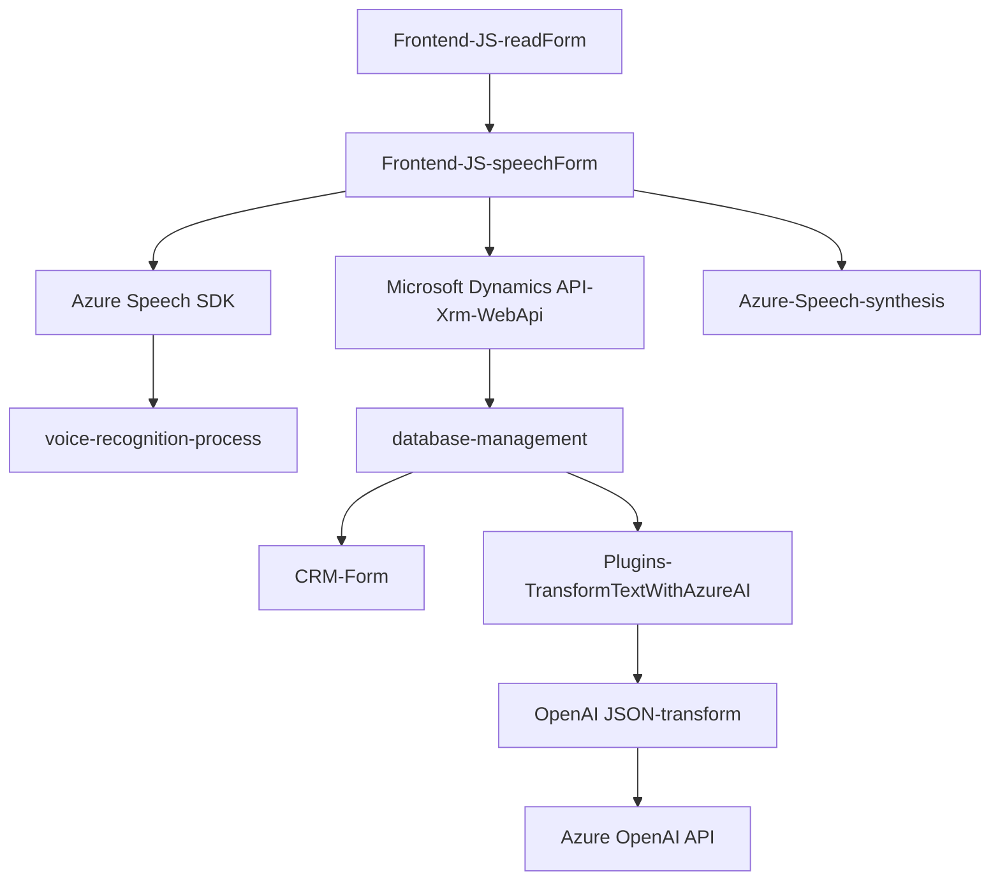

### Breve resumen técnico

Los archivos proporcionados están relacionados con un sistema que implementa soluciones frontend y backend para la integración con servicios de Microsoft Dynamics CRM y Azure AI. El objetivo central es permitir el procesamiento de datos mediante reconocimiento y síntesis de voz, además de transformar textos en JSON estructurado utilizando un plugin basado en Azure OpenAI. La solución utiliza APIs externas y se orienta hacia una arquitectura de **alta cohesión**, combinando diferentes niveles de módulos y servicios.

---

### Descripción de la arquitectura

La arquitectura del sistema es híbrida y sigue principios de diseño modular. Los archivos `readForm.js` y `speechForm.js` están orientados hacia una **arquitectura cliente-servidor**, donde el frontend interactúa con APIs externas y el backend. Algunas funcionalidades en estos archivos dependen de procesos asincrónicos y se implementa el patrón **Callback** para la carga del SDK.

Por otro lado, el archivo `TransformTextWithAzureAI.cs` utiliza un modelo **Plugin-based** diseñado específicamente para integrarse con Dynamics CRM mediante servicios de Microsoft.Xrm.Sdk. Este tiene una estructura con un fuerte enfoque en la integración con APIs externas y sigue un patrón de **Service Gateway** para interactuar con el servicio Azure OpenAI, encapsulando las llamadas HTTP para el procesamiento de texto.

En conjunto, la solución tiene una arquitectura **n-capas**, donde el frontend interactúa con servicios externos y el backend maneja la transformación de datos utilizando plugins y APIs.

---

### Tecnologías empleadas

1. **Frontend (JavaScript)**
   - **Azure Speech SDK**: Proporciona capacidades de reconocimiento y síntesis de voz.
   - **JavaScript**: Principal lenguaje de programación.
   - **Browser APIs**: Manejo de eventos, DOM, y otros objetos de navegador.

2. **Backend (.NET Framework)**
   - **C# Plugin de Dynamics CRM** (`Microsoft.Xrm.Sdk`): Manejo del contexto de ejecución en CRM.
   - **Azure OpenAI**: Servicio de IA para procesamiento y transformación de texto.
   - **HttpClient**: Para realizar solicitudes a APIs externas.
   - **JSON Libraries (Newtonsoft.Json, System.Text.Json)**: Serialización y manipulación de JSON.

3. **APIs Externas**
   - Azure Speech SDK: Reconocimiento y síntesis de voz.
   - Azure OpenAI API: Procesamiento avanzado de texto utilizando AI en la nube.

---

### Diagrama Mermaid

---

### Conclusión final

La solución presentada constituye una integración entre un frontend basado en JavaScript y APIs externas, y un backend basado en plugins para Dynamics CRM. Las tecnologías clave incluyen Azure Speech SDK y Azure OpenAI API, que proporcionan capacidades de inteligencia artificial como reconocimiento de voz y procesamiento de lenguaje natural. La arquitectura tiene un diseño modular, que busca un alto grado de cohesión entre las funcionalidades de frontend y backend. Además, sigue principios de **n-capas** y utiliza patrones como **Facade**, **Service Gateway**, y **Callback**.

Sin embargo, digo que podría haber problemas de seguridad relacionados con el manejo del `apiKey`, lo que se debe considerar como posible una mejora a implementar. Esto podría requerir el uso de gestores de secretos, integraciones con variables de entorno o un servicio seguro para almacenar y acceder a las credenciales externas.