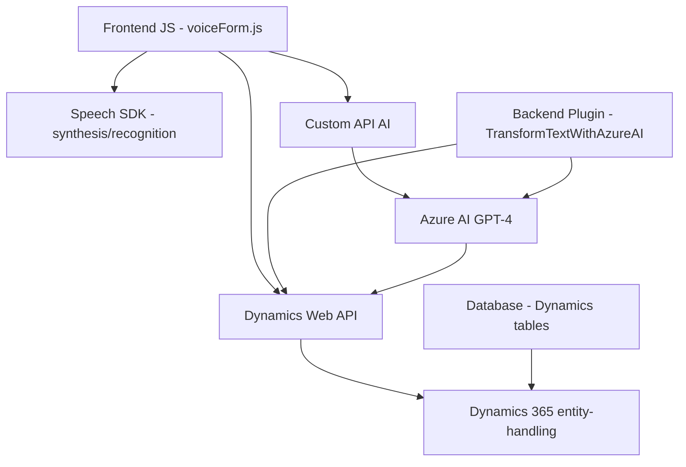

### Breve resumen técnico
El repositorio implementa un conjunto de funcionalidades para trabajar con formulaciones dinámicas de voz en aplicaciones de **Dynamics 365**. Contiene tres principales componentes:
- **Frontend**: Scripts JS para leer y sintetizar formularios hacia voz (o viceversa) usando **Azure Speech SDK**.
- **Backend Plugin**: Un plugin en C# para transformar texto con reglas específicas mediante el servicio **Azure OpenAI GPT**.

La solución está diseñada para interactuar con formularios dinámicos extendiendo la funcionalidad estándar de Dynamics 365 con capacidades de procesamiento de voz y texto avanzado.

---

### Descripción de arquitectura
El proyecto implementa una solución de arquitectura híbrida orientada al uso de servicios externos (APIs). 
1. **Frontend**: Aplicación modular en JavaScript que:
   - Realiza lectura y síntesis de datos en formularios interactivos con el **Azure Speech SDK**.
   - Proporciona reconocimiento de voz y actualización dinámica de campos del formulario.
   - Procesa los resultados de reconocimiento y permite mapeos automáticos de los datos transcritos.

2. **Backend Plugin**:
   - Basado en la arquitectura de extensibilidad de Dynamics 365 mediante **plugins**.
   - Envía datos a los servicios externos de **Azure OpenAI** para realizar transformaciones textuales.

En conjunto, la solución utiliza **n capas**:
- **Frontend (presentación)**: para la interacción del usuario.
- **API Principales**: Azure Speech SDK y Azure OpenAI son integradas. El código incluye patrones de validación y encapsulación mediante funciones específicas en frontend y backend.
- **Base de datos**: Dynamics 365 y sus API internas (Dynamics Web API) para manejo de datos de los formularios.

---

### Tecnologías usadas
**Frontend:**
- **JavaScript**: Especificaciones ES6 y uso modular.
- **Azure Speech SDK**: Para síntesis y reconocimiento de voz.
- **HTML**: Formulario dinámico.

**Backend:**
- **C# y .NET SDK**: Desarrollo del plugin para Dynamics 365.
- **Microsoft.Xrm.Sdk**: Bibliotecas de Dynamics para integrarse con CRM.
- **Azure OpenAI Service**: GPT-4 para transformar texto.
- **JSON Manipulation**: Usando `System.Text.Json` y `Newtonsoft.Json.Linq`.

**General:**
- Integración de servicios externos mediante estáticos de **CDN** y **REST APIs** a servicios como Azure Speech SDK y Azure OpenAI.

---

### Diagrama Mermaid

---

### Conclusión final
La solución presentada es una integración avanzada que extiende Dynamics 365 mediante procesamiento de voz y texto utilizando **Azure Speech SDK** y **Azure OpenAI GPT**. Su arquitectura es modular y orientada a servicios, con diseño basado en **n capas**. La dependencia externa en soluciones de terceros como Azure requiere gestión detallada de claves API y configuraciones. El enfoque modular en frontend y plugin backend asegura escalabilidad y mantenibilidad, compatible con los principios de diseño modernos.