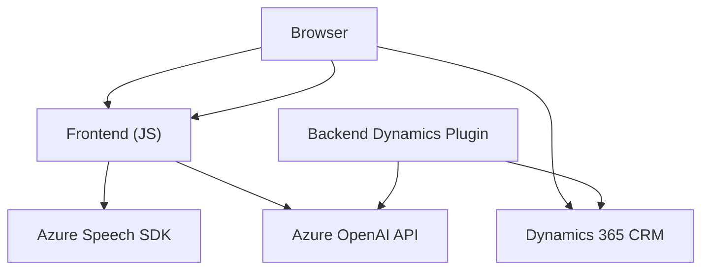

### Breve resumen técnico:
La solución en el repositorio representa un sistema híbrido que combina un **frontend** en JavaScript y plugins personalizados en .NET (C#) destinados para Dynamics 365 CRM. Su principal funcionalidad es habilitar la interacción por voz y texto con formularios dinámicos, llevando a cabo procesamiento natural de lenguaje (NLP) y comandos mediante servicios de Azure Speech SDK y Azure OpenAI API. Además, incluye lógica para modificar datos en formularios de CRM tanto manualmente como usando inteligencia artificial.

---

### Descripción de arquitectura:
La arquitectura sigue un modelo **n-capas**, distribuido en tres componentes principales:
1. **Frontend/JS:** Implementación de interacción con formularios en el navegador y conexión a APIs externas (Azure Speech e IA). Sigue un diseño modular y asíncrono con funciones organizadas por propósitos específicos.
2. **Backend/Dynamics Plugins:** Extensiones mediante plugins en C# que usan Dynamics SDK para integrar funcionalidad específica de negocio, como la transformación de texto mediante Azure OpenAI.
3. **Servicios externos:** Consumo de Azure Speech SDK para síntesis y reconocimiento de voz, y de Azure OpenAI API para procesamiento de lenguaje natural (de usuario a texto estructurado).

---

### Tecnologías usadas:
1. **Frontend:**
   - JavaScript con módulos independientes.
   - Integración de Azure Speech SDK para síntesis y reconocimiento de voz.
   - Uso de llamadas asincrónicas (promises y funciones async/await).

2. **Backend/Plugins:**
   - C# y .NET Framework.
   - Dynamics 365 SDK.
   - Azure OpenAI API con modelos de lenguaje avanzados como GPT-4.
   - JSON para la estructura del texto procesado.

3. **Dependencias externas:**
   - Azure Speech SDK: Utilizado en el frontend para interpretar voz y generar síntesis textual.
   - Azure OpenAI API: Usado en el plugin para procesamiento semántico de texto.
   - Dynamics 365 Web API (`Xrm.WebApi`): Para interactuar y actualizar formularios de CRM.

4. **Patrones observados:**
   - Modularización en el frontend.
   - Service Layer en el backend.
   - API Gateway para comunicación con servicios externos (Azure APIs).
   - Loading external dependencies dynamically (Azure Speech SDK).

---

### Diagrama **Mermaid**:

---

### Conclusión final:
La solución descrita aquí proporciona funciones avanzadas de accesibilidad y procesamiento de datos mediante una arquitectura **n-capas**, en la que el frontend actúa como interfaz de usuario y orquestador de solicitudes a servicios externos (Azure Speech) y al backend. El backend, a su vez, utiliza plugins en Dynamics 365 CRM para implementar lógicas de negocio como la integración con Azure OpenAI. Esto permite una interacción más inteligente entre el usuario, el formulario y servicios externos.

Sin embargo, se recomienda:
1. Incorporar documentación API más detallada sobre los puntos de integración (como parámetros requeridos por Azure APIs).
2. Modularización adicional en las funciones largas de los scripts JS, para mantener un código más limpio y sostenible.
3. Confirmar que los servicios externos (Azure Speech/OpenAI) se gestionan correctamente en términos de autenticación y manejo de errores para garantizar robustez.