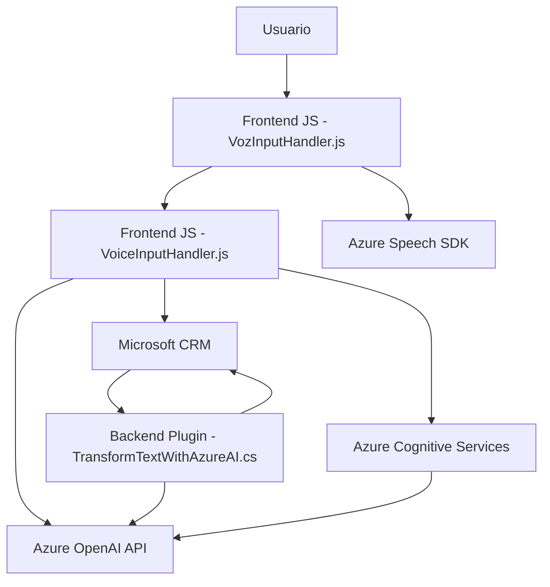

### Breve Resumen Técnico

El repositorio contiene tres archivos clave que forman parte de una solución diseñada para la integración de voz y inteligencia artificial con Dynamics CRM. Se centra en habilitar la interacción basada en voz (Azure Speech SDK y Cognitive Services), transformaciones de texto basadas en IA (Azure OpenAI), y manipulación de datos de un formulario CRM. La solución parece ser una combinación de desarrollo web (frontend en JavaScript) y extensiones en forma de plugin para el sistema CRM.

---

### Descripción de la Arquitectura

La arquitectura general puede clasificarse como **n capas** con elementos de **integración de servicios externos**. Las capas incluyen:

1. **Frontend (Presentación):**
   - JavaScript (Azure Cognitive Speech SDK).
   - Este componente opera sobre el formulario web visible para el usuario y se encarga de ejecutar lógica interactiva de entrada/salida de datos.
   
2. **Control y lógica del negocio:**
   - Plugin en C# que actúa como enlace entre las interacciones con el formulario, la lógica de negocio interna y los servicios externos (Azure OpenAI API).
   - Este plugin está diseñado para integrar múltiples servicios e interactuar con Dynamics CRM para procesamiento de datos estructurados.

3. **Servicios externos:**
   - APIs y SDK de Microsoft para Speech-to-Text y Text-to-Speech, junto con la integración con Azure OpenAI para procesar texto y transformar datos.

El enfoque modular y orientado a eventos, combinado con la división en múltiples capas, apunta a un diseño de tipo **n capas**. Además, la integración con servicios cognitivos de Azure marca el uso del patrón **Service Integration** como pieza fundamental.

---

### Tecnologías, Frameworks y Patrones Usados

#### Tecnologías:
1. **Frontend:**
   - **JavaScript:** Desarrollo interactivo de interfaz web. Scripts de interacción con formularios CRM.
   - **Azure Cognitive Speech SDK:** Procesamiento de voz a texto y texto a voz.
   - **Microsoft Dynamics CRM SDK:** Interacciones con el sistema CRM.

2. **Backend:**
   - **C# Plugins (Dynamics CRM):** Extensiones personalizadas del sistema CRM.
   - **Azure OpenAI API:** IA para clasificación y transformación de texto.

#### Patrones:
1. **Modularidad:** Dividiendo tareas en funciones independientes reutilizables en el frontend.
2. **Facade Pattern:** Enmascara las complejidades del API de Azure y Dynamics con métodos simplificados.
3. **Event-driven Architecture:** Arquitectura impulsada por eventos, como carga del SDK y resultados de voz.
4. **Plugin-based Development:** Para extensiones de Dynamics CRM.
5. **Service Integration Pattern:** Combina APIs externas (Azure Speech/OpenAI) con el sistema CRM.

---

### Dependencias o Componentes Externos

1. **Microsoft Azure Speech SDK:** Procesamiento de voz.
2. **Dynamics CRM SDK:** Interacción directa con entidades del sistema CRM.
3. **Azure OpenAI API:** Transformación avanzada de texto.
4. **Newtonsoft.Json:** Procesamiento de JSON en el plugin de C#.
5. **System.Net.Http:** Para llamadas HTTP al servicio Azure OpenAI desde el lado del plugin.

---

### Diagrama Mermaid Compatible con GitHub

---

### Conclusión Final

El repositorio combina tecnologías modernas como Azure Cognitive Services y el SDK de Dynamics CRM para habilitar interacciones avanzadas basadas en voz e inteligencia artificial dentro de formularios ligados al sistema CRM. La solución implementa una arquitectura n capas modular y facilita la integración con servicios externos como Azure Speech y OpenAI para ofrecer funcionalidad enriquecida, procesando datos tanto desde inputs hablados como textuales. Es una solución moderna que expone capacidades interactivas centradas en productividad y accesibilidad.