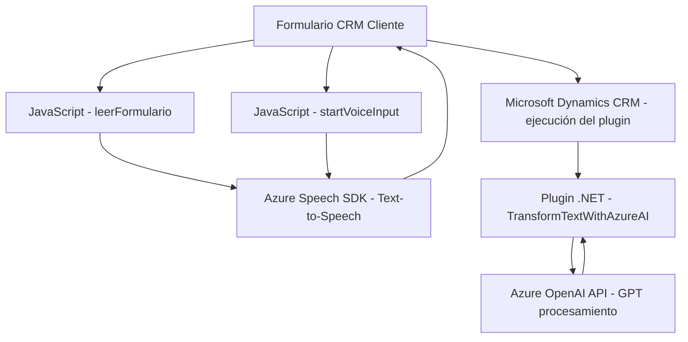

### Breve resumen técnico
El proyecto consta de tres archivos principales que implementan funcionalidad relacionada con accesibilidad y procesamiento de datos en entornos CRM mediante integraciones con Azure Speech SDK y Azure OpenAI. También incluye plugin para Dynamics CRM que interactúa con modelos de GPT para transformar texto.

### Descripción de arquitectura
La arquitectura general del proyecto sigue un enfoque **modular** orientado a servicios, donde cada componente tiene responsabilidades bien definidas:
- **Frontend (JavaScript)**: Permite leer y procesar formularios (text-to-speech) y manejar entrada de voz para captar, transcribir y asignar valores mediante integración con Dynamics CRM. Actividades como cargar el SDK y realizar llamadas API están desacopladas.
- **Backend (Plugin para Dynamics CRM)**: Actúa como middleware incorporado en Dynamics CRM, conectándose con la API de OpenAI para realizar transformaciones en texto según reglas específicas.
  
Aunque el proyecto utiliza servicios distribuidos (Azure Speech y Azure OpenAI), la lógica sigue estando centralizada en una arquitectura de **n capas** donde cada capa (frontend y backend) interactúa con APIs externas.

### Tecnologías usadas
1. **Frontend**
   - **Azure Speech SDK**: Para servicios de síntesis de voz y transcripción.
   - **Dynamics CRM Web API**: Para manipulación de formularios y datos.
   
2. **Backend**
   - **Microsoft Dynamics CRM SDK** (`Microsoft.Xrm.Sdk`): Para interacción directa con Dynamics CRM.
   - **Azure OpenAI API**: Para procesamiento de texto mediante modelos GPT.
   - **Newtonsoft.Json / System.Text.Json**: Parsing y serialización JSON.
   - **.NET Framework** (probablemente versión 4.x, usado para plugins tradicionales de Dynamics CRM).

3. **General**
   - **HTTP API calls**: Comunicación con servicios web de Azure.
   - **Modular Design**: Cada archivo y su funcionalidad están segmentados según el principio de responsabilidad única (SRP).

### Diagrama Mermaid válido para GitHub

### Conclusión final
El proyecto representa una solución diseñada para mejorar la accesibilidad y la interacción en entornos empresariales basados en Dynamics CRM, combinando funcionalidades de frontend en JavaScript y backend mediante plugins para procesamiento de datos con asistencia de inteligencia artificial. La arquitectura es sencilla y modular, manteniendo capas definidas que interactúan con servicios externos. Si bien utiliza herramientas avanzadas como Azure AI y OpenAI, la solución se mantiene centralizada y no adopta totalmente una arquitectura distribuida como microservicios, pero está bien adaptada para sistemas CRM empresariales.