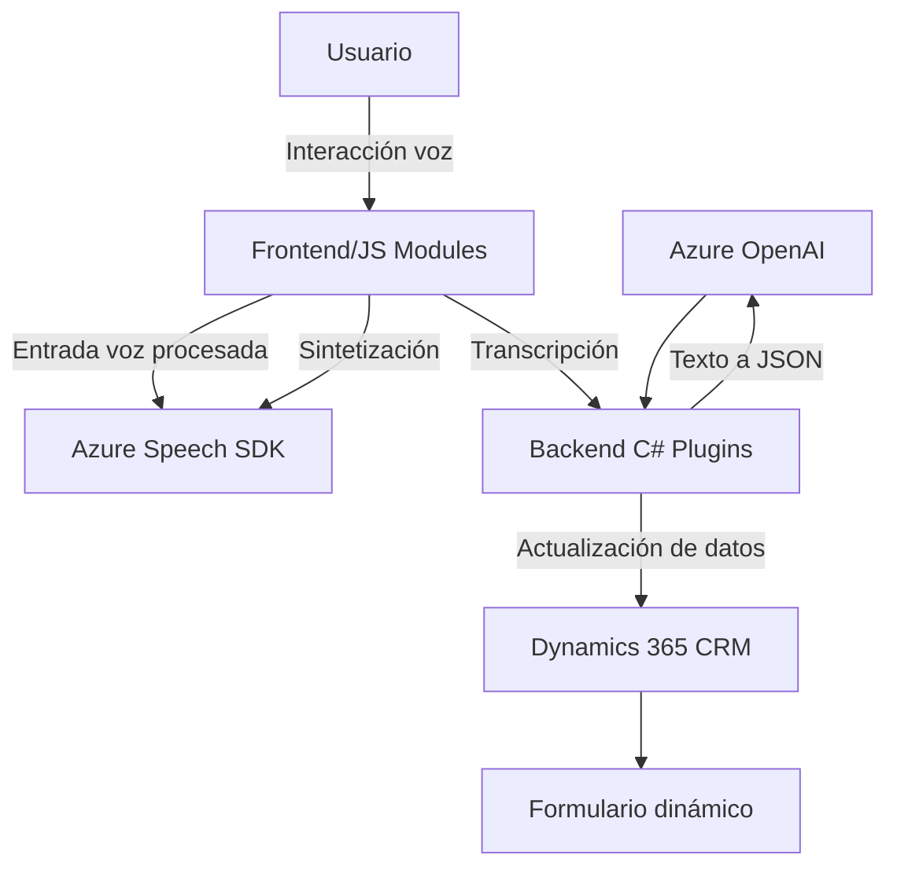

### Breve resumen técnico:
El repositorio contiene componentes que interactúan principalmente con formularios dinámicos en un sistema CRM (Dynamics 365), e integran funcionalidad avanzada de entrada por voz y procesamiento de texto mediante servicios de Microsoft Azure, como Azure Speech SDK y Azure OpenAI. Está diseñado para habilitar acceso inclusivo, simplificar interacciones y soportar automatización basada en IA.

---

### Descripción de la arquitectura:
La solución está diseñada como una **arquitectura de tres capas** integrada con **componentes externos**. Las capas incluyen:
- **Frontend JavaScript:** Funcionalidad basada en Azure Speech SDK para síntesis y reconocimiento de voz, interacción con formularios dinámicos y APIs personalizadas.
- **Backend (Plugins)**: Extensiones del CRM (Dynamics 365) diseñadas como plugins para procesar datos usando Azure OpenAI.
- **Servicios externos:** Dependencia fuerte de servicios basados en la nube de Microsoft (Azure Speech y Azure OpenAI).

---

### Tecnologías usadas:
1. **Frontend:**
   - **JavaScript**: Para manejo dinámico del DOM y lógica de interacción con SDKs.
   - **Azure Speech SDK**: Para síntesis y reconocimiento de voz.
   - **Xrm.WebApi**: Para integrar con APIs del CRM.
   - **Promesas y asincronía**: En llamadas a APIs, carga dinámica de SDKs y procesamiento de texto transcrito.

2. **Backend Plugins:**
   - **C#:** Para lógica robusta y extensibilidad dentro del CRM.
   - **Dynamics 365 SDK:** Usado para el contexto y datos organizacionales.
   - **Azure OpenAI HTTP Client:** Comunicación RESTful con servicios de IA.
   - **JSON Manipulation (System.Text.Json):** Transformación y validación de datos estructurados.

3. **Patrones arquitecturales:**
   - Modularización funcional y programación orientada a eventos.
   - Uso del patrón Repository en funciones relacionadas con el mapa de campos y datos del CRM.
   - Diseño basado en plugins para extensibilidad en Dynamics 365.

---

### Diagrama **Mermaid** para GitHub Markdown:

---

### Conclusión final:
Este repositorio implementa una solución híbrida que combina funcionalidades **frontend** para interacción del usuario con formularios mediante entrada por voz y **backend** para procesar texto con servicios de virtualización e inteligencia artificial. 

### Características clave:
- **Arquitectura multicapa:** Dividida entre interacción del usuario, procesamiento en el CRM y servicios externos de IA.
- **Servicios fuertes:** Dependencia de Azure SDKs (Speech y OpenAI) para lógica avanzada de reconocimiento y síntesis.
- **Integración personalizada:** El uso de plugins para extender Dynamics 365 permite automatizar procesos y escalar capacidades del sistema.

Aunque altamente dependiente de servicios Azure, esta estructura facilita el diseño inclusivo y procesamiento avanzado adaptado a diferentes tipos de interacción y transformaciones de datos.