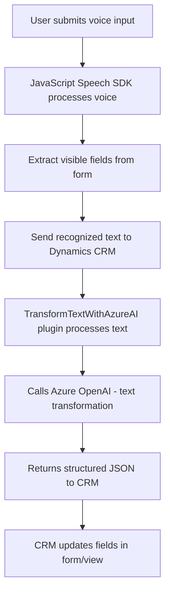

### Breve Resumen Técnico
El repositorio implementa una solución que permite la interacción vía voz con formularios en el frontend y procesamiento avanzado de texto en el backend, utilizando Microsoft Azure Speech SDK y Azure OpenAI. Incluye un componente de frontend para gestionar la entrada y síntesis de voz, y un plugin para Dynamics CRM que transforma texto usando modelos GPT.

---

### Descripción de Arquitectura
La arquitectura es híbrida con partes diferenciadas:
1. **Frontend**
   - Patrón modular con microfrontends.
   - Basado en JavaScript, interactúa asíncronamente con Microsoft Speech SDK para síntesis y reconocimiento de voz.
   - Facilita integración directa con formularios dinámicos en la interfaz de usuario.

2. **Backend**
   - Plugin diseñado para Dynamics CRM que actúa como un microservicio interno.
   - Usa servicios externos como Azure OpenAI para transformación de texto.
   - Sigue el **Plugin Pattern** dentro de Microsoft Dynamics, con eventos desencadenados por interacciones del usuario o del sistema CRM.

---

### Tecnologías Usadas
1. **Frontend**
   - **JavaScript**: Lógica principal para la interacción con formularios y Speech SDK.
   - **Microsoft Azure Speech SDK**: Reconocimiento y síntesis de voz.

2. **Backend**
   - **C#**: Desarrollo del plugin para Dynamics CRM.
   - **Microsoft Dynamics CRM SDK**: Manejo del contexto CRM.
   - **Azure OpenAI Service**: Transformación de texto.
   - **REST API**: Comunicación con servicios externos.
   - **Newtonsoft.Json/System.Text.Json**: Manejo de serialización/deserialización JSON.
   - **System.Net.Http**: Realiza llamadas a la API de Azure OpenAI.

---

### Diagrama Mermaid para GitHub Markdown

---

### Conclusión Final
El repositorio implementa una solución enfocada en mejorar experiencias de usuario a través de entrada por voz y transformación automatizada de texto combinando servicios avanzados como Azure Speech SDK y Azure OpenAI. Tiene una arquitectura modular con microfrontends en el cliente y componentes que actúan como plugins en el backend, integrando servicios externos. La solución destaca tanto por su modularidad como por la aplicación de patrones eficientes para inicialización de SDK y procesamiento de datos.