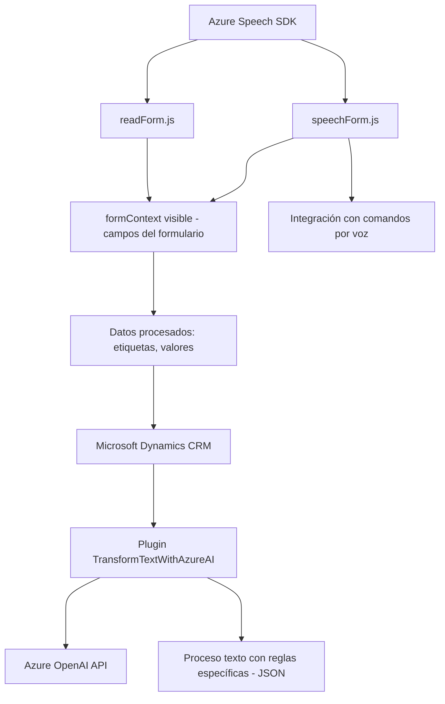

### Breve resumen técnico:

El repositorio presentado contiene tres archivos principales (`readForm.js`, `speechForm.js` y `TransformTextWithAzureAI.cs`) enfocados en la integración de tecnologías de Microsoft como Dynamics CRM, Azure Speech SDK y Azure OpenAI para proporcionar capacidades avanzadas de entrada y salida de voz, junto con transformación de datos mediante inteligencia artificial. Los archivos siguen patrones que permiten modularidad, extensibilidad y conexiones con APIs externas.

---

### Descripción de arquitectura:

- **Tipo de solución**: Este repositorio representa una combinación de frontend y backend de un sistema CRM con extensiones para manejo de voz e inteligencia artificial. La solución incluye:
  - **Frontend**: Scripts (`readForm.js` y `speechForm.js`) que interactúan con el formulario del CRM y gestionan entrada/salida de voz mediante Azure Speech SDK.
  - **Backend**: Plugin (`TransformTextWithAzureAI.cs`) desarrollado para el servidor de Dynamics CRM, implementando lógica personalizada para transformar datos mediante Azure OpenAI.

- **Patrones y diseño**:
  - **Modularidad**: Significativa presencia de funciones modulares en los scripts de frontend y clases en el plugin de backend, promoviendo reutilización y escalabilidad.
  - **Gateway**: Para integrar servicios externos (Azure Speech SDK y Azure OpenAI).
  - **Event-driven architecture**: El plugin se ejecuta basado en disparadores de eventos en Dynamics CRM, como cambios en los datos del cliente.

---

### Tecnologías usadas:

1. **Frontend**:
   - **JavaScript**: Para scripting y manipulación del formulario.
   - **Azure Speech SDK**: Para reconocimiento y síntesis de voz.

2. **Backend**:
   - **C#**: Utilizado para la implementación del plugin.
   - **Dynamics CRM SDK (`IPlugin`, `IOrganizationService`)**: Framework base para crear plugins extendidos.
   - **Azure OpenAI API**: Servicio externo para procesamiento avanzado de texto.
   - **Librerías adicionales**: `System.Text.Json`, `Newtonsoft.Json`, `System.Net.Http`.

3. **General**:
   - API y servicios externos: Implementación de APIs personalizadas para procesamiento de texto y APIs de Azure.

---

### Diagrama **Mermaid**:

---

### Conclusión final:

Este repositorio combina tecnologías modernas para crear una solución extensible que permite la interacción con datos CRM mediante comandos de voz y plugins robustos que aprovechan capacidades de inteligencia artificial. La arquitectura es híbrida debido a su división entre frontend (scripts JavaScript) y backend (plugin en C#), con fuerte uso de servicios externos como Azure Speech SDK y OpenAI API. La implementación sigue buenas prácticas de modularidad y desacoplamiento, lo cual facilita futuras actualizaciones o escalabilidad del sistema.