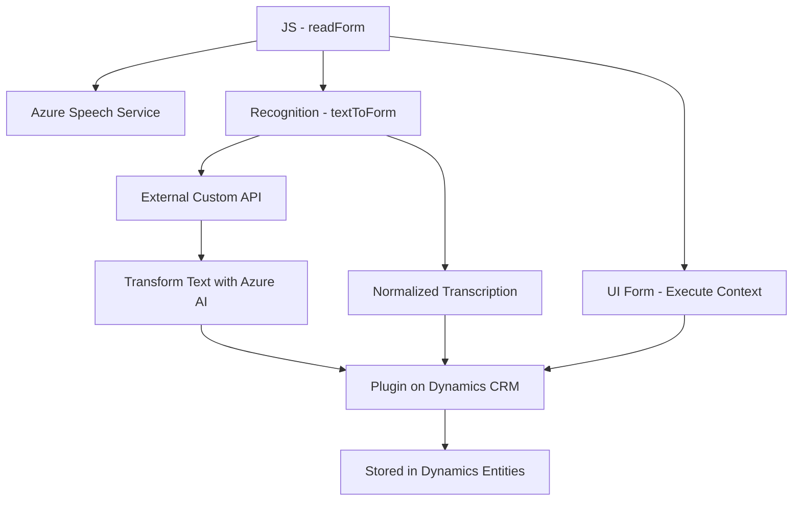

### Breve Resumen Técnico
El repositorio contiene tres archivos principales que implementan una solución para integrar reconocimiento de voz, síntesis de voz y procesamiento de texto con servicios externos. Los componentes están diseñados para interactuar directamente con **Azure Speech SDK**, **Azure OpenAI**, y **Dynamics 365 CRM**, adoptando una arquitectura orientada a modularidad y eventos.

---

### Descripción de Arquitectura
1. **Tipo de solución:** Este repositorio parece ser parte de una solución **dependiente del cliente** centrada en **Dynamics CRM** y **Azure AI** para interacción con formularios mediante voz y procesamiento de texto. Es un sistema híbrido que combina **frontend** para interacción y un **plugin** para ampliar las funcionalidades de Dynamics CRM.
2. **Arquitectura:**  
   - La solución incluye un **plugin** (`TransformTextWithAzureAI.cs`) que sigue el patrón de **Plugin Architecture** integrado en Dynamics CRM.  
   - El frontend se organiza de manera **modular** y **event-driven** (orientado a eventos), con lógica para reconocimiento y síntesis de voz mediante **Azure Speech SDK**.  
   - En términos generales, representa una arquitectura de **n-capas**, ya que separa las responsabilidades: frontend para la interfaz de usuario, lógica en plugins para negocio y procesamiento en servicios remotos.  
3. **Patrones utilizados:**  
   - **Modularización** para la organización de funcionalidades.
   - **SDK Loader** para cargar y acceder a dependencias de Azure dinámicamente desde el navegador.  
   - **Adaptador** para interactuar con APIs externas y normalizar respuestas.  
   - **Event-driven architecture** en el manejo de transcripción y métodos asincrónicos.  
   - **Plugin-hosted architecture** en la extensión de funcionalidades de Dynamics CRM.  

---

### Tecnologías Usadas
1. **Frontend/JavaScript:**
   - **Azure Speech SDK**: Reconocimiento y síntesis de voz.
   - **JavaScript ES6**: Uso de funciones modulares (no ES6 Modules).
   - **Dynamics 365 JavaScript API** (`Xrm.WebApi`): Para interacciones con formularios del CRM.

2. **Backend/C#:**
   - **Microsoft.Xrm.Sdk**: Interacciones con las entidades y servicios de Dynamics CRM.  
   - **HTTP Client** y **System.Text.Json**/**Newtonsoft.Json**: Consumo de APIs externas con procesamiento JSON.  
   - **Azure OpenAI API (GPT-4)**: Manipulación avanzada de texto.

3. **Servicios Externos:**
   - **Azure AI API**: Para sintetización de voz y generación de texto con IA.
   - **Dynamics CRM web services** para interacción con formularios y datos.

---

### Diagrama Mermaid (Compatible para GitHub Markdown)

### Conclusión Final
Este repositorio representa un sistema híbrido en entorno de Dynamics CRM. El frontend facilita la interacción mediante voz al usar **Azure Speech SDK** para el reconocimiento y síntesis de voz. Los datos procesados en el frontend se envían a un **plugin en C#**, en el que se realiza una integración con APIs avanzadas de **Azure OpenAI** para transformar texto. La solución combina **modularidad**, aprovechamiento de SDKs, **integración de servicios de nube**, y los patrones arquitectónicos propios del sistema de **Plugins** de Dynamics 365.