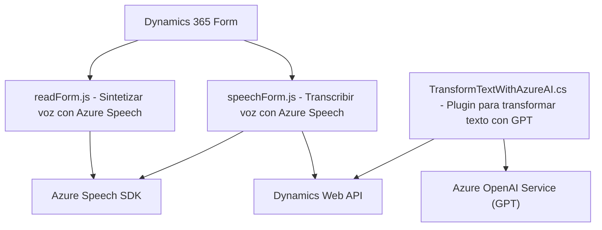

### Breve resumen técnico

El repositorio presenta tres archivos principales que implementan funcionalidades relacionadas con la entrada/salida de voz, procesamiento de texto y transformación mediante inteligencia artificial (Azure Speech SDK y Azure OpenAI). Estas funcionalidades están diseñadas para integrarse con Dynamics 365 CRM, haciendo que las interfaces de formularios sean dinámicas y habilitando capacidades avanzadas como reconocimiento de voz, síntesis de voz, y manipulación de datos en tiempo real.

---

### Descripción de arquitectura

La arquitectura es **modular** y **orientada a eventos**, lo que permite que las funciones en cada archivo se dediquen a tareas específicas pero se integren directamente con un sistema más amplio (Dynamics 365). Por lo tanto, adopta principalmente una arquitectura **n-capas**:

1. **Capa de presentación (frontend)**: Los archivos `readForm.js` y `speechForm.js` definen las interacciones directas con los usuarios, procesando entrada/salida de voz y modificando dinámicamente formularios.
2. **Capa lógica**: Parte de la lógica se implementa directamente en JavaScript y .NET (`TransformTextWithAzureAI.cs`) para el procesamiento de texto avanzado.
3. **Capa de integración**: Conexiones con APIs externas como Azure Speech y Azure OpenAI, además de integrarse dinámicamente con la WebApi de Dynamics 365.

Se utilizan patrones como **lazy-loading del SDK**, **wrapper para APIs externas**, y un flujo basado en eventos (command-handler y input/output processing).

---

### Tecnologías usadas

1. **Frontend**:
   - **JavaScript**: Implementación de las funciones.
   - **Azure Speech SDK**: Para síntesis y reconocimiento de voz.
   - **ES6+**: Uso de funciones modernas y promesas para manejar eventos y asíncronía.
   - **Dynamics 365 SDK**: Para manipulación directa de formularios.

2. **Backend**:
   - **C#** (.NET): Plugin para CRM.
   - **Azure OpenAI (GPT)**: Transformación avanzada de texto.
   - **Dynamics CRM Plugin Framework**: Implementación del archivo C# en Dynamics CRM.
   - **HTTP Client Libraries**: Para consumir servicios externos (Azure).

3. **Dependencias externas**:
   - **Azure Playwright SDK**, `Newtonsoft.Json`, `System.Text.Json`: Procesamiento de datos JSON de API.

---

### Diagrama Mermaid válido

---

### **Conclusión final**

El repositorio describe una solución híbrida que utiliza mecanismos frontend y backend integrados con servicios cloud (Azure Speech y OpenAI). Esta solución funciona principalmente como una extensión de Dynamics 365 CRM, añadiendo capacidades de interacción por voz y transformación de texto. La arquitectura modular y el enfoque en patrones de eventos hacen que sea extensible y adaptable para otros contextos de CRM y flujo de trabajo.