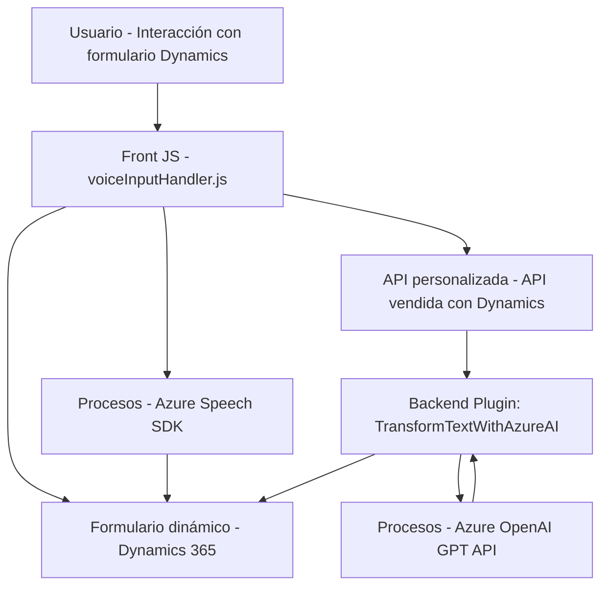

### Breve resumen técnico
El repositorio incluye soluciones que integran formularios dinámicos de Microsoft Dynamics 365 con tecnologías basadas en voz y procesamiento de texto mediante Azure Speech SDK y Azure OpenAI. Las principales funcionalidades abarcan síntesis de voz, entrada de voz, inteligencia artificial, transformación y aplicación de datos en formularios.

### Descripción de arquitectura
1. **Tipo de solución:**  
   Basado en los archivos analizados, el repositorio representa un conjunto de componentes para una **aplicación híbrida** de Dynamics 365, compuesta por complementos frontend (JavaScript) y extensiones backend (C# plugins). La solución está orientada a mejorar la interacción de los usuarios mediante entrada y procesamiento de voz, síntesis de texto y capacidades de IA.
   
2. **Artefactos principales:**  
   - **Frontend (JavaScript):** Extiende el cliente Dynamics 365 con funciones como captura de voz, síntesis de texto y mapeo de datos en tiempo real.  
   - **Backend (C# plugin):** Implementa un microservicio plugin que conecta Dynamics 365 con Azure OpenAI para transformar texto según reglas predefinidas.

3. **Arquitectura:**  
   La arquitectura combina patrones de **N capas** con elementos de **hexagonal**:
   - **N capas:** Existe una separación clara entre funciones frontend (interfaz y SDK de voz) y el backend (plugin que interactúa con OpenAI).  
   - **Hexagonal:** La solución interactúa con servicios externos como Azure Speech SDK y Azure OpenAI, empleando adaptadores (HTTP y SDK).  

4. **Patrones adicionales:**  
   - **Event-driven:** Las funciones JavaScript se disparan por eventos del formulario.
   - **Plugin Pattern:** El backend incluye un plugin que se ejecuta dentro de Dynamics 365 como lógica extendida.  
   - **Dependency Injection:** `IServiceProvider` para la inyección de servicios en el plugin.

### Tecnologías usadas
1. **Frontend:**
   - **JavaScript:** Manipulación de las interfaces del navegador y de Dynamics.
   - **Azure Speech SDK:** Procesamiento de síntesis/entrada de voz y transformación a texto.  
   - **Microsoft Dynamics 365 Web API:** Interacción con entidades del sistema CRM.  

2. **Backend:**
   - **C# y .NET Framework:** Construcción de plugins de Dynamics 365, implementados para lógica personalizada.  
   - **Azure OpenAI API:** Modelo GPT para análisis y transformación textual.  
   - **System.Net.Http / Json:** Para comunicación y manejo del modelo OpenAI.

### Dependencias o componentes externos
1. **Azure Speech SDK (frontend):** Para la entrada/salida de voz y reconocimiento.  
2. **Azure OpenAI API (backend plugin):** Procesamiento avanzado de texto mediante GPT.  
3. **Microsoft Dynamics 365 Web API:** Manipulación y actualización de datos en formularios dinámicos.  
4. **Frontend dinámico:** Dependencia interna de Dynamics para formularios.  
5. **C# NuGet Packages:**
   - `Microsoft.Xrm.Sdk`: Extensiones para integración con Dynamics.  
   - JSON Libraries (`Newtonsoft.Json` y `System.Text.Json`) para manipulación de datos estructurados.

---

### Diagrama Mermaid válido para GitHub Markdown

---

### Conclusión final
El diseño del repositorio representa una solución integrada para mejorar la interacción en Dynamics 365 mediante tecnologías emergentes como síntesis de voz y procesamiento de lenguaje natural. Su arquitectura basada en N capas y hexagonal permite una modularidad sólida. Además, la integración transparente con Azure Speech SDK y Azure OpenAI API muestra una clara orientación hacia el uso de servicios externos especializados, optimizando los procesos de entrada y manejo de datos. Sin embargo, podría beneficiarse de mayor documentación sobre las dependencias y de asegurar pruebas unitarias en los plugins y scripts.